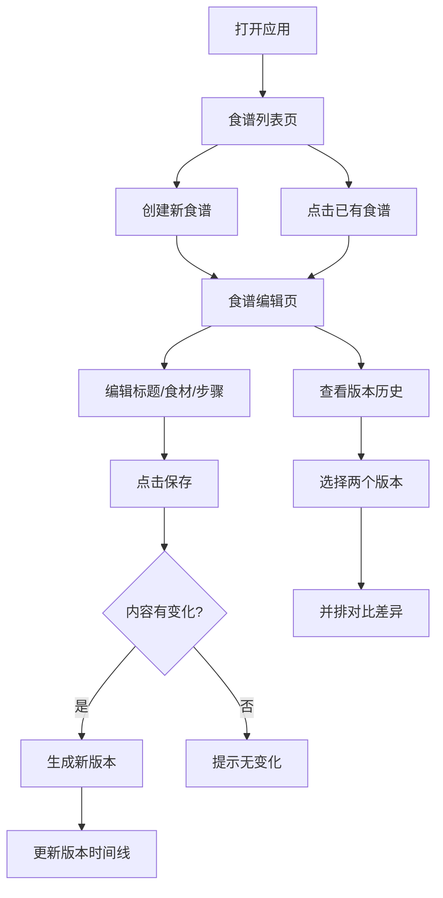

## 1. 产品概述

谱记是一款面向烹饪团队和家庭的在线协同食谱编辑与版本控制应用。用户可以共同编辑食谱，每次修改自动生成版本记录，支持查看修改历史、对比差异和回退版本。

- 核心目标：让多人协作编辑食谱变得简单可追溯
- 目标用户：烹饪团队、美食爱好者家庭、菜谱创作者
- 产品价值：解决多人协作编辑时的版本混乱问题，保留完整的修改历史

## 2. 核心功能

### 2.1 用户角色

| 角色 | 加入方式 | 核心权限 |
|------|----------|----------|
| 团队创建者 | 创建食谱并生成邀请码 | 管理食谱、编辑、查看所有版本 |
| 团队成员 | 通过邀请码加入 | 编辑团队食谱、查看版本历史 |
| 访客 | 无 | 无（暂不支持） |

### 2.2 功能模块

1. **食谱列表页**：展示个人和团队食谱卡片，支持创建新食谱和加入团队
2. **食谱编辑页**：富文本编辑器、食材管理、步骤管理、保存版本
3. **版本历史模块**：时间线展示、版本对比、差异高亮
4. **团队协作模块**：邀请码、在线成员、编辑状态指示

### 2.3 页面详情

| 页面名称 | 模块名称 | 功能描述 |
|----------|----------|----------|
| 食谱列表页 | 食谱卡片列表 | 展示所有食谱，自己的用蓝色边框，他人的用灰色边框 |
| 食谱列表页 | 创建/加入区域 | 创建新食谱、输入邀请码加入团队 |
| 食谱编辑页 | 在线成员栏 | 顶部显示在线成员头像，编辑时有呼吸灯效果 |
| 食谱编辑页 | 食谱编辑器 | 标题编辑、食材列表（增删排序）、步骤列表（增删排序+图片占位） |
| 食谱编辑页 | 保存按钮 | 保存时检测变化，生成新版本 |
| 食谱编辑页 | 版本历史侧边栏 | 时间线列表、版本切换、对比功能 |
| 食谱编辑页 | 版本对比视图 | 并排展示两版内容，差异高亮显示 |

## 3. 核心流程

用户从食谱列表进入食谱详情，编辑内容后保存，系统自动生成新版本。团队成员可随时查看历史版本，选择两个相邻版本进行对比，查看具体修改内容。

## 4. 用户界面设计

### 4.1 设计风格

- **主色调**：暖色调，背景 #FFF8E1（奶黄色），强调温暖的家庭/厨房氛围
- **卡片背景**：白色 #FFFFFF
- **标题颜色**：深褐色 #4E342E
- **正文颜色**：深棕色 #3E2723
- **按钮主色**：#FF8A65（橙红色），悬停 #FF7043
- **边框**：自己的食谱 #2196F3 蓝色边框，他人的 #BDBDBD 灰色边框
- **差异高亮**：新增 #C8E6C9 绿色，删除 #FFCDD2 红色
- **最新版本背景**：#E8F5E9 浅绿色

### 4.2 字体

- **标题字体**：Georgia 衬线体，体现食谱的传统与质感
- **正文字体**：Segoe UI 无衬线体，保证可读性
- **按钮圆角**：2px 圆角，简洁利落
- **动画时长**：0.2-0.3秒，平滑过渡

### 4.3 页面设计概览

| 页面名称 | 模块名称 | UI 元素 |
|----------|----------|---------|
| 食谱列表页 | 顶部导航 | 应用名称「谱记」、用户昵称、创建食谱按钮 |
| 食谱列表页 | 邀请码区域 | 输入框 + 加入按钮，卡片式设计 |
| 食谱列表页 | 食谱卡片网格 | 卡片带边框区分归属，悬停有上浮效果 |
| 食谱编辑页 | 在线成员栏 | 圆形头像（首字母+随机色），呼吸灯动画 |
| 食谱编辑页 | 编辑器区域 | 标题输入、食材表格、步骤列表 |
| 食谱编辑页 | 版本侧边栏 | 时间线样式，最新版本高亮 |
| 食谱编辑页 | 对比视图 | 双栏并排，平滑展开动画，浮动滚动按钮 |

### 4.4 响应式设计

- **桌面端**：左侧编辑器 + 右侧版本历史侧边栏（固定宽度）
- **移动端（<768px）**：版本历史折叠为底部抽屉，点击按钮展开
- **触摸优化**：按钮最小尺寸 44px，拖拽区域加大

### 4.5 动效细节

- **页面切换**：淡入淡出 0.3s
- **卡片悬停**：轻微上浮 + 阴影加深 0.2s
- **对比视图展开**：高度平滑过渡 0.3s
- **呼吸灯效果**：头像边框颜色淡入淡出交替，周期 2s
- **保存成功提示**：从顶部滑入，0.3s 后滑出

## 5. 性能要求

- 打开包含 50 个版本、每版本 1000 字内容的食谱，对比视图首次渲染时间不超过 2 秒
- 版本列表滚动流畅，支持虚拟滚动优化（如需要）
- 差异计算在后台进行，不阻塞 UI
