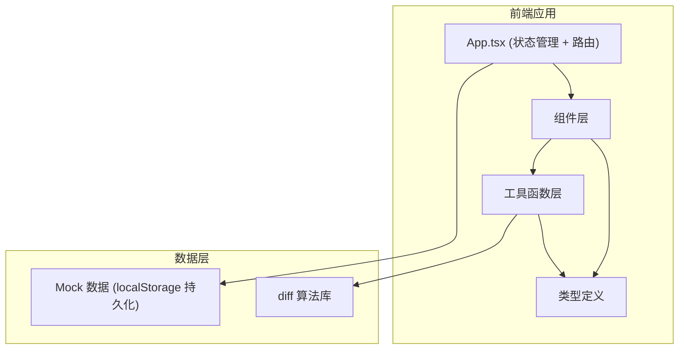

## 1. 架构设计



## 2. 技术栈说明

- **前端框架**：React 18 + TypeScript 5
- **构建工具**：Vite 5（端口 3000，开启 HMR）
- **差异算法**：diff 库（文本差异对比）
- **唯一 ID**：uuid
- **状态管理**：React useState + useContext（轻量级，无需 Redux）
- **样式方案**：CSS Modules 或全局 CSS + CSS 变量
- **数据持久化**：localStorage（前端模拟，无需后端）

## 3. 路由定义

本项目为单页应用，使用状态管理模拟页面切换：

| 页面 | 状态值 | 说明 |
|------|--------|------|
| 食谱列表页 | 'list' | 展示所有食谱 |
| 食谱详情/编辑页 | 'detail' | 编辑食谱 + 版本历史 |

## 4. 数据模型

### 4.1 核心类型定义

```typescript
// 食材项
interface Ingredient {
  id: string;
  name: string;
  quantity: string;
  unit: string;
}

// 步骤项
interface Step {
  id: string;
  description: string;
  hasImage: boolean;
}

// 食谱内容
interface RecipeContent {
  title: string;
  ingredients: Ingredient[];
  steps: Step[];
}

// 版本记录
interface Version {
  id: string;
  versionNumber: number;
  recipeId: string;
  content: RecipeContent;
  author: string;
  timestamp: number;
  note?: string;
}

// 食谱
interface Recipe {
  id: string;
  inviteCode: string;
  ownerId: string;
  teamMembers: TeamMember[];
  createdAt: number;
  currentVersionId: string;
}

// 团队成员
interface TeamMember {
  id: string;
  nickname: string;
  avatarColor: string;
  isOnline: boolean;
  isEditing: boolean;
}

// 差异块
interface DiffBlock {
  value: string;
  added?: boolean;
  removed?: boolean;
}
```

### 4.2 数据流

1. App.tsx 维护全局状态（食谱列表、当前食谱、版本列表、团队成员）
2. 子组件通过 props 接收数据和回调
3. 保存时：RecipeEditor 对比新旧内容 → 有变化则调用 onSaveVersion → App 生成新版本并更新状态
4. 对比时：VersionHistory 调用 diff 库 → 渲染差异视图

## 5. 文件结构

```
src/
├── types.ts              # 类型定义
├── App.tsx               # 主应用组件
├── index.css             # 全局样式
├── main.tsx              # 入口文件
├── utils/
│   ├── diffUtils.ts      # 差异计算工具
│   └── mockData.ts       # Mock 数据生成
└── components/
    ├── RecipeCard.tsx        # 食谱卡片
    ├── RecipeEditor.tsx      # 食谱编辑器
    ├── VersionHistory.tsx    # 版本历史
    ├── VersionDiff.tsx       # 版本对比视图
    ├── OnlineMembers.tsx     # 在线成员
    ├── IngredientList.tsx    # 食材列表
    └── StepList.tsx          # 步骤列表
```

## 6. 性能优化策略

- 使用 React.memo 优化版本列表项渲染
- 差异计算使用 useMemo 缓存结果
- 大版本列表可考虑虚拟滚动（react-window）
- 食材/步骤的拖拽使用轻量方案（如 HTML5 原生拖拽 API）
- 对比视图的渲染分段进行，避免一次性渲染大量 DOM

## 7. 第三方库选择说明

- **diff**：成熟的文本差异算法库，支持字符级和单词级对比
- **uuid**：生成唯一 ID，确保版本和食材/步骤的唯一标识
- **@vitejs/plugin-react**：Vite 的 React 插件，支持 Fast Refresh
