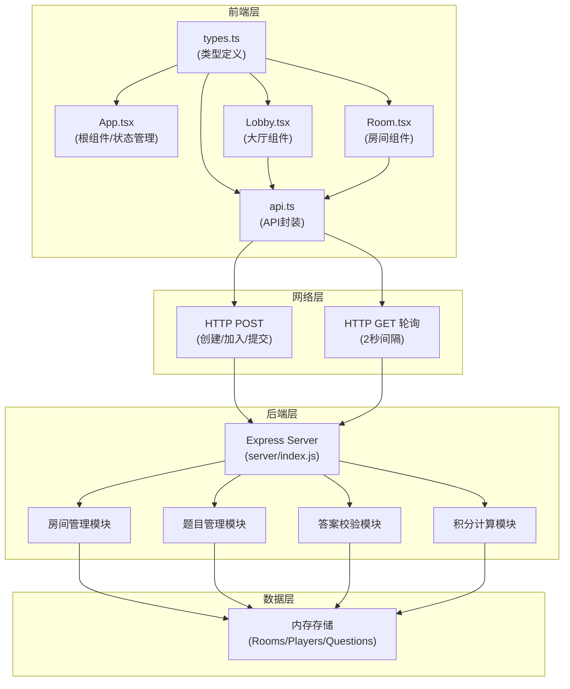
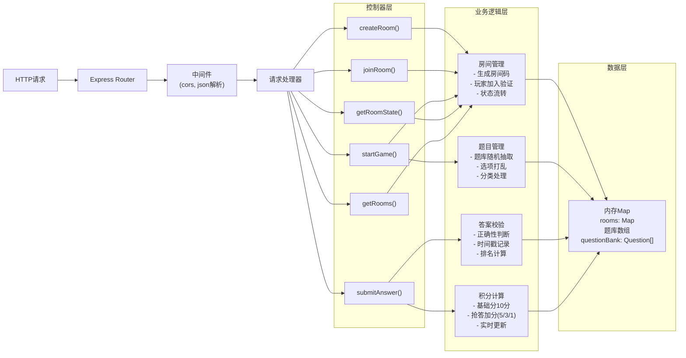
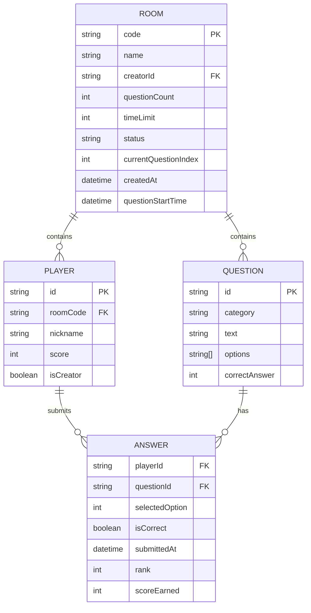

## 1. 架构设计



## 2. 技术描述

- 前端：React@18 + TypeScript@5 + Vite@5 + @vitejs/plugin-react@4 + axios@1
- 后端：Express@4 + cors@2 + uuid@9
- 构建工具：Vite
- 并发启动：concurrently@8
- 数据存储：内存存储（无需数据库）
- 通信协议：HTTP/1.1，轮询机制

### 依赖包说明

| 包名 | 版本 | 用途 |
|------|------|------|
| react | ^18.2.0 | 前端框架 |
| react-dom | ^18.2.0 | React DOM渲染 |
| typescript | ^5.0.0 | 类型系统 |
| vite | ^5.0.0 | 构建工具 |
| @vitejs/plugin-react | ^4.0.0 | React支持 |
| axios | ^1.6.0 | HTTP客户端 |
| express | ^4.18.0 | 后端框架 |
| cors | ^2.8.5 | 跨域支持 |
| uuid | ^9.0.0 | 生成唯一ID |
| concurrently | ^8.2.0 | 并发启动前后端 |

## 3. 路由定义

| 路由 | 页面 | 用途 |
|-------|------|---------|
| / | 大厅 | 房间列表、创建/加入房间 |
| /room/:code | 房间 | 等待区、答题、排名、复盘 |

## 4. API 定义

### 4.1 TypeScript 类型定义

```typescript
// 题目分类
type QuestionCategory = 'science' | 'history' | 'literature' | 'geography' | 'entertainment';

// 玩家接口
interface Player {
  id: string;
  nickname: string;
  score: number;
  isCreator: boolean;
  answers: {
    questionId: string;
    selectedOption: number;
    isCorrect: boolean;
    submittedAt: number;
    rank: number;
  }[];
}

// 题目接口
interface Question {
  id: string;
  category: QuestionCategory;
  text: string;
  options: string[];
  correctAnswer: number;
}

// 房间状态
type RoomStatus = 'waiting' | 'playing' | 'finished';

// 房间接口
interface Room {
  code: string;
  name: string;
  creatorId: string;
  questionCount: number;
  timeLimit: number;
  status: RoomStatus;
  currentQuestionIndex: number;
  questions: Question[];
  players: Player[];
  createdAt: number;
  questionStartTime: number | null;
}

// API请求/响应
interface CreateRoomRequest {
  roomName: string;
  nickname: string;
  questionCount: number;
  timeLimit: number;
}

interface CreateRoomResponse {
  room: Room;
  playerId: string;
}

interface JoinRoomRequest {
  roomCode: string;
  nickname: string;
}

interface JoinRoomResponse {
  room: Room;
  playerId: string;
}

interface SubmitAnswerRequest {
  roomCode: string;
  playerId: string;
  questionId: string;
  selectedOption: number;
}

interface SubmitAnswerResponse {
  success: boolean;
  scoreEarned: number;
  isCorrect: boolean;
  rank: number;
}

interface RoomStateResponse {
  room: Room;
  timeRemaining: number;
}
```

### 4.2 HTTP API 端点

| 方法 | 路径 | 请求体 | 响应 | 用途 |
|------|------|--------|------|------|
| POST | /api/rooms | CreateRoomRequest | CreateRoomResponse | 创建房间 |
| POST | /api/rooms/join | JoinRoomRequest | JoinRoomResponse | 加入房间 |
| POST | /api/rooms/start | { roomCode, playerId } | { success: boolean } | 房主开始游戏 |
| POST | /api/answer | SubmitAnswerRequest | SubmitAnswerResponse | 提交答案 |
| GET | /api/rooms/:code | - | RoomStateResponse | 获取房间状态（轮询） |
| GET | /api/rooms | - | Room[] | 获取房间列表 |

## 5. 服务器架构



## 6. 数据模型

### 6.1 ER 图



### 6.2 内存数据结构

```javascript
// 房间存储
const rooms = new Map();
rooms.set(roomCode, {
  code: 'ABC123',
  name: '知识竞赛',
  creatorId: 'uuid-1',
  questionCount: 10,
  timeLimit: 15,
  status: 'waiting',
  currentQuestionIndex: 0,
  questions: [...],
  players: [
    {
      id: 'uuid-1',
      nickname: '玩家1',
      score: 0,
      isCreator: true,
      answers: []
    }
  ],
  createdAt: 1234567890,
  questionStartTime: null
});

// 题库（50+题目）
const questionBank = [
  {
    id: 'q1',
    category: 'science',
    text: '水的化学式是？',
    options: ['H2O', 'CO2', 'O2', 'NaCl'],
    correctAnswer: 0
  },
  // ... 更多题目
];
```

### 6.3 分类配色映射

| 分类 | 背景色 | 分类中文名 |
|------|--------|------------|
| science | #E3F2FD | 科学 |
| history | #FFF3E0 | 历史 |
| literature | #F3E5F5 | 文学 |
| geography | #E8F5E9 | 地理 |
| entertainment | #FFEBEE | 娱乐 |

## 7. 项目结构

```
auto176/
├── .trae/
│   └── documents/
│       ├── PRD.md
│       └── ARCHITECTURE.md
├── server/
│   └── index.js          # Express后端服务器
├── src/
│   ├── components/
│   │   ├── Lobby.tsx     # 大厅组件
│   │   └── Room.tsx      # 房间组件
│   ├── types.ts          # TypeScript类型定义
│   ├── api.ts            # API封装
│   └── App.tsx           # 根组件
├── index.html            # HTML入口
├── vite.config.ts        # Vite配置
├── tsconfig.json         # TypeScript配置
└── package.json          # 项目依赖和脚本
```

## 8. 数据流向说明

1. **创建房间**：Lobby.tsx → api.createRoom() → POST /api/rooms → server创建房间并加入玩家 → 返回Room和playerId → App.tsx更新状态 → 跳转/room/:code

2. **加入房间**：Lobby.tsx → api.joinRoom() → POST /api/rooms/join → server验证房间码并添加玩家 → 返回Room和playerId → App.tsx更新状态 → 跳转/room/:code

3. **房间状态轮询**：Room.tsx → useEffect定时器 → api.fetchRoomState() → GET /api/rooms/:code → server返回最新Room状态 → Room.tsx更新UI

4. **开始游戏**：Room.tsx → api.startGame() → POST /api/rooms/start → server验证房主权限 → 随机抽题 → 更新room.status='playing' → 设置questionStartTime

5. **提交答案**：Room.tsx → api.submitAnswer() → POST /api/answer → server验证时间 → 计算排名 → 计算积分 → 更新player.answers和score → 返回结果 → Room.tsx更新显示

6. **积分计算**：
   - 正确答案：基础分10分
   - 第1名正确：额外+5分（总计15）
   - 第2名正确：额外+3分（总计13）
   - 第3名正确：额外+1分（总计11）
   - 第4名及以后正确：只有10分
   - 错误/超时：0分
