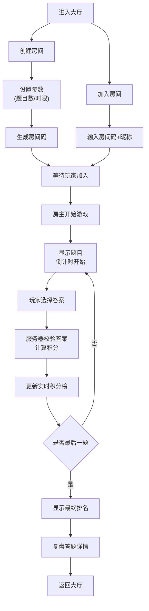

## 1. 产品概述

多人在线抢答知识竞赛游戏，玩家可创建或加入房间，在规定时间内抢答题目并获得积分，最后显示排名。

- 主要目的：提供娱乐性和知识性的多人在线竞技体验
- 解决问题：传统知识竞赛缺乏实时互动和竞技性
- 目标用户：喜欢知识问答、竞技游戏的玩家群体
- 市场价值：轻量级社交游戏，适合朋友聚会、在线团建等场景

## 2. 核心功能

### 2.1 用户角色

| 角色 | 注册方法 | 核心权限 |
|------|----------|----------|
| 玩家 | 输入昵称即可参与 | 创建房间、加入房间、答题、查看排名 |
| 房主 | 创建房间自动成为 | 开始游戏、设置题目数量和答题时限 |

### 2.2 功能模块

1. **大厅页面**：房间列表、创建房间表单、加入房间表单
2. **房间页面**：玩家列表、准备状态、开始游戏按钮、答题界面、实时积分榜、最终排名、复盘功能
3. **题目系统**：题库管理、随机抽题、选项打乱、分类配色
4. **积分系统**：基础分、抢答加分、实时排名、奖牌高亮
5. **轮询系统**：2秒间隔获取房间状态、同步答题进度

### 2.3 页面详情

| 页面名称 | 模块名称 | 功能描述 |
|-----------|-------------|---------------------|
| 大厅页面 | 房间列表 | 展示所有可加入的房间，显示房间名、人数、房主、房间码 |
| 大厅页面 | 创建房间 | 设置房间名称、题目数量(5-15)、答题时限(10-30秒)，生成6位房间码 |
| 大厅页面 | 加入房间 | 输入6位房间码和昵称加入房间 |
| 房间页面 | 等待区 | 显示所有玩家昵称和准备状态，房主可见开始游戏按钮 |
| 房间页面 | 答题区 | 显示题目、四个选项、倒计时、答题进度指示器 |
| 房间页面 | 积分榜 | 实时显示玩家排名、积分，前三名特殊颜色高亮 |
| 房间页面 | 最终排名 | 显示总积分、正确率进度条、前三名祝贺动画 |
| 房间页面 | 复盘功能 | 逐题展示每位玩家的答案和正误情况 |

## 3. 核心流程

玩家进入大厅后，可以选择创建房间或加入已有房间。创建房间时设置游戏参数，系统生成6位房间码。其他玩家输入房间码和昵称加入。房主点击开始后，所有玩家同步进入答题环节。每题限时作答，系统记录提交顺序并计算积分。所有题目答完后显示最终排名，支持复盘查看答题详情。

## 4. 用户界面设计

### 4.1 设计风格

- 主色调：科技蓝 #1E88E5，深灰 #212121
- 背景：深色渐变（从 #121212 到 #1E3A5F）
- 按钮风格：圆角卡片式，悬停阴影加深过渡0.2秒
- 字体：标题使用醒目无衬线字体，正文清晰易读
- 布局：卡片式布局，空间层次分明
- 图标风格：简约线性图标，配合动画效果

### 4.2 页面设计概述

| 页面名称 | 模块名称 | UI元素 |
|-----------|-------------|----------|
| 大厅页面 | 房间列表 | 卡片式布局，圆角12px，悬停阴影加深，显示房间名/人数/房间码 |
| 大厅页面 | 创建/加入表单 | 深色输入框，蓝色边框聚焦状态，提交按钮带加载动画 |
| 房间页面 | 答题进度区 | 圆点指示器（答对绿#4CAF50、答错红#F44336、未答灰），红色大字倒计时，最后5秒闪烁 |
| 房间页面 | 题目区 | 分类主题色背景（科学#E3F2FD、历史#FFF3E0、文学#F3E5F5、地理#E8F5E9、娱乐#FFEBEE），题干居中显示 |
| 房间页面 | 选项区 | 四张卡片横向均分，高度60px，选中时边框变主题色并放大1.02倍，动画0.15秒 |
| 房间页面 | 积分榜 | 排名列表，第一名金色#FFD700、第二名银色#C0C0C0、第三名铜色#CD7F32 |
| 房间页面 | 最终排名 | 前三名带祝贺动画（皇冠、银星、铜星，缩放0.3秒），正确率百分比进度条 |

### 4.3 响应式

- 桌面端（≥768px）：选项卡片横向排列，倒计时大字显示
- 手机端（<768px）：选项卡片竖向排列，宽度100%，倒计时缩小至24px
- 触摸优化：按钮最小高度48px，增加点击区域

### 4.4 动画与交互

- 页面切换：淡入淡出过渡0.3秒
- 卡片悬停：阴影加深，轻微上浮0.2秒
- 选项选中：放大1.02倍，边框变色0.15秒
- 倒计时闪烁：最后5秒字体颜色交替变化
- 排名公布：前三名缩放动画0.3秒，皇冠/星星从上方落入
- 答题进度：圆点变色动画0.2秒

## 5. 性能约束

- 轮询间隔：2秒
- 单次响应数据量：≤10KB
- 动画帧率：≥50fps
- 选项点击响应：≤100ms
