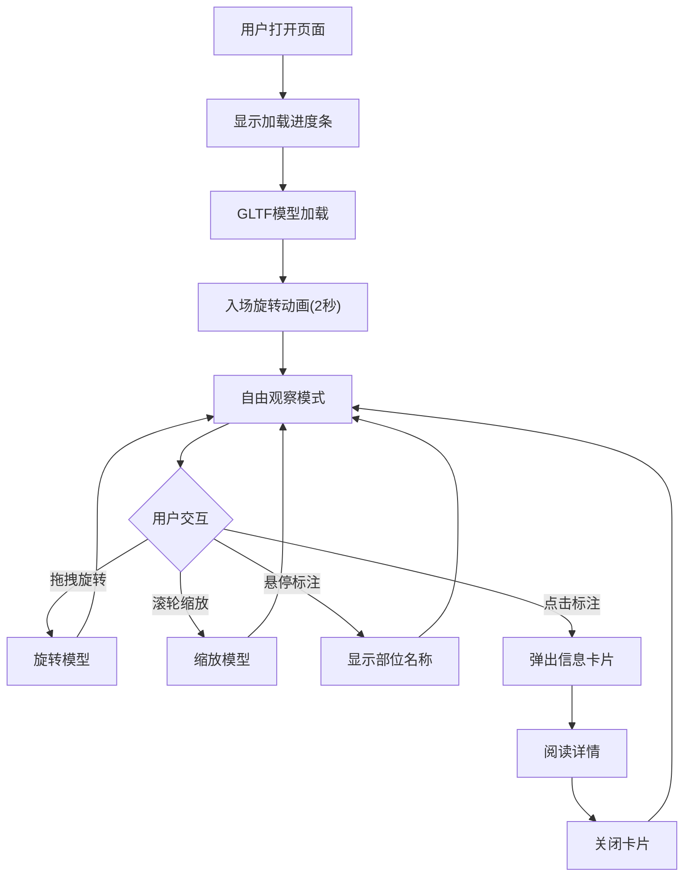

## 1. 产品概述
面向博物馆和教育机构的三维文物展示与标注交互应用，让参观者能够在网页上以三维方式近距离观察和旋转查看文物高精度模型，并通过标注点了解文物细节和背景信息。
- 目标用户：博物馆参观者、教育机构师生、历史文化爱好者
- 核心价值：提供沉浸式文物观察体验，以交互标注方式深化知识传递

## 2. 核心功能

### 2.1 功能模块
1. **三维场景页面**：文物3D模型展示、旋转缩放交互、标注点浏览、信息卡片查看

### 2.2 页面详情
| 页面名称 | 模块名称 | 功能描述 |
|----------|----------|----------|
| 三维场景页面 | 场景渲染 | 使用Three.js创建场景，环境光(0.4)、定向光(0.8)、背光(0.2)，半透明网格地面(#888888, 0.3透明度)，渐变背景(#1a1a2e→#16213e) |
| 三维场景页面 | 模型加载 | 通过modelLoader.ts加载GLTF青铜鼎模型，显示#e94560色进度条(6px高度, 圆角)，加载完成后自动旋转一周(2秒)入场动画 |
| 三维场景页面 | 标注系统 | 模型表面6-8个圆形Sprite标注点(32px, #ffd700, 光晕动画)，悬停放大至40px并显示部位名称标签(14px白色, #333333半透明背景)，点击弹出信息卡片 |
| 三维场景页面 | 信息卡片 | 浮动卡片(380px宽, #2d2d2d背景, 12px圆角, 阴影)，含部位名称(24px白色加粗)、描述文字(16px #cccccc)、插画示意图(圆角8px, 渐显0.3s)、关闭按钮(32px圆形, #e94560) |
| 三维场景页面 | 相机控制 | OrbitControls(阻尼0.1, 旋转速度0.5, 缩放0.5-5)，交互时暂停自动旋转，5秒无操作恢复 |
| 三维场景页面 | UI控件 | 左上角文物名称(24px)和时代背景(14px #aaaaaa)，右上角自动旋转按钮(40px圆形, 激活#e94560)和重置视角按钮(0.5秒过渡动画) |

## 3. 核心流程

用户打开页面 → 显示加载进度条 → 模型加载完成 → 入场旋转动画 → 用户自由观察模型(旋转/缩放) → 发现标注点 → 悬停查看部位名称 → 点击弹出信息卡片 → 阅读详细信息 → 关闭卡片继续观察

## 4. 界面设计

### 4.1 设计风格
- 主色调：深色科幻风格，主背景#0f0f23
- 辅助色：控件和卡片#2d2d2d
- 点缀色：#e94560(交互高亮)、#ffd700(标注点)
- 按钮样式：圆形按钮，半透明背景，悬停0.2秒过渡
- 字体：标题用粗体无衬线体，正文用轻量无衬线体
- 布局：全屏3D画布，UI控件浮动叠加

### 4.2 页面设计概览
| 页面名称 | 模块名称 | UI元素 |
|----------|----------|--------|
| 三维场景页面 | 顶部信息区 | 左上角文物名称(24px #ffffff粗体)、时代背景(14px #aaaaaa) |
| 三维场景页面 | 右上控件区 | 自动旋转按钮(40px圆形, #ffffff透明度0.2背景, 旋转箭头图标)、重置视角按钮(同风格) |
| 三维场景页面 | 标注点 | 圆形Sprite(32px #ffd700), 光晕动画, 悬停放大+标签 |
| 三维场景页面 | 信息卡片 | 380px宽浮动卡片, 从右下角缩放进入(0.3s ease-out), 右下关闭按钮 |
| 三维场景页面 | 进度条 | 顶部#e94560线性进度条, 6px高, 圆角, 0%→100%动画 |

### 4.3 响应式
- 桌面优先设计，移动端适配
- 宽度<768px时：信息卡片宽度调整为80%并居中，按钮尺寸相应缩小

### 4.4 3D场景指引
- 环境：深色渐变背景(#1a1a2e→#16213e)，营造博物馆氛围
- 光照：环境光0.4 + 定向光0.8(右上45度) + 背光0.2，突出文物细节
- 相机：透视相机，OrbitControls交互，阻尼0.1
- 焦点：文物模型居中，标注点环绕分布
- 交互：旋转、缩放、标注点击、自动旋转
- 动画：入场旋转、标注光晕、卡片缩放过渡
- 性能目标：≥55fps，点击响应<100ms

## 5. 性能约束
- 加载模型后帧率≥55fps
- 标注点点击反馈延迟<100ms
- 模型加载时间≤3秒(预设模型约5MB)
