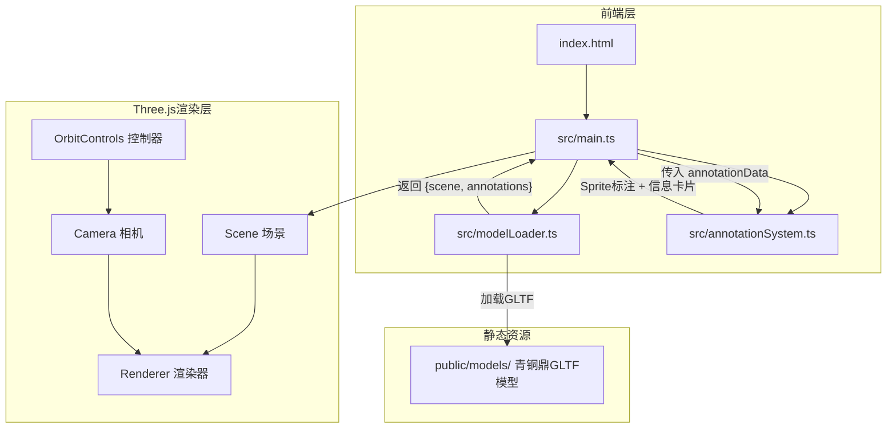

## 1. 架构设计



## 2. 技术说明
- 前端：TypeScript + Three.js + Vite（纯前端项目，无后端）
- 构建工具：Vite（端口3000，开启HMR）
- TypeScript：严格模式，target ES2020
- 3D库：Three.js（场景渲染、模型加载、交互控制）
- 无数据库、无后端服务

## 3. 文件结构
```
├── package.json          # 依赖：three @types/three typescript vite
├── vite.config.js        # 构建配置，端口3000，HMR
├── tsconfig.json         # 严格模式，ES2020
├── index.html            # 入口页面，全屏canvas容器
├── public/
│   └── models/
│       └── bronze_ding.glb  # 青铜鼎模型（预设占位）
└── src/
    ├── main.ts              # 应用入口，场景/相机/渲染器/控制器初始化
    ├── modelLoader.ts       # GLTF模型加载，返回scene和annotations
    └── annotationSystem.ts  # 标注点创建、交互、信息卡片
```

### 数据流向
1. `main.ts` 调用 `modelLoader.loadModel()` → 返回 `Promise<{scene, annotations}>`
2. `main.ts` 将 `scene` 添加到Three.js场景，将 `annotations` 传给 `annotationSystem.initAnnotations()`
3. `annotationSystem` 在模型表面生成 Sprite 标注点 → 点击触发 `showInfoCard()` 弹出信息卡片
4. 用户交互通过 OrbitControls 处理，main.ts 管理自动旋转逻辑

## 4. 类型定义

```typescript
interface AnnotationData {
  id: string;
  position: { x: number; y: number; z: number };
  label: string;
  title: string;
  description: string;
  imageUrl: string;
}

interface ModelLoadResult {
  scene: THREE.Group;
  annotations: AnnotationData[];
}
```

## 5. 标注数据结构（青铜鼎预设6个标注点）
| ID | 部位 | 局部坐标(近似) | 描述概要 |
|----|------|---------------|----------|
| ear-left | 左耳 | (-0.6, 1.2, 0) | 鼎耳用于搬运和悬挂 |
| ear-right | 右耳 | (0.6, 1.2, 0) | 对称的鼎耳设计 |
| rim | 口沿 | (0, 1.0, 0.5) | 饰有回纹的口沿 |
| belly | 腹部 | (0, 0.4, 0.6) | 饕餮纹主要装饰区 |
| leg-front | 前足 | (0.4, -0.5, 0.3) | 三足鼎立的前足 |
| leg-back | 后足 | (-0.3, -0.5, -0.3) | 柱状鼎足 |

## 6. 关键技术决策
- **模型替代方案**：由于无法提供真实GLTF青铜鼎模型，将使用Three.js几何体程序化生成一个简约青铜鼎模型，确保展示功能完整可用
- **标注点实现**：使用THREE.Sprite + SpriteMaterial创建始终面向相机的标注点
- **信息卡片**：使用DOM元素叠加在Canvas上，而非3D空间内UI，确保文字清晰
- **光晕动画**：通过自定义着色器或动态修改Sprite的scale和opacity实现
- **入场动画**：使用THREE.Clock + requestAnimationFrame驱动旋转，2秒完成360度
