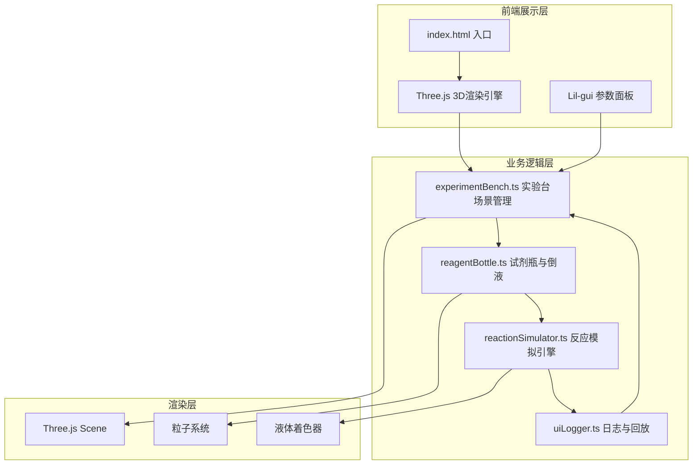

## 1. 架构设计



**数据流向**：
1. 用户操作事件 → `experimentBench` 接收 → 转发给 `reactionSimulator`
2. `reagentBottle` 倒液事件 → `reactionSimulator` 判断反应 → 更新烧杯状态
3. `reactionSimulator` 反应完成 → 通知 `uiLogger` 记录日志
4. `uiLogger` 回放操作 → 调用 `experimentBench` 恢复场景状态

## 2. 技术说明

- **前端框架**：TypeScript + Three.js（无React/Vue，纯TS模块化开发）
- **构建工具**：Vite（端口3000，开启HMR）
- **参数调节**：Lil-gui
- **3D引擎**：Three.js + OrbitControls + DragControls
- **后端**：无（纯前端项目）
- **数据库**：无（状态全部在内存中管理）

## 3. 项目文件结构

```
├── package.json
├── index.html
├── vite.config.js
├── tsconfig.json
└── src/
    ├── main.ts
    └── modules/
        ├── experimentBench.ts
        ├── reactionSimulator.ts
        ├── reagentBottle.ts
        └── uiLogger.ts
```

## 4. 模块职责与接口定义

### 4.1 experimentBench.ts — 实验台场景管理

**职责**：创建3D场景、台面、灯光、相机，管理场景内物体生命周期

**核心接口**：
```typescript
interface ExperimentBench {
  scene: THREE.Scene
  camera: THREE.PerspectiveCamera
  renderer: THREE.WebGLRenderer
  init(container: HTMLElement): void
  addBeaker(beaker: BeakerObject): void
  highlightArea(objectId: string): void
  restoreState(state: BenchState): void
  onUserAction(callback: (action: UserAction) => void): void
}

interface BenchState {
  beakers: BeakerState[]
  cameraPosition: THREE.Vector3
}

interface UserAction {
  type: 'pour' | 'heat' | 'select'
  source: string
  target: string
  amount: number
}
```

### 4.2 reagentBottle.ts — 试剂瓶与倒液操作

**职责**：创建试剂瓶3D模型、标签、液面显示，处理拖拽倒液和粒子流

**核心接口**：
```typescript
interface ReagentBottle {
  mesh: THREE.Group
  reagentName: string
  currentVolume: number
  createBottle(name: string, color: THREE.Color): THREE.Group
  startPour(target: BeakerObject, amount: number): void
  stopPour(): void
  onPourComplete(callback: (reagent: string, amount: number) => void): void
}

interface ParticleFlowConfig {
  particleCount: 30
  flowSpeed: 2
  color: THREE.Color
}
```

### 4.3 reactionSimulator.ts — 化学反应模拟引擎

**职责**：根据试剂组合计算产物、颜色变化、气泡效果、温度和pH变化

**核心接口**：
```typescript
interface ReactionSimulator {
  addReagent(beakerId: string, reagent: string, amount: number): ReactionResult | null
  setHeatLevel(beakerId: string, level: number): void
  onReaction(callback: (result: ReactionResult) => void): void
}

interface ReactionResult {
  beakerId: string
  reagents: string[]
  products: string[]
  colorChange: { from: THREE.Color; to: THREE.Color; duration: number }
  temperatureChange: number
  phChange: number
  bubbleEffect: boolean
  precipitate: { color: THREE.Color; amount: number } | null
}

interface ReactionDefinition {
  reagents: string[]
  products: string[]
  colorTo: string
  colorTransitionDuration: number
  temperatureDelta: number
  phDelta: number
  bubbles: boolean
  precipitateColor: string | null
}
```

### 4.4 uiLogger.ts — UI日志与回放模块

**职责**：监听反应事件记录步骤列表，支持点击回放，管理UI面板

**核心接口**：
```typescript
interface UILogger {
  log(entry: LogEntry): void
  onReplay(callback: (entry: LogEntry) => void): void
  render(container: HTMLElement): void
  collapse(): void
  expand(): void
}

interface LogEntry {
  id: string
  timestamp: number
  reagentName: string
  amount: number
  reactionType: string
  benchState: BenchState
}
```

## 5. 3D场景技术细节

### 5.1 材质方案

| 物体 | 材质类型 | 关键参数 |
|------|---------|---------|
| 实验台面 | MeshStandardMaterial | 程序化木质纹理，roughness=0.7，metalness=0.0 |
| 烧杯 | MeshPhysicalMaterial | transmission=0.95，roughness=0.05，thickness=0.5，ior=1.5 |
| 液体 | MeshPhysicalMaterial | transmission=0.3，roughness=0.1，颜色随反应变化 |
| 试剂瓶 | MeshPhysicalMaterial | transmission=0.9，roughness=0.05 |
| 标签 | MeshBasicMaterial | CanvasTexture渲染Georgia字体文字 |

### 5.2 粒子系统

- 倒液粒子流：BufferGeometry + Points，30个粒子，沿抛物线轨迹运动
- 气泡效果：球体实例化渲染，从烧杯底部上升并缩放消失
- 加热粒子：小型发光粒子围绕酒精灯火焰区域

### 5.3 动画方案

- 液面上升：每帧更新液体Mesh的scale.y，使用缓动函数
- 颜色过渡：THREE.Color.lerp()配合0.3秒缓动曲线
- 日志条目滑入：CSS animation 0.3秒，transform: translateX(-100%) → translateX(0)

### 5.4 性能优化

- 使用InstancedMesh渲染同类物体
- 粒子系统使用BufferGeometry减少draw calls
- 液体渲染限制3个烧杯
- 粒子数量上限10个系统
- 使用requestAnimationFrame确保60FPS
- 开启renderer.setPixelRatio限制

## 6. 预设化学反应数据

```typescript
const REACTIONS: ReactionDefinition[] = [
  {
    reagents: ['HCl', 'NaOH'],
    products: ['NaCl', 'H₂O'],
    colorTo: '#e0e0e0',
    colorTransitionDuration: 0.3,
    temperatureDelta: 15,
    phDelta: 7,
    bubbles: true,
    precipitateColor: null
  },
  {
    reagents: ['FeCl₃', 'KSCN'],
    products: ['[Fe(SCN)]²⁺'],
    colorTo: '#8B0000',
    colorTransitionDuration: 0.5,
    temperatureDelta: 0,
    phDelta: -1,
    bubbles: false,
    precipitateColor: null
  },
  {
    reagents: ['CuSO₄', 'NaOH'],
    products: ['Cu(OH)₂'],
    colorTo: '#1E90FF',
    colorTransitionDuration: 0.3,
    temperatureDelta: 5,
    phDelta: 3,
    bubbles: false,
    precipitateColor: '#4169E1'
  },
  {
    reagents: ['Na₂CO₃', 'HCl'],
    products: ['NaCl', 'H₂O', 'CO₂'],
    colorTo: '#f0f0f0',
    colorTransitionDuration: 0.3,
    temperatureDelta: 5,
    phDelta: -4,
    bubbles: true,
    precipitateColor: null
  },
  {
    reagents: ['AgNO₃', 'NaCl'],
    products: ['AgCl'],
    colorTo: '#f5f5f5',
    colorTransitionDuration: 0.3,
    temperatureDelta: 2,
    phDelta: 0,
    bubbles: false,
    precipitateColor: '#FFFFFF'
  }
]
```
