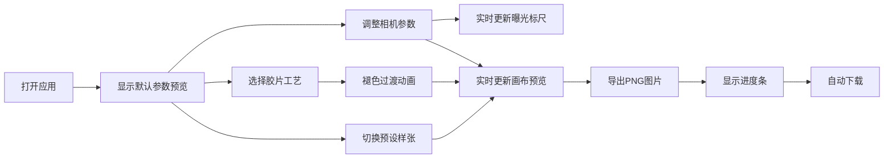

## 1. 产品概述

胶片相机模拟器是一款面向摄影爱好者的Web应用，用于直观理解光圈、快门、ISO组合对曝光和景深的影响，以及不同胶片冲洗工艺（C-41、E-6、黑白）对色彩和颗粒感的作用。通过实时预览和参数调整，帮助用户快速掌握摄影参数与胶片效果的关联。

- 核心问题：拍摄时难以直观理解参数组合对最终效果的影响，无法快速预览调整方案
- 目标用户：摄影爱好者、学生、胶片摄影初学者
- 产品价值：降低摄影参数学习门槛，提供即时可视化的胶片效果预览

## 2. 核心功能

### 2.1 用户角色
| 角色 | 注册方式 | 核心权限 |
|------|----------|----------|
| 访客用户 | 无需注册 | 使用全部模拟功能、导出图片 |

### 2.2 功能模块
1. **相机参数模拟**：光圈转盘、快门拨盘、ISO旋钮三个核心参数控制器
2. **曝光计算与提示**：EV值实时计算、曝光补偿标尺、过曝/欠曝警告
3. **胶片冲洗工艺选择**：C-41彩负、E-6反转片、黑白工艺三种预设
4. **照片预览与直方图**：实时画布预览、参数信息叠加、RGB直方图显示
5. **照片保存与分享**：导出PNG图片、参数水印、下载进度反馈

### 2.3 页面详情
| 页面名称 | 模块名称 | 功能描述 |
|----------|----------|----------|
| 主页 | 相机参数控制区 | 光圈f/1.4-f/22共8档，快门1/1000s-30s共12档，ISO 50-6400共7档，带阻尼动画和反馈 |
| 主页 | 曝光标尺 | -3至+3 EV标尺，#FFD600刻度，白色圆点指示，平滑移动，过曝/欠曝警告色 |
| 主页 | 胶片工艺选择 | C-41/E-6/黑白三种卡片式选项，选中边框高亮#FF8F00，0.5s褪色过渡 |
| 主页 | 预览画布 | 600x400px画布，4:3胶片边框，参数信息卡，RGB直方图，颗粒噪声效果 |
| 主页 | 导出功能 | 1200px宽PNG导出，参数水印，保存进度条，自动下载 |

## 3. 核心流程

用户打开应用 → 查看默认参数下的照片预览 → 调整光圈/快门/ISO参数 → 观察曝光标尺和预览变化 → 选择不同胶片工艺 → 对比色彩和颗粒效果 → 切换预设样张 → 满意后导出PNG图片

## 4. 用户界面设计

### 4.1 设计风格
- **主题色调**：暗色主题，背景#121212，主色暖橙#FF8F00，辅助色深灰#37474F
- **按钮风格**：圆角矩形，hover时scale(1.03)放大0.2s，点击时scale(0.97)压缩
- **字体**：无衬线字体，参数显示等宽字体风格
- **布局风格**：双栏布局（左400px控制区，右预览区），取景器内阴影效果
- **动效**：参数阻尼回弹、快门咔哒反馈、数值渐变过渡、胶片褪色、平滑移动

### 4.2 页面设计概览
| 页面名称 | 模块名称 | UI元素 |
|----------|----------|----------|
| 主页 | 左栏控制区 | 圆形转盘（带刻度）、工艺卡片（选中高亮#FF8F00）、导出按钮（带进度条） |
| 主页 | 右栏预览区 | 600x400画布（胶片边框#333、圆角8px、4:3比例）、参数信息卡（右上角#F5F5F5/12px）、直方图（右下角200x100px RGB三通道）、2px内阴影取景器效果 |
| 主页 | 曝光标尺 | 顶部横向标尺，#FFD600刻度，8px白色圆点指示，背景色随EV渐变 |

### 4.3 响应式设计
- 桌面端：双栏布局，左栏400px固定宽度，右栏自适应
- 平板/移动端（<900px）：左栏折叠为顶部工具栏，画布自动缩放适配屏幕宽度

### 4.4 性能指标
- 参数调节到预览更新延迟 ≤ 100ms
- 直方图计算和渲染 ≤ 50ms
- 导出PNG时间 ≤ 3秒
