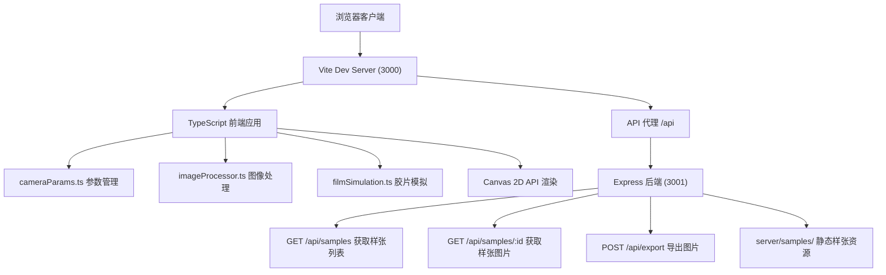

## 1. 架构设计



## 2. 技术描述

- **前端**：TypeScript (无框架) + Vite 构建 + Canvas 2D API
- **构建工具**：Vite 5.x，代理 /api 到后端 3001 端口
- **后端**：Express 4.x，提供静态样张资源和导出接口
- **图像处理**：纯 Canvas 2D + ImageData 像素级操作，无第三方图像处理库
- **严格模式**：TypeScript strict: true，target ES2020，module ESNext

## 3. 路由定义

| 路由 | 用途 |
|------|------|
| / | 主页，胶片相机模拟器应用 |

## 4. API 定义

### 4.1 获取样张列表
```typescript
// GET /api/samples
// Response:
interface SampleImage {
  id: string;
  name: string;
  url: string;
}

type SamplesResponse = SampleImage[];
```

### 4.2 获取样张图片
```
GET /api/samples/:id
// Response: image/png binary
```

### 4.3 导出图片
```typescript
// POST /api/export
// Request Body:
interface ExportRequest {
  imageData: string;  // base64 encoded PNG
  params: {
    aperture: string;
    shutter: string;
    iso: number;
    ev: number;
    film: string;
  };
}

// Response:
interface ExportResponse {
  success: boolean;
  downloadUrl: string;
  filename: string;
}
```

## 5. 数据模型

### 5.1 相机参数
```typescript
interface CameraParams {
  aperture: number;      // f值，如 1.4, 2.0, 2.8...
  apertureIndex: number; // 当前档位索引 0-7
  shutter: number;       // 快门速度秒数，如 0.001, 0.002...
  shutterIndex: number;  // 当前档位索引 0-11
  iso: number;           // ISO值，如 50, 100, 200...
  isoIndex: number;      // 当前档位索引 0-6
}
```

### 5.2 胶片工艺配置
```typescript
interface FilmProfile {
  id: 'c41' | 'e6' | 'bw';
  name: string;
  description: string;
  colorMatrix: number[][];   // 3x3 RGB色彩变换矩阵
  toneCurve: { r: number[]; g: number[]; b: number[] }; // 色调曲线 256点
  contrast: number;          // 对比度调整百分比
  saturation: number;        // 饱和度调整百分比
  grainIntensity: number;    // 颗粒强度 0-1
  grainSize: number;         // 颗粒大小
  sharpness: number;         // 锐度百分比
}
```

### 5.3 直方图数据
```typescript
interface HistogramData {
  r: Uint32Array;  // 红色通道 256 bins
  g: Uint32Array;  // 绿色通道 256 bins
  b: Uint32Array;  // 蓝色通道 256 bins
  l: Uint32Array;  // 亮度通道 256 bins
}
```

## 6. 项目文件结构

```
auto189/
├── .trae/documents/
│   ├── PRD-胶片相机模拟器.md
│   └── 技术架构-胶片相机模拟器.md
├── server/
│   ├── index.js          # Express后端入口
│   └── samples/          # 预设样张PNG图片 (4张)
│       ├── sample1.png
│       ├── sample2.png
│       ├── sample3.png
│       └── sample4.png
├── src/
│   ├── main.ts           # 应用入口，UI框架初始化
│   ├── cameraParams.ts   # 光圈/快门/ISO参数状态管理
│   ├── imageProcessor.ts # 曝光计算、色彩映射、颗粒叠加
│   └── filmSimulation.ts # 胶片工艺LUT和色彩矩阵
├── index.html            # 入口HTML
├── vite.config.js        # Vite构建配置
├── tsconfig.json         # TypeScript配置
└── package.json          # 项目依赖和脚本
```

## 7. 核心算法说明

### 7.1 EV值计算
```
EV = log2(aperture² / shutterTime) - log2(ISO / 100)
基准EV0定义为：ISO 100、f/1.0、1秒曝光
```

### 7.2 曝光补偿应用
对每个像素RGB值乘以曝光系数：`exposureFactor = 2^evDelta`

### 7.3 色彩矩阵变换
```
[R']   [m00 m01 m02] [R]
[G'] = [m10 m11 m12] [G]
[B']   [m20 m21 m22] [B]
```

### 7.4 颗粒生成算法
使用高斯噪声叠加，强度和颗粒大小根据胶片工艺调整，保证性能<100ms。

### 7.5 直方图计算
遍历ImageData的每个像素，统计RGB和亮度（L=0.299R+0.587G+0.114B）各256级的像素数量。
