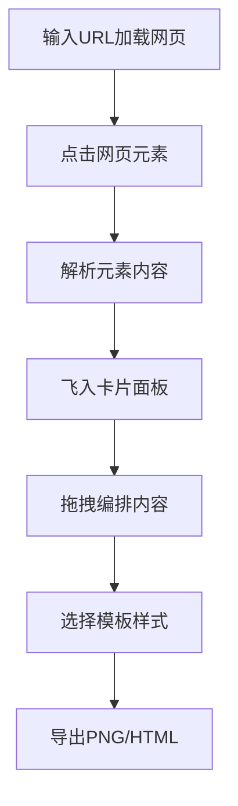

## 1. 产品概述

CardMaker 是一款面向在线教育讲师和内容创作者的网页内容摘录与卡片排版工具，支持用户在网页上快速摘录文本、代码块和图片，自动排版为精美的分享卡片。

- **核心价值**：解决手动截图拼接效率低的问题，一键生成风格统一的教学分享卡片
- **目标用户**：在线教育讲师、技术博主、内容创作者

## 2. 核心功能

### 2.1 功能模块

1. **网页预览区**：URL输入加载、元素交互选择、选中数量统计
2. **元素摘录**：点击摘录文本/代码/图片、高亮选中、飞入动画
3. **卡片编辑**：拖拽重排、内容编辑、删除操作、占位符显示
4. **模板系统**：3种预设布局（单列紧凑、双列均衡、大图居中）、平滑切换动画
5. **样式定制**：5种渐变背景、圆角滑块调节、实时预览
6. **导出功能**：PNG导出（可调整截取范围）、HTML导出（内联样式）

### 2.2 页面详情

| 页面名称 | 模块名称 | 功能描述 |
|-----------|-------------|---------------------|
| 主页面 | 预览区 | URL输入框、加载按钮、iframe预览、元素高亮、选中计数 |
| 主页面 | 编辑区 | 卡片缩略图、模板选择器、卡片编辑面板、块操作按钮 |
| 主页面 | 操作栏 | 背景渐变选择、圆角调节滑块、导出PNG/HTML按钮 |

## 3. 核心流程

用户在预览区输入网址并加载 → 点击网页中的文本/代码/图片元素 → 元素飞入右侧卡片面板 → 拖拽调整卡片内块的顺序 → 选择模板和样式 → 导出PNG或HTML文件。

## 4. 用户界面设计

### 4.1 设计风格

- **主色调**：深色背景 `#1a1a2e`，卡片渐变 `#667eea` → `#764ba2`
- **强调色**：暖橙 `#ff6b35`，文字浅色 `#e0e0e0`
- **阴影**：柔和多层阴影 `0 8px 32px rgba(0,0,0,0.3)`
- **圆角**：卡片圆角 8-32px 可调，默认 16px
- **字体**：展示字体使用 Plus Jakarta Sans，正文使用 Inter
- **布局**：左右分栏（40%/60%），可拖拽分割条，移动端上下叠放
- **动画**：元素飞入 0.4s 缓动，模板切换 0.5s 淡入淡出，背景渐变 2s 过渡

### 4.2 页面设计概述

| 页面名称 | 模块名称 | UI Elements |
|-----------|-------------|-------------|
| 主页面 | 预览区 | URL输入框（带加载按钮）、iframe容器、底部选中计数条、元素高亮边框 |
| 主页面 | 编辑区 | 卡片缩略图（4px内阴影）、模板选择器（3个选项）、编辑面板、块分割虚线 |
| 主页面 | 操作栏 | 背景渐变预设（5个色块）、圆角滑块（8-32px）、导出按钮组 |

### 4.3 响应式

- **桌面端**：左右分栏布局，预览区40%，编辑区60%，中间可拖拽分割
- **移动端**（<768px）：上下叠放，预览区和编辑区各占全宽，滚动浏览

### 4.4 交互细节

- **元素摘录**：鼠标悬停显示高亮边框，点击后元素播放飞入动画到卡片面板
- **拖拽重排**：拖拽时显示半透明占位符，块之间 2px 虚线分隔
- **编辑模式**：双击块进入编辑，边框变为虚线+暖橙色高亮
- **删除操作**：块删除时播放 0.3s 缩放消失动画
- **PNG导出**：卡片区域出现虚线截取框，可拖动调整范围
