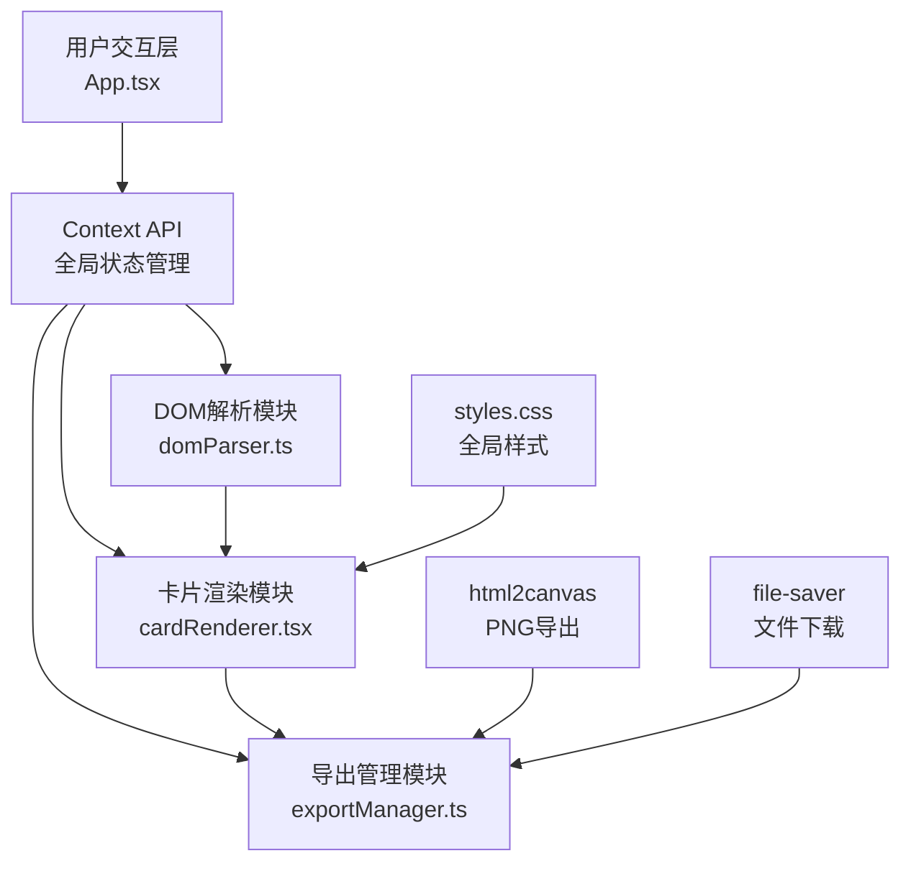

## 1. 架构设计



## 2. 技术描述

- **前端框架**：React 18 + TypeScript
- **构建工具**：Vite
- **状态管理**：React Context API
- **导出功能**：html2canvas + file-saver
- **拖拽实现**：原生 HTML5 Drag and Drop API
- **动画方案**：CSS Transitions + Keyframes
- **CSS方案**：原生CSS（不使用Tailwind，根据用户指定文件结构）

### 依赖说明
- react, react-dom：UI框架
- typescript：类型安全
- vite：构建开发服务器
- @vitejs/plugin-react：React插件
- html2canvas：DOM转Canvas
- file-saver：文件下载

## 3. 项目结构

```
e:\solo\VersionFastPro\tasks\auto19\
├── package.json
├── vite.config.js
├── tsconfig.json
├── index.html
└── src/
    ├── domParser.ts       # DOM解析模块
    ├── cardRenderer.tsx   # 卡片渲染组件
    ├── exportManager.ts   # 导出管理模块
    ├── App.tsx            # 主应用组件
    └── styles.css         # 全局样式
```

## 4. 数据模型

### 4.1 摘录块类型定义

```typescript
type BlockType = 'text' | 'code' | 'image';

interface ExtractBlock {
  id: string;
  type: BlockType;
  content: string;
  metadata?: {
    language?: string;      // 代码语言
    alt?: string;          // 图片alt
    src?: string;          // 图片src
    tagName?: string;      // 原始标签名
  };
  layout?: {
    heightRatio?: number;  // 高度比例
    widthRatio?: number;   // 宽度比例
  };
}

interface CardTemplate {
  id: string;
  name: string;
  layout: 'single' | 'double' | 'feature';
  // 'single' - 单列紧凑
  // 'double' - 双列均衡
  // 'feature' - 大图居中
}

interface CardStyle {
  gradientFrom: string;
  gradientTo: string;
  borderRadius: number;
}

interface AppState {
  blocks: ExtractBlock[];
  selectedElementIds: Set<string>;
  currentTemplate: CardTemplate;
  cardStyle: CardStyle;
  isExporting: boolean;
  exportCropRect: { x: number; y: number; width: number; height: number } | null;
}
```

## 5. 模块数据流

### 5.1 DOM解析流程
```
用户点击iframe元素 → 获取元素引用 → domParser.parse()
    → 识别类型(text/code/image) → 生成ExtractBlock
    → Context API更新状态 → cardRenderer接收数据渲染
```

### 5.2 卡片渲染流程
```
Context状态更新 → cardRenderer接收blocks数组
    → 根据currentTemplate布局 → 渲染卡片DOM
    → 监听拖拽事件 → 更新blocks顺序
    → 监听双击编辑 → 更新block.content
```

### 5.3 导出流程
```
用户点击导出按钮 → 获取卡片容器ref
    → 显示可调整截取框 → 用户确认
    → exportManager.exportPNG() 或 exportHTML()
    → html2canvas截图/序列化HTML → file-saver下载
```

## 6. 性能优化点

1. **DOM解析优化**：使用 `requestIdleCallback` 处理非紧急解析任务
2. **重渲染优化**：使用 `React.memo` 包裹卡片项组件
3. **拖拽性能**：使用 CSS `transform` 而非 `top/left` 实现拖拽动画
4. **动画优化**：使用 `will-change` 提示浏览器优化动画元素
5. **防抖处理**：URL输入和样式调节添加防抖
