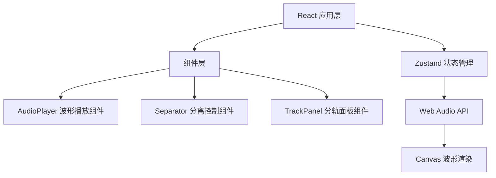

## 1. 架构设计



## 2. 技术描述

- **前端框架**：React 18 + TypeScript
- **构建工具**：Vite 5
- **状态管理**：Zustand
- **音频处理**：Web Audio API
- **波形渲染**：HTML5 Canvas
- **样式方案**：原生 CSS + CSS 变量

## 3. 文件结构

| 文件路径 | 用途 |
|----------|------|
| `package.json` | 项目依赖与脚本配置 |
| `vite.config.js` | Vite 构建配置，端口 3000 |
| `tsconfig.json` | TypeScript 严格模式配置 |
| `index.html` | 入口 HTML，标题「声轨分离器」 |
| `src/main.tsx` | 应用入口，渲染根组件 |
| `src/store.ts` | Zustand 状态管理 |
| `src/AudioPlayer.tsx` | 音频播放与波形渲染组件 |
| `src/Separator.tsx` | 分离控制组件 |
| `src/TrackPanel.tsx` | 分轨展示与下载面板 |
| `src/App.tsx` | 根组件整合 |
| `src/index.css` | 全局样式与主题变量 |

## 4. 状态管理 (Zustand)

### 4.1 Store 定义

```typescript
interface AudioState {
  // 音频文件元数据
  file: File | null;
  fileName: string;
  duration: number;
  
  // 分离进度
  separationProgress: number;
  isSeparating: boolean;
  isSeparated: boolean;
  
  // 波形数据
  originalWaveform: number[];
  vocalWaveform: number[];
  accompanimentWaveform: number[];
  
  // 音量状态
  vocalVolume: number;
  accompanimentVolume: number;
  
  // 质量评分
  qualityScore: number;
}
```

## 5. 核心组件说明

### 5.1 AudioPlayer 组件
- 管理 Web Audio 上下文
- Canvas 绘制波形（灰度线条）
- 支持拖拽缩放时间轴（0.4s ease-out 动画）
- 播放/暂停控制
- 播放进度指示

### 5.2 Separator 组件
- 文件上传（MP3，≤20MB）
- 分离按钮（渐变暖色）
- 圆形进度环（圆弧填充动画 2s/圈）
- 进度百分比文字
- 质量评分展示

### 5.3 TrackPanel 组件
- 人声/伴奏双轨道波形展示
- 独立音量滑块（0-100%）
- 独立播放控制
- 分别下载 MP3 文件

## 6. 性能优化策略

- Canvas 波形渲染使用 requestAnimationFrame
- 波形数据降采样，避免过多绘制点
- 离屏 Canvas 预渲染静态波形
- 节流处理缩放拖拽事件
- CSS transform 实现平滑动画

## 7. 响应式设计

- 桌面端：左右双栏布局
- 移动端（<768px）：竖向堆叠布局
- 波形图自适应容器宽度
- 触摸手势支持
