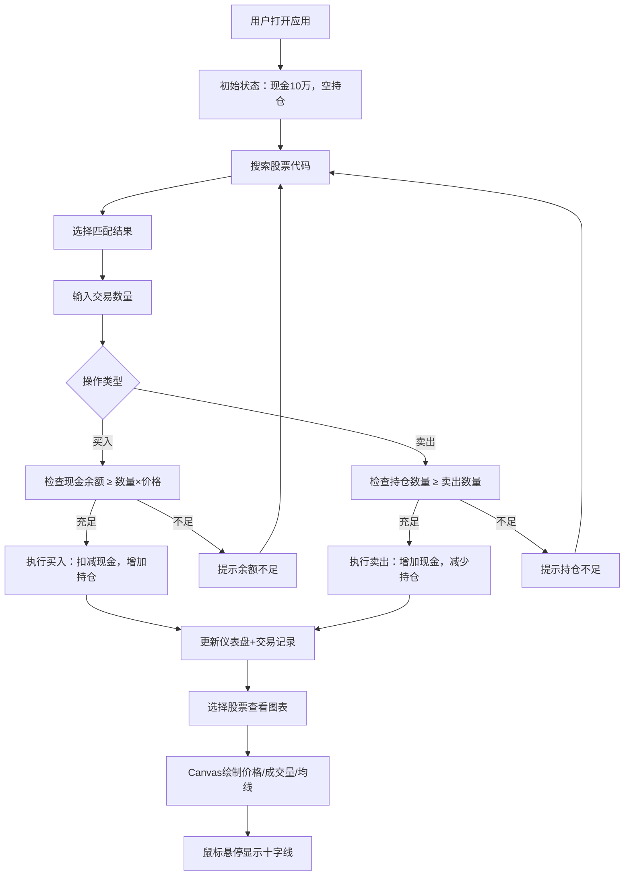

## 1. 产品概述

模拟股票投资组合应用，帮助个人投资者在真实交易前练习投资策略和风险管理。
- 主要解决新手投资者缺乏实操经验、不敢贸然进入真实市场的痛点
- 目标用户：对股票投资感兴趣的初学者、想验证投资策略的投资者
- 产品价值：零风险模拟真实交易环境，积累投资经验

## 2. 核心功能

### 2.1 用户角色
| 角色 | 注册方式 | 核心权限 |
|------|----------|----------|
| 普通用户 | 无需注册，直接使用 | 搜索股票、买卖交易、查看组合仪表盘、分析股票行情 |

### 2.2 功能模块
1. **模拟交易模块**：股票搜索、买入操作、卖出操作、交易记录
2. **投资组合仪表盘**：总资产概览、盈亏统计、持仓列表、交易历史展开
3. **股票行情图表**：30日价格走势、成交量、移动平均线、十字线交互

### 2.3 页面详情
| 页面名称 | 模块名称 | 功能描述 |
|----------|----------|----------|
| 主页面 | 搜索栏 | 输入股票代码（AAPL/TSLA等），实时过滤匹配结果，下拉选择 |
| 主页面 | 交易面板 | 选择股票后输入数量，点击买入/卖出按钮，检查余额/持仓充足性 |
| 主页面 | 资产概览卡片 | 展示总资产、当日盈亏金额和百分比，绿涨红跌高亮 |
| 主页面 | 持仓列表 | 每只股票代码、名称、持股数、平均成本、当前市值、盈亏百分比，点击行展开历史记录 |
| 主页面 | 行情图表区 | 右侧Canvas绘制30日K线/折线图、成交量柱、MA5/MA20，鼠标悬停十字线提示 |

## 3. 核心流程

用户打开应用 → 初始现金10万元 → 搜索股票代码 → 选择目标股票 → 输入数量 → 点击买入/卖出 → 系统校验（现金/持仓充足性）→ 更新现金余额和持仓 → 仪表盘实时刷新 → 选择持仓或搜索股票 → 右侧图表展示行情数据 → 鼠标悬停查看详细数据点

## 4. 用户界面设计

### 4.1 设计风格
- 主背景色：#1a1a2e（深邃夜色蓝紫）
- 次要背景色：#16213e（深海蓝）
- 卡片毛玻璃：backdrop-filter: blur(10px)，边框#ffffff22半透明白
- 买入按钮：#00c853 绿色渐变，悬停scale(1.05) + 0.2s弹性过渡
- 卖出按钮：#ff1744 红色渐变，悬停scale(1.05) + 0.2s弹性过渡
- 字体：使用 JetBrains Mono 作为数字字体，提升金融数据专业感；正文使用现代无衬线字体
- 图标风格：线性简约图标，与数字风格统一
- 盈亏色：盈利行底#00c85311淡绿，数值#00c853加粗；亏损行底#ff174411淡红，数值#ff1744加粗

### 4.2 页面设计概述
| 页面名称 | 模块名称 | UI元素 |
|----------|----------|--------|
| 主页面 | 顶部搜索交易区 | 毛玻璃卡片，圆角16px，搜索框深色内阴影，按钮渐变+悬停动画 |
| 主页面 | 资产概览区 | 三个统计卡片并排，总资产最大突出，盈亏卡片根据涨跌变色 |
| 主页面 | 持仓列表区 | 表格行斑马纹，盈利/亏损底色区分，点击展开交易记录带过渡动画 |
| 主页面 | 图表区域 | 右侧画布，坐标轴#ffffff33，折线渐变从#00bcd4到#ff4081，十字线跟随鼠标平滑移动 |

### 4.3 响应式设计
- 设计优先：桌面端（≥1024px）
- 平板端（768px-1023px）：图表宽度缩小，持仓列表两列布局
- 移动端（<768px）：图表区域折叠到页面底部，持仓列表全宽显示，搜索交易区垂直堆叠
- 触控优化：按钮最小尺寸44px，列表行高增加，长按替代悬停

### 4.4 性能指标
- 图表渲染：Canvas重绘≤16ms（60FPS），使用requestAnimationFrame优化
- 交易响应：点击后≤100ms完成状态更新和界面刷新
- 首屏加载：Vite冷启动≤2s，HMR实时更新
