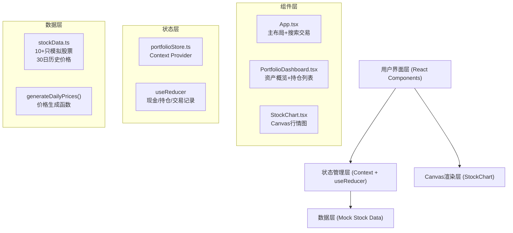

## 1. 架构设计



## 2. 技术描述
- **前端框架**：React 18 + TypeScript 5（严格模式）
- **构建工具**：Vite 5 + @vitejs/plugin-react
- **状态管理**：React Context + useReducer（无额外依赖）
- **图表渲染**：原生 Canvas 2D API（60FPS性能）
- **样式方案**：CSS-in-JS（styled-components风格内联 + <style>标签）+ CSS变量
- **唯一ID生成**：uuid
- **后端**：无，纯前端Mock数据
- **开发服务器端口**：3000

## 3. 路由定义
| 路由 | 用途 |
|------|------|
| / | 主应用页面（单页应用，无路由跳转） |

## 4. 数据模型

### 4.1 核心类型定义

```typescript
// 股票数据
interface Stock {
  code: string;          // 股票代码，如 'AAPL'
  name: string;          // 股票名称
  currentPrice: number;  // 当前价格
  change: number;        // 当日涨跌幅（百分比）
  priceHistory: DailyPrice[];  // 近30日历史价格
}

// 每日价格数据
interface DailyPrice {
  date: string;          // 'YYYY-MM-DD'
  open: number;
  high: number;
  low: number;
  close: number;
  volume: number;
}

// 持仓信息
interface Position {
  code: string;
  name: string;
  shares: number;        // 持股数量
  avgCost: number;       // 平均成本
}

// 交易记录
interface TradeRecord {
  id: string;
  code: string;
  name: string;
  type: 'buy' | 'sell';
  shares: number;
  price: number;
  amount: number;
  timestamp: number;
}

// 投资组合状态
interface PortfolioState {
  cash: number;          // 现金余额（初始100000）
  positions: Position[]; // 持仓列表
  trades: TradeRecord[]; // 交易记录
  searchQuery: string;   // 搜索关键词
  selectedStock: Stock | null;  // 当前选中股票
}
```

### 4.2 状态管理 Action 类型

```typescript
type PortfolioAction =
  | { type: 'SET_SEARCH_QUERY'; payload: string }
  | { type: 'SELECT_STOCK'; payload: Stock | null }
  | { type: 'BUY_STOCK'; payload: { stock: Stock; shares: number } }
  | { type: 'SELL_STOCK'; payload: { code: string; shares: number } };
```

## 5. 文件结构

```
auto23/
├── package.json
├── vite.config.js
├── tsconfig.json
├── index.html
└── src/
    ├── data/
    │   └── stockData.ts          # 模拟股票数据（12只）
    ├── store/
    │   └── portfolioStore.ts     # Context + useReducer 状态管理
    ├── components/
    │   ├── PortfolioDashboard.tsx  # 仪表盘组件
    │   └── StockChart.tsx          # Canvas图表组件
    ├── App.tsx                    # 主应用
    └── index.tsx                  # React入口
```

## 6. 性能优化策略

1. **Canvas渲染优化**：
   - 使用 requestAnimationFrame 驱动重绘
   - 离屏Canvas缓存静态元素（坐标轴、网格线）
   - 仅在数据变化或鼠标移动时重绘
   - 目标：单次渲染 ≤ 16ms

2. **React渲染优化**：
   - 使用 useMemo 缓存计算值（总资产、盈亏）
   - 使用 useCallback 缓存事件处理函数
   - 子组件拆分，避免不必要的重渲染

3. **交互响应优化**：
   - 交易操作使用同步reducer，100ms内完成UI更新
   - 搜索过滤使用防抖（100ms）
