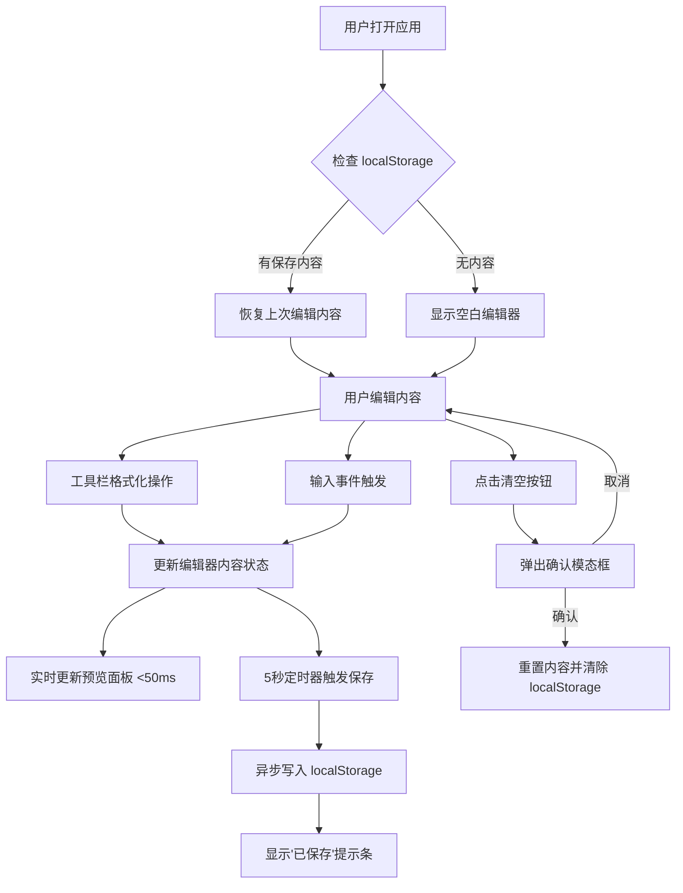

## 1. 产品概述

富文本编辑器应用，让用户能像在 Notion 或 Confluence 一样自由编辑富文本内容，并实时预览排版效果。

- 主要用途：提供所见即所得的文档编辑体验，支持多种文本格式化操作
- 目标用户：需要快速编写和格式化文档内容的普通用户、内容创作者
- 产品价值：低门槛的富文本编辑工具，实时预览让用户专注于内容创作而非排版

## 2. 核心功能

### 2.1 功能模块

1. **主编辑区**：富文本编辑器，基于 contentEditable 实现
2. **工具栏**：格式化按钮组（加粗、斜体、下划线、删除线、标题、列表、引用）
3. **预览面板**：并排实时预览，Markdown 风格样式
4. **状态栏**：字数统计、段落数、清空按钮
5. **自动保存**：localStorage 持久化，保存提示
6. **清空确认模态框**：二次确认清空操作

### 2.2 页面详情

| 页面名称 | 模块名称 | 功能描述 |
|---------|---------|---------|
| 主应用页面 | 工具栏 | 格式化按钮，状态高亮，悬停/按下效果 |
| 主应用页面 | 编辑器区域 | contentEditable 富文本输入，支持多种格式 |
| 主应用页面 | 预览面板 | 实时渲染 HTML 内容，Markdown 风格卡片 |
| 主应用页面 | 状态栏 | 字数、段落数统计，清空按钮 |
| 主应用页面 | 保存提示条 | 顶部淡入淡出的"已保存"提示 |
| 主应用页面 | 清空确认模态框 | 半透明背景，居中卡片，确认/取消按钮 |

## 3. 核心流程

## 4. 用户界面设计

### 4.1 设计风格

- 主色调：深蓝灰色 (#1e293b) 工具栏背景
- 强调色：亮蓝色 (#3b82f6) 按钮悬停态，深蓝色 (#1d4ed8) 按钮按下态
- 成功色：绿色 (#10b981) 用于已保存提示和列表圆点
- 危险色：红色 (#ef4444) 用于确认删除按钮
- 中性色：浅灰色背景 (#f8fafc)，白色编辑区 (#ffffff)，细边框 (#e5e7eb)
- 按钮风格：扁平风格，圆角过渡，0.2s 悬停动画
- 字体：系统无衬线字体，14px 正文，行高 1.6
- 布局：左右分栏桌面端，上下叠放移动端，顶部固定工具栏

### 4.2 页面设计概述

| 页面名称 | 模块名称 | UI 元素 |
|---------|---------|---------|
| 主应用 | 工具栏 | 48px 固定高度，#1e293b 背景，按钮 0.2s 过渡，悬停 #3b82f6，按下 #1d4ed8 |
| 主应用 | 编辑区 | 60% 宽度，白色背景，浅灰边框，16px 内边距，14px 字体，行高 1.6 |
| 主应用 | 预览区 | 40% 宽度，#f8fafc 背景，白色卡片带阴影 (0 1px 3px rgba(0,0,0,0.1))，20px 内边距 |
| 主应用 | 预览样式 | 标题带校色左边框，列表使用绿色圆点，整体 Markdown 风格视觉差异 |
| 主应用 | 状态栏 | 底部固定，字数/段落数统计，清空按钮 |
| 主应用 | 模态框 | 半透明黑色遮罩，居中白色卡片，红色确认/灰色取消按钮 |

### 4.3 响应式设计

- 桌面优先（>768px）：左右两栏布局，编辑器 60%，预览 40%
- 移动端（≤768px）：上下叠放，工具栏折叠为汉堡菜单，点击展开下拉列表
- 滚动同步：右侧预览滚动时左侧编辑区同步滚动，保持内容对齐

### 4.4 性能要求

- 预览更新延迟 < 50ms
- 帧率保持 ≥ 30fps，连续输入无卡顿闪烁
- localStorage 写入异步执行，不阻塞主线程
