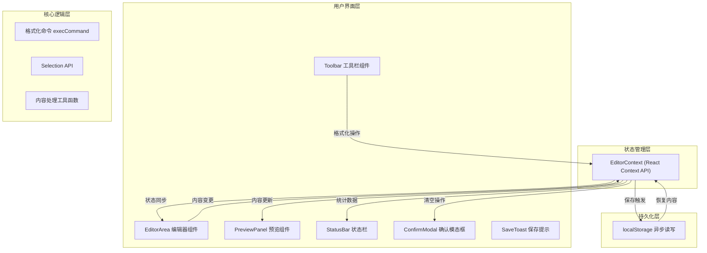

## 1. 架构设计



## 2. 技术描述

- 前端框架：React 18 + TypeScript
- 构建工具：Vite 5.x（端口 3000）
- 包管理：npm
- 状态管理：React Context API
- 富文本编辑：contentEditable + document.execCommand + Selection API
- 样式方案：原生 CSS（CSS Modules 可选）
- 持久化：浏览器 localStorage（异步写入）
- 依赖库：react、react-dom、typescript、vite、@vitejs/plugin-react、uuid

## 3. 目录结构

```
项目根目录/
├── index.html
├── package.json
├── vite.config.js
├── tsconfig.json
└── src/
    ├── main.tsx
    ├── App.tsx
    ├── components/
    │   ├── Toolbar.tsx
    │   ├── EditorArea.tsx
    │   ├── PreviewPanel.tsx
    │   ├── StatusBar.tsx
    │   ├── ConfirmModal.tsx
    │   └── SaveToast.tsx
    └── context/
        └── EditorContext.tsx
```

## 4. 模块职责与接口定义

### 4.1 EditorContext (context/EditorContext.tsx)

**职责**：统一管理编辑器内容状态、格式状态、保存逻辑、清空逻辑

**导出接口**：
```typescript
interface EditorContextType {
  content: string;                    // 编辑器 HTML 内容
  setContent: (content: string) => void;
  formatState: FormatState;           // 当前选中文本的格式状态
  updateFormatState: () => void;
  execFormat: (command: FormatCommand) => void;  // 执行格式化命令
  wordCount: number;                  // 字数统计
  paragraphCount: number;             // 段落数统计
  showConfirmModal: boolean;
  setShowConfirmModal: (show: boolean) => void;
  clearAll: () => void;               // 清空所有内容
  showSaveToast: boolean;
  lastSavedAt: number | null;
}

interface FormatState {
  bold: boolean;
  italic: boolean;
  underline: boolean;
  strikethrough: boolean;
  h1: boolean;
  h2: boolean;
  insertOrderedList: boolean;
  insertUnorderedList: boolean;
  formatBlock?: string;
}

type FormatCommand =
  | 'bold'
  | 'italic'
  | 'underline'
  | 'strikethrough'
  | 'h1'
  | 'h2'
  | 'insertOrderedList'
  | 'insertUnorderedList'
  | 'removeFormat';
```

### 4.2 Toolbar (components/Toolbar.tsx)

**Props**：无（通过 Context 获取）

**职责**：
- 渲染格式按钮组
- 按钮状态与 formatState 同步高亮
- 点击按钮调用 execFormat
- 响应式：≤768px 时折叠为汉堡菜单

### 4.3 EditorArea (components/EditorArea.tsx)

**Props**：无（通过 Context 获取）

**职责**：
- 使用 contentEditable div 实现富文本输入
- 监听 input、keyup、mouseup 事件同步内容
- 监听 selectionchange 更新 formatState
- 受控内容：将 Context 中的 content 同步回 DOM（防止光标跳转问题需要特殊处理）
- 与 PreviewPanel 实现滚动同步

### 4.4 PreviewPanel (components/PreviewPanel.tsx)

**Props**：无（通过 Context 获取 content）

**职责**：
- 使用 dangerouslySetInnerHTML 渲染编辑器内容
- 应用 Markdown 风格 CSS（标题左边框、绿色列表标记等）
- 与 EditorArea 实现双向滚动同步

### 4.5 App.tsx

**职责**：
- 三栏布局框架（左侧菜单占位、中央编辑器、右侧预览）
- 顶部工具栏、底部状态栏
- EditorContext.Provider 包裹
- 响应式布局样式

## 5. 性能优化策略

1. **内容更新防抖**：输入事件使用 requestAnimationFrame 合并，避免每秒 60+ 次重渲染
2. **异步 localStorage**：使用 setTimeout(0) 或 Promise.resolve().then() 推迟写入操作
3. **滚动同步节流**：使用 rAF 节流滚动事件处理，防止滚动抖动
4. **ContentEditable 优化**：仅在外部修改（如恢复、清空）时才设置 innerHTML，用户输入时避免重置 DOM
5. **样式隔离**：预览区使用 scoped CSS，避免影响编辑器样式
