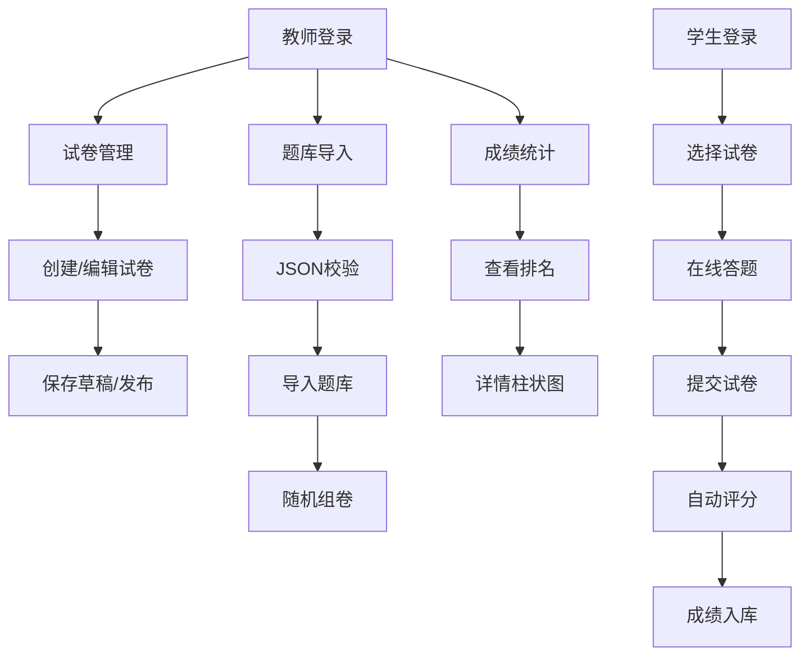

## 1. 产品概述

ExamForge在线考试系统是一款面向学校和教育机构的在线考试平台，旨在解决传统纸质考试阅卷慢、试卷管理繁琐、成绩统计耗时长的问题。通过数字化的方式实现试卷创建、题库管理、在线考试和自动评分的全流程闭环。

- **目标用户**：教师（试卷创建与管理、成绩统计）、学生（在线答题）
- **核心价值**：提升考试效率、减少人工阅卷工作量、即时生成成绩统计分析

## 2. 核心功能

### 2.1 用户角色

| 角色 | 登录方式 | 核心权限 |
|------|----------|----------|
| 教师 | 直接进入系统 | 创建/编辑/发布试卷、导入题库、查看成绩统计 |
| 学生 | 输入学号和姓名 | 选择试卷答题、查看个人成绩 |

### 2.2 功能模块

1. **试卷管理模块**：试卷列表、创建/编辑试卷、发布/草稿状态管理、题目编辑
2. **题库导入模块**：JSON格式题库导入、格式校验、随机组卷
3. **考试引擎模块**：学生登录、题目展示、倒计时、答题导航、自动评分
4. **成绩统计模块**：成绩列表排名、筛选功能、详情柱状图展示

### 2.3 页面详情

| 页面名称 | 模块名称 | 功能描述 |
|----------|----------|----------|
| 试卷管理页 | 试卷管理模块 | 展示试卷列表，支持创建、编辑、发布、删除试卷，每道题可设置题型、分值、正确答案 |
| 题库导入页 | 题库导入模块 | 粘贴JSON格式题目数据，校验格式，支持随机抽取题目生成试卷 |
| 考试中心页 | 考试引擎模块 | 学生输入信息后选择试卷答题，显示倒计时和答题进度导航 |
| 成绩统计页 | 成绩统计模块 | 展示所有学生成绩排名，支持筛选，点击查看详情柱状图 |

## 3. 核心流程

### 3.1 教师创建试卷流程

教师进入试卷管理页面 → 点击创建试卷 → 填写试卷标题和说明 → 添加题目（选择题型、设置分值和答案）→ 保存为草稿或直接发布 → 试卷列表展示

### 3.2 题库导入流程

教师进入题库导入页面 → 粘贴JSON格式题目数据 → 系统校验格式 → 校验成功则导入题库 → 可选择随机抽取题目生成新试卷（带洗牌动画）

### 3.3 学生考试流程

学生进入考试中心 → 输入学号和姓名 → 选择未完成的试卷 → 开始答题（倒计时、导航面板）→ 提交试卷 → 系统自动评分 → 显示成绩和正确率

### 3.4 成绩统计流程

教师进入成绩统计页面 → 查看成绩排名列表 → 按班级或试卷名称筛选 → 点击学生成绩行 → 弹出柱状图展示各题型得分情况

## 4. 用户界面设计

### 4.1 设计风格

- **主色调**：#1976D2（清爽蓝色）
- **背景色**：#F5F7FA（浅灰蓝背景）
- **按钮风格**：圆角矩形（border-radius: 8px），悬停时轻微上浮（transform: translateY(-2px)）
- **卡片风格**：柔和阴影（box-shadow: 0 2px 8px rgba(0,0,0,0.1)）
- **布局结构**：左右分栏（左侧30%导航，右侧70%内容），移动端上下堆叠
- **图标风格**：Material Design 风格（使用 lucide-react 图标库）
- **倒计时**：红色数字，每秒闪烁一次动画
- **状态标签**：已发布用绿色标签，草稿用灰色标签

### 4.2 页面设计概览

| 页面名称 | 模块名称 | UI元素 |
|----------|----------|--------|
| 试卷管理页 | 试卷管理模块 | 左侧导航菜单、试卷卡片列表、创建试卷表单、题目编辑器、状态标签 |
| 题库导入页 | 题库导入模块 | JSON文本输入框、校验结果提示、导入按钮、随机组卷按钮、洗牌动画 |
| 考试中心页 | 考试引擎模块 | 学生信息输入表单、试卷选择列表、答题界面（题目区+导航面板）、倒计时、提交按钮 |
| 成绩统计页 | 成绩统计模块 | 筛选栏、成绩排名表格、详情弹窗柱状图 |

### 4.3 响应式设计

- **设计策略**：桌面端优先，移动端自适应
- **断点设置**：768px以下转为上下堆叠布局
- **移动端优化**：导航菜单转为顶部横向菜单，内容区域全宽，触摸交互优化
- **平板适配**：保持分栏布局但调整比例

### 4.4 动画与交互

- **按钮悬停**：translateY(-2px) 上浮效果 + 阴影增强
- **洗牌动画**：0.5秒卡片翻转效果
- **倒计时闪烁**：每1秒闪烁一次
- **已答题目标记**：绿色圆点，未答灰色圆点
- **页面切换**：平滑过渡效果
