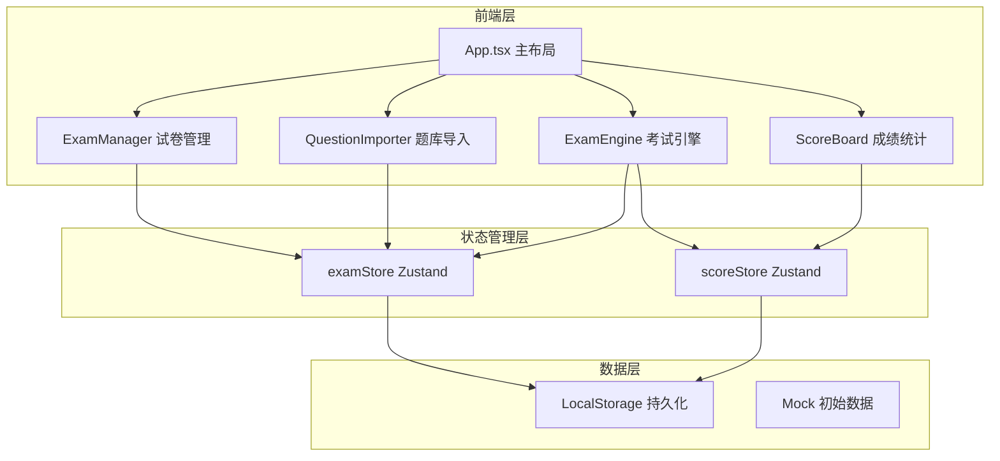

## 1. 架构设计



## 2. 技术描述

- **前端框架**：React 18 + TypeScript
- **构建工具**：Vite 5
- **状态管理**：Zustand 4
- **图表库**：Recharts 2
- **图标库**：Lucide React
- **唯一ID生成**：uuid
- **数据持久化**：LocalStorage
- **开发服务器端口**：3000

## 3. 路由定义

本项目采用单页应用 + 状态切换模式（非路由库），通过 Zustand 全局状态管理当前页面：

| 页面标识 | 路径/状态 | 用途 |
|----------|-----------|------|
| examManage | 'examManage' | 试卷管理页面 |
| questionImport | 'questionImport' | 题库导入页面 |
| examEngine | 'examEngine' | 考试中心页面 |
| scoreBoard | 'scoreBoard' | 成绩统计页面 |

## 4. 数据模型

### 4.1 数据模型定义

```mermaid
erDiagram
    EXAM ||--o{ QUESTION : contains
    EXAM ||--o{ EXAM_RESULT : has
    STUDENT ||--o{ EXAM_RESULT : takes
    QUESTION_BANK ||--o{ QUESTION : stores

    EXAM {
        string id PK
        string title
        string description
        string status "draft/published"
        number duration_minutes
        Question[] questions
        Date createdAt
        Date updatedAt
    }

    QUESTION {
        string id PK
        string type "single/multiple/truefalse"
        string question
        string[] options
        string|string[] answer
        number score
    }

    STUDENT {
        string studentId PK
        string name
    }

    EXAM_RESULT {
        string id PK
        string examId FK
        string studentId
        string studentName
        number totalScore
        number correctRate
        number duration_seconds
        object answers
        Date submittedAt
    }

    QUESTION_BANK {
        string id PK
        Question[] questions
    }
```

### 4.2 类型定义

```typescript
// 题目类型
type QuestionType = 'single' | 'multiple' | 'truefalse';

interface Question {
  id: string;
  type: QuestionType;
  question: string;
  options: string[];
  answer: string | string[];
  score: number;
}

// 试卷
interface Exam {
  id: string;
  title: string;
  description: string;
  status: 'draft' | 'published';
  duration: number; // 分钟
  questions: Question[];
  createdAt: number;
  updatedAt: number;
}

// 学生答案
interface StudentAnswers {
  [questionId: string]: string | string[];
}

// 考试结果
interface ExamResult {
  id: string;
  examId: string;
  studentId: string;
  studentName: string;
  totalScore: number;
  correctRate: number; // 百分比
  duration: number; // 秒
  answers: StudentAnswers;
  submittedAt: number;
}

// 考试状态
interface ExamState {
  currentExamId: string | null;
  currentQuestionIndex: number;
  answers: StudentAnswers;
  startTime: number | null;
  isSubmitted: boolean;
}
```

## 5. 目录结构

```
src/
├── main.tsx              # 入口文件
├── App.tsx               # 主应用组件
├── stores/
│   ├── examStore.ts      # 试卷状态管理
│   └── scoreStore.ts     # 成绩状态管理
├── modules/
│   ├── examManage/
│   │   ├── ExamManager.tsx
│   │   └── QuestionImporter.tsx
│   ├── examEngine/
│   │   └── ExamEngine.tsx
│   └── scoreBoard/
│       └── ScoreBoard.tsx
└── styles/
    └── index.css         # 全局样式
```

## 6. 核心模块说明

### 6.1 examStore (Zustand)

**职责**：管理试卷列表、题库、当前考试状态

**方法**：
- `createExam(title, description)` - 创建新试卷
- `updateExam(id, data)` - 更新试卷信息
- `deleteExam(id)` - 删除试卷
- `publishExam(id)` - 发布试卷
- `addQuestion(examId, question)` - 添加题目
- `updateQuestion(examId, questionId, data)` - 更新题目
- `deleteQuestion(examId, questionId)` - 删除题目
- `addQuestions(questions)` - 批量导入题目到题库
- `generateRandomExam(title, count)` - 从题库随机抽题生成试卷
- `startExam(examId)` - 开始考试
- `setAnswer(questionId, answer)` - 设置答案
- `submitExam(studentId, studentName)` - 提交试卷

### 6.2 scoreStore (Zustand)

**职责**：管理学生成绩列表

**方法**：
- `addScore(result)` - 添加成绩
- `getScores()` - 获取所有成绩
- `filterByExam(examId)` - 按试卷筛选
- `getScoreById(id)` - 获取单条成绩详情

### 6.3 ExamManager 组件

**功能**：试卷列表展示、创建/编辑表单、题目编辑器、状态切换

### 6.4 QuestionImporter 组件

**功能**：JSON文本输入、格式校验、错误提示定位、导入题库、随机组卷动画

### 6.5 ExamEngine 组件

**功能**：学生信息输入、试卷选择、答题界面、倒计时、答题导航面板、自动评分

### 6.6 ScoreBoard 组件

**功能**：成绩排名表格、筛选功能、详情弹窗柱状图（Recharts）
