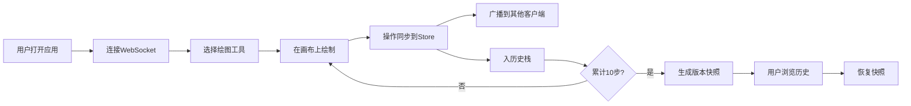

## 1. 产品概述
在线协作白板是一款支持多人实时协作的绘图工具，用户可以通过 WebSocket 连接在同一白板上绘制图形、添加文字便签，支持撤销/重做和版本历史回溯。
- 主要解决远程团队协作 brainstorm、教学辅导、设计评审等场景下的实时可视化沟通问题
- 目标是打造流畅、低延迟、高性能的多人协作白板体验

## 2. 核心功能

### 2.1 功能模块
1. **主画布页面**: 工具栏、无限画布、图层面板、版本历史侧边栏

### 2.2 页面详情
| 页面名称 | 模块名称 | 功能描述 |
|-----------|-------------|---------------------|
| 主画布页面 | 工具栏 | 圆形、矩形、自由线条、文字、选择、橡皮擦工具切换；选中时底部彩色指示条滑入动画 |
| 主画布页面 | Canvas 画布 | 无限缩放平移、浅灰色网格背景、图形绘制、平滑动画过渡、200个元素稳定45fps |
| 主画布页面 | 图层面板 | 可折叠、图层列表、长按拖拽排序（弹性阻尼动画）、锁定/隐藏/删除操作 |
| 主画布页面 | 版本历史 | 侧边栏、自动快照（每10步操作）、最多50步撤销重做、快照预览与恢复 |

## 3. 核心流程
用户打开应用 → 自动连接 WebSocket 服务端 → 选择绘图工具在画布上绘制 → 操作实时同步到所有客户端 → 操作入历史栈 → 每10步自动生成快照 → 用户可通过图层面板管理图层 → 用户可通过版本历史回溯任意快照

## 4. 用户界面设计

### 4.1 设计风格
- **主色调**: 深蓝色 (#0F172A / #1E3A5F) 作为背景基调，白色 (#FFFFFF / #F8FAFC) 作为画布与内容区
- **强调色**: 珊瑚橙 (#FF6B6B) 用于交互高亮、选中状态、动画指示条
- **辅助色**: 浅灰 (#E2E8F0) 用于网格线，中灰 (#94A3B8) 用于次要文字
- **按钮风格**: 圆角 8px，悬停时轻微上浮 + 阴影，选中时底部珊瑚橙指示条
- **字体**: 中文使用 PingFang SC / Microsoft YaHei，英文使用 SF Pro Display / Segoe UI，标题 16-18px semibold，正文 13-14px regular
- **布局风格**: 三栏式布局（左工具栏 + 中画布 + 右图层面板），桌面优先
- **图标风格**: 线性风格，使用 lucide-react 图标库

### 4.2 页面设计概述
| 页面名称 | 模块名称 | UI 元素 |
|-----------|-------------|-------------|
| 主画布页面 | 工具栏 | 垂直图标按钮组、选中态指示条动画、悬停浮层提示、深蓝背景 |
| 主画布页面 | Canvas 画布 | 浅灰网格（随缩放变化）、无限平移/缩放、图形绘制动画、居中缩放 |
| 主画布页面 | 图层面板 | 可折叠面板、图层卡片、拖拽排序弹性动画、锁定/隐藏/删除图标按钮 |
| 主画布页面 | 版本历史 | 侧边抽屉、快照列表、预览缩略图、恢复按钮、时间戳 |

### 4.3 响应式
- **桌面优先**设计（1024px 以上）：标准三栏布局
- **≤1024px**：工具栏自动收窄为顶部水平横条，图层面板改为可全屏弹出的抽屉
- **触摸优化**：拖拽目标区域不小于 44×44px，支持双指缩放画布
