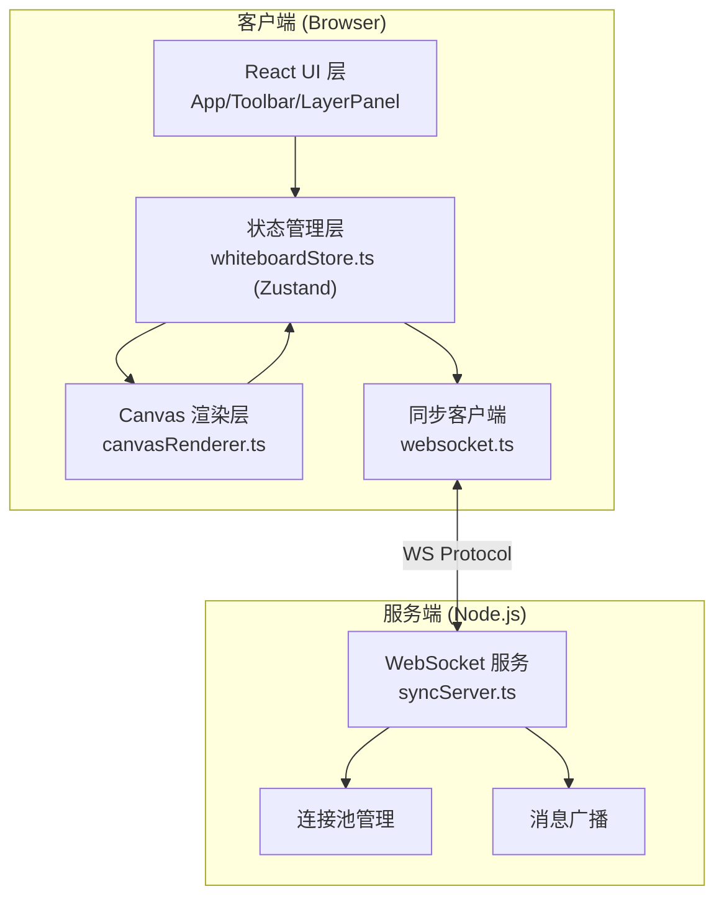

## 1. 架构设计


## 2. 技术说明
- **前端框架**: React@18 + TypeScript@5
- **构建工具**: Vite@5 + @vitejs/plugin-react
- **状态管理**: Zustand@4
- **渲染层**: HTML5 Canvas 2D API（高性能批量绘制）
- **实时通信**: ws@8（WebSocket 客户端+服务端）
- **唯一 ID**: uuid@9
- **图标**: lucide-react@latest
- **后端**: Node.js + ws（轻量 WebSocket 服务，随 Vite dev server 一起启动）

## 3. 模块文件结构
```
project-root/
├── package.json
├── vite.config.js
├── tsconfig.json
├── index.html
└── src/
    ├── modules/
    │   ├── sync/
    │   │   ├── websocket.ts        # 客户端 WebSocket 连接管理
    │   │   └── syncServer.ts       # 服务端 WebSocket 同步服务
    │   ├── store/
    │   │   └── whiteboardStore.ts  # Zustand 全局状态管理
    │   └── renderer/
    │       └── canvasRenderer.ts   # Canvas 渲染引擎
    └── components/
        ├── App.tsx                 # 主应用入口
        ├── Toolbar.tsx             # 工具栏组件
        └── LayerPanel.tsx          # 图层面板组件
```

## 4. 数据模型

### 4.1 基础类型定义
```typescript
// 图形元素类型
type ElementType = 'circle' | 'rectangle' | 'line' | 'text'

// 单个图形元素
interface BoardElement {
  id: string
  type: ElementType
  x: number
  y: number
  width: number
  height: number
  fill?: string
  stroke?: string
  strokeWidth: number
  text?: string
  fontSize?: number
  points?: { x: number; y: number }[] // 自由线条路径点
  visible: boolean
  locked: boolean
  createdAt: number
  updatedAt: number
}

// 历史操作
type HistoryAction = 
  | { type: 'ADD'; element: BoardElement }
  | { type: 'UPDATE'; id: string; prev: Partial<BoardElement>; next: Partial<BoardElement> }
  | { type: 'DELETE'; element: BoardElement }
  | { type: 'REORDER'; from: number; to: number }

// 版本快照
interface VersionSnapshot {
  id: string
  name: string
  timestamp: number
  elements: BoardElement[]
  layerOrder: string[]
}

// 同步消息
type SyncMessage =
  | { type: 'INIT'; elements: BoardElement[]; layerOrder: string[] }
  | { type: 'ACTION'; action: HistoryAction; senderId: string }
  | { type: 'CURSOR'; userId: string; x: number; y: number }
```

### 4.2 Store 状态结构
```typescript
interface WhiteboardState {
  // 数据层
  elements: Record<string, BoardElement>
  layerOrder: string[]
  
  // 工具层
  activeTool: ElementType | 'select' | 'eraser'
  selectedId: string | null
  
  // 视图层
  zoom: number
  panX: number
  panY: number
  
  // 历史层
  historyStack: HistoryAction[]
  historyIndex: number
  snapshots: VersionSnapshot[]
  operationsSinceSnapshot: number
}
```

## 5. 同步通信协议

### 5.1 消息类型
| 消息类型 | 方向 | 触发时机 | 负载 |
|---------|------|---------|------|
| `INIT` | Server → Client | 新客户端连接 | 当前全部 elements + layerOrder |
| `ACTION` | Client → Server → All Clients | 任意绘图操作 | HistoryAction + senderId |
| `CURSOR` | Client → Server → All Clients | 鼠标移动（节流 50ms） | userId + x/y |

### 5.2 延迟目标
- 端到端同步延迟 ≤ 200ms（目标），≤ 300ms（硬性指标）
- ACTION 消息采用 fire-and-forget，本地乐观更新后立即广播

## 6. 性能优化策略
1. **Canvas 批量渲染**: requestAnimationFrame 循环，脏区域标记局部重绘
2. **离屏缓存**: 静态元素缓存到 OffscreenCanvas，变动元素单独重绘
3. **WebSocket 消息节流**: 自由线条 points 批量发送（每 16ms 一次）
4. **Zustand 选择器订阅**: 渲染组件只订阅必要字段避免多余 re-render
5. **DOM 层最小化**: 仅工具栏/图层面板走 React，画布走纯 Canvas
