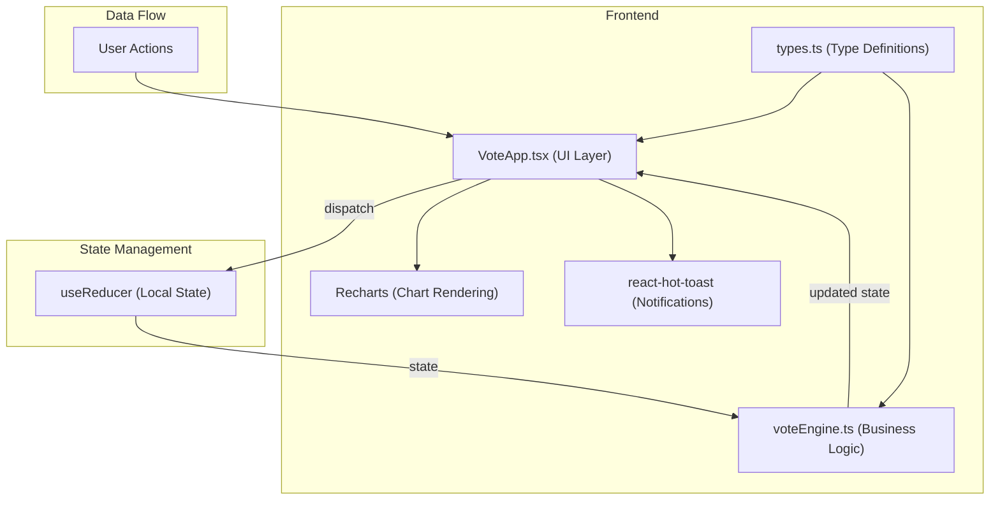
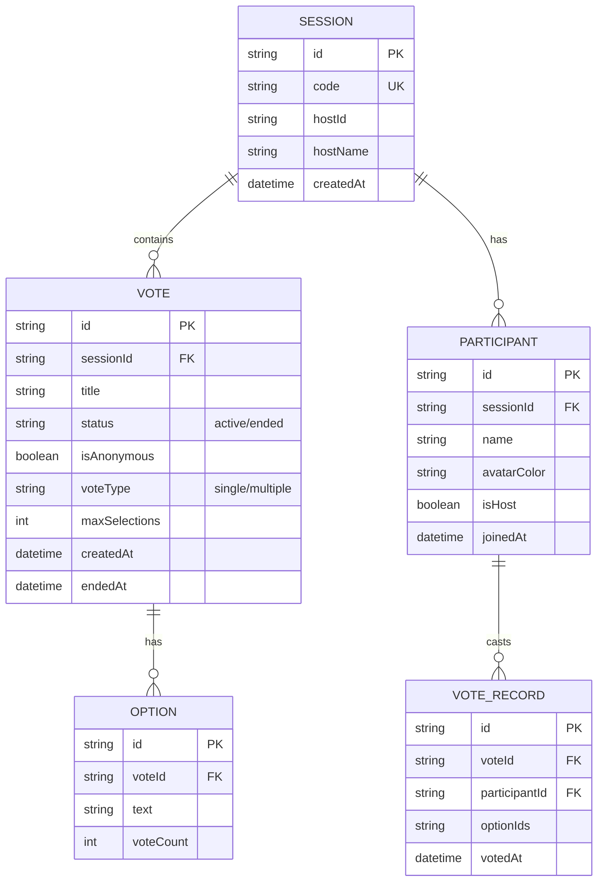

## 1. 架构设计



## 2. 技术描述

- **前端框架**: React 18 + TypeScript 5
- **构建工具**: Vite 5
- **图表库**: Recharts 2（柱状图、环形图）
- **通知库**: react-hot-toast 2
- **ID生成**: uuid 9
- **状态管理**: React useReducer（本地状态）
- **样式方案**: CSS-in-JS with inline styles + CSS animations
- **开发服务器端口**: 3000

## 3. 模块结构

| 文件 | 职责 |
|------|------|
| `src/types.ts` | 定义 Vote、Option、Session、Participant 等核心数据类型接口 |
| `src/voteEngine.ts` | 投票引擎纯函数模块：创建投票、校验选项、统计票数、管理投票状态 |
| `src/VoteApp.tsx` | 主应用组件：UI渲染、用户交互、状态管理（useReducer） |
| `src/main.tsx` | React应用入口，渲染根组件 |
| `index.html` | HTML入口页面 |

## 4. 核心数据模型

### 4.1 数据模型定义



### 4.2 TypeScript 类型定义

```typescript
interface Participant {
  id: string;
  name: string;
  isHost: boolean;
  avatarColor: string;
  votedVoteIds: string[];
  joinedAt: number;
}

interface Option {
  id: string;
  text: string;
  voteCount: number;
}

interface Vote {
  id: string;
  title: string;
  options: Option[];
  status: 'active' | 'ended';
  isAnonymous: boolean;
  voteType: 'single' | 'multiple';
  maxSelections: number;
  createdAt: number;
  endedAt?: number;
  voteRecords: VoteRecord[];
}

interface VoteRecord {
  participantId: string;
  participantName?: string;
  optionIds: string[];
  votedAt: number;
}

interface Session {
  id: string;
  code: string;
  hostId: string;
  participants: Participant[];
  votes: Vote[];
  currentVoteId?: string;
  createdAt: number;
}

interface AppState {
  currentUser: Participant | null;
  session: Session | null;
  isLoading: boolean;
  error: string | null;
}
```

## 5. 状态管理与数据流

### 5.1 useReducer Actions

```typescript
type Action =
  | { type: 'JOIN_SESSION_START' }
  | { type: 'JOIN_SESSION_SUCCESS'; payload: { session: Session; user: Participant } }
  | { type: 'JOIN_SESSION_ERROR'; payload: string }
  | { type: 'CREATE_VOTE'; payload: Vote }
  | { type: 'UPDATE_VOTE'; payload: Vote }
  | { type: 'END_VOTE'; payload: string }
  | { type: 'REACTIVATE_VOTE'; payload: string }
  | { type: 'CAST_VOTE'; payload: { voteId: string; optionIds: string[] } }
  | { type: 'ADD_PARTICIPANT'; payload: Participant }
  | { type: 'SET_CURRENT_VOTE'; payload: string };
```

### 5.2 Vote Engine 纯函数

```typescript
// 创建投票
function createVote(params: CreateVoteParams): Vote

// 校验选项
function validateOptions(options: string[]): ValidationResult

// 投票
function castVote(state: Session, voteId: string, participantId: string, optionIds: string[]): Session

// 统计票数
function calculateVoteCounts(vote: Vote): Option[]

// 结束投票
function endVote(vote: Vote): Vote

// 重新激活投票
function reactivateVote(vote: Vote): Vote

// 导出结果
function exportVoteResult(vote: Vote): ExportData
```

## 6. 性能优化策略

- **状态粒度**: 使用 useReducer 集中管理状态，避免不必要的重渲染
- **组件拆分**: 将图表、选项按钮、参与者列表拆分为独立组件，配合 React.memo
- **动画优化**: 使用 CSS transition 而非 JS 动画，利用 GPU 加速
- **图表性能**: Recharts 使用 isAnimationActive 控制动画，只在数据变化时重绘
- **投票更新**: 目标响应时间 < 200ms，图表过渡 < 300ms
- **点击响应**: 目标 < 100ms，避免同步阻塞操作

## 7. 模块依赖关系

```
main.tsx ──> VoteApp.tsx ──> types.ts
                        └──> voteEngine.ts
                                    └──> types.ts
```

- `types.ts`: 零依赖，定义所有核心接口
- `voteEngine.ts`: 仅依赖 types，纯函数实现，无副作用
- `VoteApp.tsx`: 依赖 types + voteEngine + React + 第三方库
- `main.tsx`: 依赖 VoteApp，负责挂载
