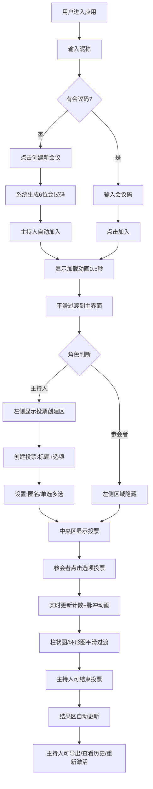

## 1. 产品概述

VoteNow 是一个在线会议投票与即时决策应用，让会议主持人快速创建投票，参会者通过输入会议码加入并实时投票，投票结果以动态柱状图和环形图实时更新展示。

- 主要解决会议中意见收集、决策效率低下的问题，提供即时、可视化的投票工具
- 目标用户为企业会议主持人、参会人员，教育场景下的教师和学生，以及任何需要快速群体决策的团队
- 产品价值在于提升会议决策效率，通过实时可视化结果让每位参与者看到意见分布，支持匿名投票保护隐私

## 2. 核心特性

### 2.1 用户角色

| 角色 | 注册方式 | 核心权限 |
|------|----------|----------|
| 主持人 | 输入昵称创建会议 | 创建投票、管理投票状态、设置匿名/多选模式、结束投票、导出结果、重新激活历史投票 |
| 参会者 | 输入昵称和会议码加入 | 投票、查看实时结果、查看在线参与者列表 |

### 2.2 功能模块

1. **会议入口模块**：昵称输入、会议码加入、创建新会议、加载动画
2. **投票创建模块**：标题输入、选项动态增删、匿名投票开关、单选/多选模式设置
3. **投票操作模块**：选项选择、取消选择、投票提交、投票状态反馈
4. **结果展示模块**：柱状图实时展示、环形图占比展示、票数脉冲动画、平滑过渡动画
5. **投票历史模块**：历史投票列表、状态显示、重新激活功能
6. **导出功能模块**：JSON格式导出、下载触发、成功提示
7. **参与者管理模块**：在线列表、头像展示、投票状态标识、主持人标识

### 2.3 页面详情

| 页面名称 | 模块名称 | 功能描述 |
|----------|----------|---------|
| 会议入口页 | 登录表单 | 昵称输入框、会议码输入框、加入按钮、创建新会议按钮、加载动画 |
| 投票主界面 | 左侧投票创建区 | 投票标题输入、选项列表、添加选项按钮、匿名投票开关、单选多选切换、创建投票按钮 |
| 投票主界面 | 中央投票展示区 | 当前投票标题、选项按钮组、柱状图结果、环形图结果、投票历史列表、导出按钮 |
| 投票主界面 | 右侧参与者列表 | 在线参与者头像列表、昵称显示、投票状态环、主持人皇冠标识 |

## 3. 核心流程

用户进入应用后，输入昵称和会议码点击加入，或点击创建新会议自动生成会议码。加入成功后进入投票主界面。主持人在左侧创建投票，设置标题、选项、匿名模式和投票类型。创建后中央区域显示投票，参会者点击选项进行投票，结果实时以柱状图和环形图更新。主持人可结束投票、查看历史、重新激活或导出结果。右侧实时显示在线参与者及投票状态。

## 4. 用户界面设计

### 4.1 设计风格

- **主色调**：靛蓝 #4f46e5，紫色 #7c3aed
- **背景色**：深色 #1e1b4b，卡片 #312e81
- **文本色**：主白 #f8fafc，次要 #cbd5e1
- **按钮风格**：圆角12px卡片式，默认背景#4338ca，悬停#6366f1上移2px，点击缩放0.95
- **字体**：使用现代无衬线字体，标题粗体，正文常规
- **布局**：三栏结构，左侧创建区、中央展示区（最大800px居中）、右侧参与者列表
- **图标风格**：简洁线性图标，使用lucide-react

### 4.2 页面设计概述

| 页面名称 | 模块名称 | UI元素 |
|----------|----------|--------|
| 会议入口页 | 登录表单 | 深色背景、居中卡片、渐入动画、旋转加载器、按钮hover效果 |
| 投票主界面 | 左侧创建区 | 表单卡片、输入框、动态选项列表、淡入动画、开关控件、创建按钮 |
| 投票主界面 | 中央展示区 | 投票标题、选项按钮（高亮填充动画）、图表容器（半透明圆角16px）、柱状图（主色高亮最高票）、环形图（中央总人数）、历史列表 |
| 投票主界面 | 右侧参与者列表 | 圆形头像（昵称首字母、哈希颜色）、缩放进入动画、投票状态环（绿/灰）、主持人皇冠、最多16个头像 |

### 4.3 响应式

- **桌面优先**设计，宽度小于768px时触发响应式
- 移动端：左侧和右侧折叠，顶部固定工具栏，右侧可滑动抽屉式侧边栏
- 触摸优化：按钮最小尺寸48px，点击区域扩大
- 图表自适应容器宽度

### 4.4 动效设计

- 页面切换：透明度0.3秒平滑过渡
- 加入会议：旋转加载动画0.5秒
- 选项添加：淡入0.2秒
- 按钮选中：填充动画0.1秒从浅到深
- 票数更新：脉冲放大1.05倍再恢复
- 图表更新：柱状图高度0.3秒缓动，环形图扇形渐变展开
- 参与者加入：缩放动画0.3秒从0到1
- 按钮悬停：背景变亮+上移2px
- 按钮点击：缩放0.95
