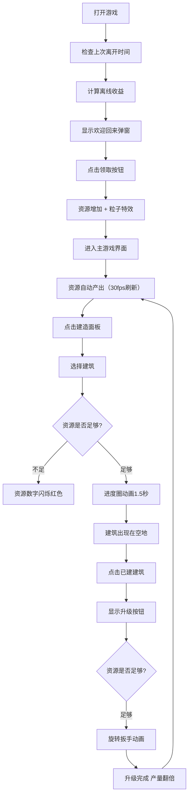

## 1. 产品概述
像素风格放置类模拟经营游戏，玩家在小岛上建设生产建筑，资源随时间自动产出，支持手动收取与建筑升级，包含离线收益机制。

- 核心玩法：建造生产建筑 → 自动产出资源 → 升级建筑提升效率 → 解锁更多建筑
- 目标用户：喜欢放置类、经营类游戏的休闲玩家
- 产品价值：提供轻松解压的游戏体验，碎片时间即可游玩

## 2. 核心功能

### 2.1 用户角色
| 角色 | 注册方式 | 核心权限 |
|------|----------|----------|
| 玩家 | 无需注册，本地存储 | 建造建筑、升级建筑、收取资源、领取离线收益 |

### 2.2 功能模块
1. **资源状态栏**：显示金币、木头、石头当前数量及每秒产量，资源不足时闪烁提示
2. **建造面板**：左侧弹出式面板，展示6种可建造建筑及其消耗资源
3. **岛屿主区域**：网格布局展示已建造建筑，支持点击升级
4. **离线收益弹窗**：欢迎回来弹窗，展示离线收益，支持领取并播放特效
5. **升级系统**：建筑可升级，每级产量翻倍，消耗递增

### 2.3 页面详情
| 页面名称 | 模块名称 | 功能描述 |
|---------|----------|----------|
| 主游戏页面 | 资源状态栏 | 半透明深色底色配金色边框，等宽字体带发光效果显示资源数量和产量 |
| 主游戏页面 | 建造面板 | 左侧滑出，显示建筑图标、名称、所需资源，点击可建造 |
| 主游戏页面 | 岛屿网格 | 淡绿色高亮空地，建筑间保持10px间距，响应式网格布局 |
| 主游戏页面 | 建筑交互 | 点击已建建筑显示升级按钮，升级时显示旋转扳手动画 |
| 弹窗 | 离线收益 | 羊皮纸纹理背景，滚动数字动画显示收益，金币洒落粒子特效 |

## 3. 核心流程

玩家打开游戏 → 检查离线时间 → 计算并展示离线收益弹窗 → 玩家领取收益 → 进入主界面 → 资源自动产出 → 点击建造面板选择建筑 → 资源充足则在空地建造（进度圈动画）→ 点击建筑可升级（扳手动画）→ 产量提升 → 循环

## 4. 界面设计

### 4.1 设计风格
- **主色调**：土黄色 #C4A882
- **边框文字色**：深棕色 #5C4033
- **高亮金色**：#FFD700
- **资源发光色**：金币-绿色、木头-蓝色、石头-橙色
- **按钮样式**：圆角8px，阴影2px偏移，悬停放大1.05倍阴影加深，点击缩小0.95倍+波纹扩散动画
- **字体**：资源数字使用等宽字体，整体使用像素风格字体

### 4.2 页面设计概览
| 页面名称 | 模块名称 | UI元素 |
|---------|----------|--------|
| 主游戏页面 | 资源状态栏 | 半透明深色背景、金色边框、等宽数字、发光效果、闪烁动画 |
| 主游戏页面 | 建造面板 | 左侧滑入动画、建筑像素图标、资源列表、圆角卡片、悬停效果 |
| 主游戏页面 | 岛屿网格 | 淡绿色高亮空地、建筑像素图标、升级按钮、扳手旋转动画、进度圈 |
| 弹窗 | 离线收益 | 羊皮纸纹理背景、滚动数字动画、金币洒落粒子特效、领取按钮 |

### 4.3 响应式设计
- **桌面端（≥1280px）**：三列网格布局
- **平板端（768px-1280px）**：两列网格布局
- **移动端（<768px）**：单列铺满布局
- 建筑间始终保持至少10px间距

### 4.4 动画与交互
- 建造进度圈：1.5秒缓慢填满动画
- 升级扳手：旋转动画
- 资源不足：红色闪烁动画
- 按钮交互：悬停缩放、点击波纹
- 离线收益：数字滚动动画、金币粒子洒落
- 建造面板：左侧滑入/滑出动画

## 5. 性能要求
- 资源产量更新频率 ≤ 30次/秒，避免过度渲染
- 使用 requestAnimationFrame 或 setInterval 控制刷新频率
- 本地存储使用 localStorage，读写操作优化
