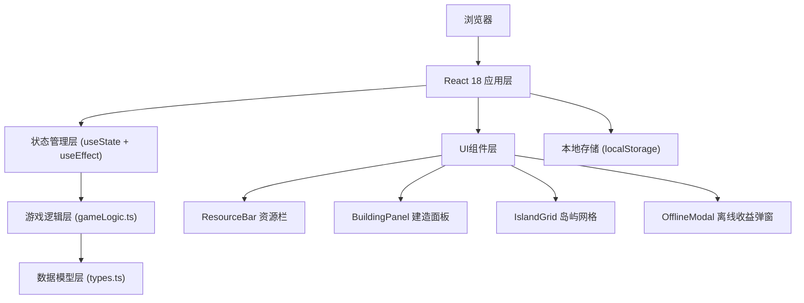
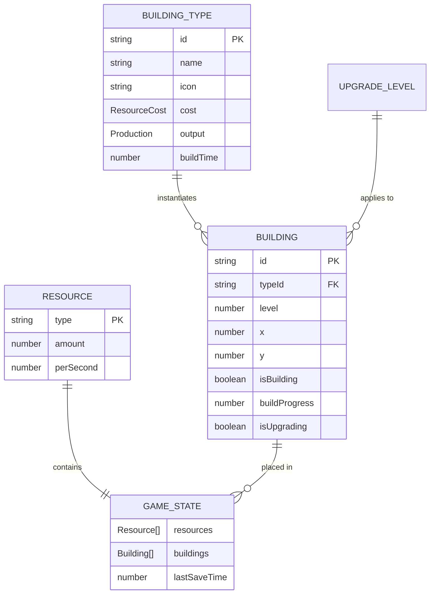

## 1. 架构设计



## 2. 技术描述

- **前端框架**：React 18 + TypeScript 5
- **构建工具**：Vite 5
- **状态管理**：React Hooks (useState, useEffect, useCallback)
- **唯一ID生成**：uuid
- **样式方案**：原生 CSS + CSS 变量 + CSS 动画
- **数据持久化**：localStorage
- **动画方案**：CSS Animations + Transitions + requestAnimationFrame

**依赖清单**：
- react: ^18.2.0
- react-dom: ^18.2.0
- typescript: ^5.0.0
- vite: ^5.0.0
- @vitejs/plugin-react: ^4.2.0
- uuid: ^9.0.0
- @types/uuid: ^9.0.0

## 3. 路由定义

| 路由 | 用途 |
|------|------|
| / | 主游戏页面（单页应用，无路由跳转） |

## 4. 数据模型

### 4.1 实体关系图



### 4.2 类型定义 (types.ts)

```typescript
// 资源类型
export type ResourceType = 'gold' | 'wood' | 'stone';

// 资源数据
export interface Resource {
  type: ResourceType;
  amount: number;
  perSecond: number;
  color: string;
  glowColor: string;
  icon: string;
  name: string;
}

// 资源消耗
export interface ResourceCost {
  gold?: number;
  wood?: number;
  stone?: number;
}

// 建筑产出配置
export interface Production {
  produces?: Partial<Record<ResourceType, number>>;
  consumes?: Partial<Record<ResourceType, number>>;
  interval?: number; // 生产周期（秒）
}

// 建筑类型定义
export interface BuildingType {
  id: string;
  name: string;
  icon: string;
  description: string;
  baseCost: ResourceCost;
  baseProduction: Production;
  buildTime: number; // 建造时间（秒）
}

// 已建造的建筑实例
export interface Building {
  id: string;
  typeId: string;
  level: number;
  x: number;
  y: number;
  isBuilding: boolean;
  buildProgress: number; // 0-1
  isUpgrading: boolean;
  upgradeProgress: number; // 0-1
  lastProductionTime: number;
}

// 游戏状态
export interface GameState {
  resources: Record<ResourceType, Resource>;
  buildings: Building[];
  lastSaveTime: number;
  totalPlayTime: number;
}

// 离线收益
export interface OfflineEarnings {
  duration: number; // 离线时长（秒）
  earnings: Record<ResourceType, number>;
}
```

### 4.3 常量数据 (types.ts)

```typescript
// 初始资源配置
export const INITIAL_RESOURCES: Record<ResourceType, Resource> = {
  gold: { type: 'gold', amount: 100, perSecond: 0, color: '#FFD700', glowColor: '#90EE90', icon: '💰', name: '金币' },
  wood: { type: 'wood', amount: 50, perSecond: 0, color: '#8B4513', glowColor: '#87CEEB', icon: '🪵', name: '木头' },
  stone: { type: 'stone', amount: 30, perSecond: 0, color: '#808080', glowColor: '#FFA500', icon: '🪨', name: '石头' },
};

// 建筑类型配置
export const BUILDING_TYPES: BuildingType[] = [
  {
    id: 'farm',
    name: '农田',
    icon: '🌾',
    description: '种植作物，稳定产出金币',
    baseCost: { gold: 50, wood: 20 },
    baseProduction: { produces: { gold: 2 } },
    buildTime: 1.5,
  },
  {
    id: 'mine',
    name: '矿场',
    icon: '⛏️',
    description: '开采矿石，产出石头',
    baseCost: { gold: 80, wood: 30 },
    baseProduction: { produces: { stone: 1 } },
    buildTime: 1.5,
  },
  {
    id: 'workshop',
    name: '工坊',
    icon: '🏭',
    description: '加工材料，消耗木头石头产出金币',
    baseCost: { gold: 150, wood: 50, stone: 30 },
    baseProduction: { produces: { gold: 5 }, consumes: { wood: 1, stone: 1 }, interval: 3 },
    buildTime: 1.5,
  },
  {
    id: 'lumbermill',
    name: '伐木场',
    icon: '🪓',
    description: '砍伐树木，产出木头',
    baseCost: { gold: 60, stone: 15 },
    baseProduction: { produces: { wood: 1 } },
    buildTime: 1.5,
  },
  {
    id: 'warehouse',
    name: '仓库',
    icon: '🏪',
    description: '提升所有建筑产量10%',
    baseCost: { gold: 200, wood: 80, stone: 50 },
    baseProduction: { produces: {} },
    buildTime: 1.5,
  },
  {
    id: 'watchtower',
    name: '哨塔',
    icon: '🗼',
    description: '提供视野，提升离线收益20%',
    baseCost: { gold: 300, wood: 100, stone: 80 },
    baseProduction: { produces: {} },
    buildTime: 1.5,
  },
];

// 升级成本倍率
export const UPGRADE_COST_MULTIPLIER = 1.5;
// 升级产量倍率
export const UPGRADE_PRODUCTION_MULTIPLIER = 2;
// 仓库产量加成
export const WAREHOUSE_BONUS = 0.1;
// 哨塔离线收益加成
export const WATCHTOWER_OFFLINE_BONUS = 0.2;
// 最大离线时间（小时）
export const MAX_OFFLINE_HOURS = 8;
// 资源刷新频率（每秒次数）
export const TICK_RATE = 30;
// 网格大小
export const GRID_SIZE = 12;
// 单元格大小
export const CELL_SIZE = 80;
```

## 5. 核心模块功能

### 5.1 gameLogic.ts 核心功能

| 函数名 | 功能描述 | 参数 | 返回值 |
|--------|----------|------|--------|
| `calculateProduction` | 计算所有建筑的每秒产量 | `buildings: Building[]` | `Record<ResourceType, number>` |
| `canAfford` | 检查资源是否足够 | `resources: GameState['resources'], cost: ResourceCost` | `boolean` |
| `deductCost` | 扣除建造/升级资源 | `resources: GameState['resources'], cost: ResourceCost` | `GameState['resources']` |
| `buildBuilding` | 创建新建筑实例 | `typeId: string, x: number, y: number` | `Building` |
| `getUpgradeCost` | 获取升级所需资源 | `building: Building` | `ResourceCost` |
| `upgradeBuilding` | 升级建筑 | `building: Building` | `Building` |
| `calculateOfflineEarnings` | 计算离线收益 | `state: GameState, offlineSeconds: number` | `OfflineEarnings` |
| `tick` | 游戏主循环，更新资源 | `state: GameState, deltaTime: number` | `GameState` |
| `findEmptySpot` | 找到随机空地 | `buildings: Building[]` | `{x: number, y: number} \| null` |
| `saveGame` | 保存游戏到本地 | `state: GameState` | `void` |
| `loadGame` | 从本地加载游戏 | `void` | `GameState \| null` |

## 6. 文件结构

```
e:\solo\VersionFastPro\tasks\auto37\
├── package.json
├── vite.config.js
├── tsconfig.json
├── index.html
├── src/
│   ├── types.ts          # 类型定义和常量数据
│   ├── gameLogic.ts      # 游戏核心逻辑
│   ├── App.tsx           # 主组件
│   ├── index.css         # 全局样式
│   ├── main.tsx          # 入口文件
│   └── components/
│       ├── ResourceBar.tsx      # 资源状态栏
│       ├── BuildingPanel.tsx    # 建造面板
│       ├── BuildingCard.tsx     # 建筑卡片
│       ├── IslandGrid.tsx       # 岛屿网格
│       ├── BuildingTile.tsx     # 建筑格子
│       └── OfflineModal.tsx     # 离线收益弹窗
```

## 7. 性能优化策略

1. **资源刷新节流**：使用 `setInterval` 控制刷新频率为 30fps，避免过度重渲染
2. **状态分离**：将游戏逻辑与 UI 渲染分离，减少不必要的组件重渲染
3. **React.memo**：对无状态展示组件使用 `React.memo` 优化
4. **useCallback**：回调函数使用 `useCallback` 缓存
5. **局部更新**：使用状态更新的函数形式，避免依赖整个状态对象
6. **requestAnimationFrame**：动画使用 RAF 确保流畅
7. **localStorage 防抖**：保存操作防抖处理，避免频繁写入

## 8. CSS 变量定义

```css
:root {
  --color-primary: #C4A882;
  --color-secondary: #5C4033;
  --color-accent: #FFD700;
  --color-bg: #F5E6D3;
  --color-gold: #FFD700;
  --color-wood: #8B4513;
  --color-stone: #808080;
  --glow-gold: #90EE90;
  --glow-wood: #87CEEB;
  --glow-stone: #FFA500;
  --radius: 8px;
  --shadow-sm: 2px 2px 4px rgba(0, 0, 0, 0.2);
  --shadow-lg: 4px 4px 8px rgba(0, 0, 0, 0.3);
  --spacing-building: 10px;
}
```
