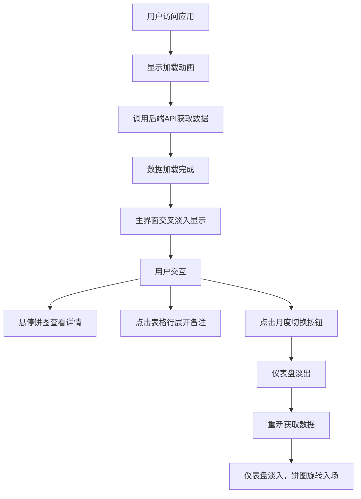

## 1. 产品概述

家庭账单管理仪表盘是一款帮助家庭成员快速添加、分类和可视化当月家庭支出数据的应用。通过直观的图表和表格展示，让用户清晰了解家庭消费情况，实现智能财务管理。

- 核心目标：提供简洁高效的家庭支出数据可视化和管理工具
- 目标用户：家庭成员、家庭财务管理者
- 市场价值：填补家庭日常消费管理的轻量化工具需求，无需复杂记账流程即可掌握消费动态

## 2. 核心功能

### 2.1 用户角色

| 角色 | 注册方式 | 核心权限 |
|------|----------|----------|
| 家庭成员 | 无需注册，本地使用 | 查看、切换月度数据，浏览消费详情 |

### 2.2 功能模块

1. **数据加载模块**：渐变色旋转加载动画，数据交叉淡入显示
2. **顶部摘要栏**：当月总消费、最大单笔开销分类、记录总数
3. **月度切换模块**：上月/下月按钮，支持参数化查询
4. **分类饼图模块**：Canvas绘制交互式饼图，悬停高亮和动画过渡
5. **开销表格模块**：按日期降序展示，支持行展开详情动画

### 2.3 页面详情

| 页面名称 | 模块名称 | 功能描述 |
|----------|----------|----------|
| 首页仪表盘 | 数据加载 | 2秒渐变色旋转加载动画，0.5秒交叉淡入主界面 |
| 首页仪表盘 | 月度切换 | 上月/下月按钮，当前月禁用下月，切换时0.4秒淡入淡出过渡 |
| 首页仪表盘 | 摘要卡片 | 三项核心数据卡片，逐个入场动画（stagger 0.2s），hover上移阴影加深 |
| 首页仪表盘 | 分类饼图 | Canvas绘制，15px悬停弹出，半透明圆角tooltip，180度旋转入场动画 |
| 首页仪表盘 | 开销表格 | 斑马纹表格，45px行高，行展开0-80px过渡动画，深蓝灰色表头 |

## 3. 核心流程

用户访问应用后，系统首先展示加载动画，同时从后端获取分类和开销数据。数据加载完成后，主界面交叉淡入显示，包含顶部摘要栏、月度切换按钮、分类饼图和开销表格。用户可点击月度按钮切换不同月份数据，切换过程仪表盘淡出再淡入，数据更新后饼图重新绘制并播放旋转入场动画。用户可悬停饼图查看详情，点击表格行展开备注信息。

## 4. 用户界面设计

### 4.1 设计风格

- 主色调：#4A90D9（按钮、强调元素）
- 辅助色：#50E3C2、#F5A623、#7B68EE、#FF6B6B、#95E1D3（饼图扇区）
- 背景色：#F0F2F5（整体）、#F9F9F9（表格斑马纹）、#FFFFFF（卡片、表格交替行）
- 表头色：#2C3E50（深蓝灰色）
- 按钮样式：主色调填充，圆角，hover变暗#3A7BC8并缩小1px
- 字体：系统无衬线字体，保持简洁现代感
- 布局风格：卡片式布局，最大宽度1200px居中，左右2%边距
- 图标：使用lucide-react图标库

### 4.2 页面设计概述

| 页面名称 | 模块名称 | UI元素 |
|----------|----------|----------|
| 首页仪表盘 | 加载动画 | 渐变色圆环，2秒旋转循环，居中显示 |
| 首页仪表盘 | 摘要栏 | 水平排列三张卡片，间距20px，8px圆角，浅阴影，hover上移2px阴影加深，数据从左到右逐个入场（stagger 0.2s） |
| 首页仪表盘 | 月度切换 | 两个按钮水平排列，当前月禁用下月按钮，主色调填充 |
| 首页仪表盘 | 饼图区域 | 占40%宽度，Canvas绘制，悬停扇区弹出15px，tooltip半透明圆角0.2s淡入 |
| 首页仪表盘 | 表格区域 | 占60%宽度，表头深蓝灰色白字加粗，斑马纹交替，45px行高，行展开0.3s ease-out过渡 |

### 4.3 响应式设计

- 桌面端（>768px）：饼图左40%，表格右60%，摘要卡片水平排列
- 移动端（≤768px）：饼图和表格垂直堆叠，饼图占满宽度，摘要卡片换行显示
- 触控优化：按钮最小高度44px，表格行触控区域足够大

### 4.4 动画设计

- 加载动画：渐变色圆环旋转，2秒循环
- 页面入场：交叉淡入0.5秒
- 卡片入场：从左到右逐个出现，stagger 0.2s
- 月度切换：仪表盘0.4秒淡出再0.4秒淡入
- 饼图入场：扇区绕中心旋转180度，0.5秒
- 饼图悬停：扇区向外弹出15px，tooltip 0.2s淡入
- 表格展开：高度从0到80px，0.3s ease-out
- 按钮交互：hover缩小1px，背景变暗
- 卡片交互：hover上移2px，阴影加深

## 5. 性能要求

- 饼图Canvas绘制帧率≥30FPS（含动画期间）
- 表格行展开动画流畅无明显掉帧
- 前后端响应时间≤300ms（本地环境）
- 动画使用CSS transform和opacity实现硬件加速
