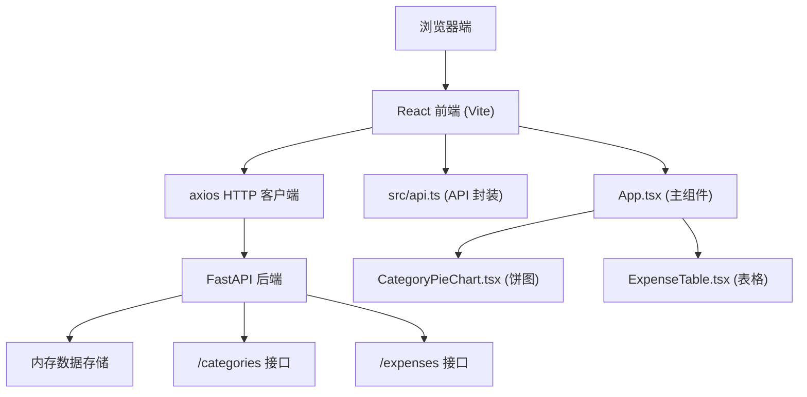
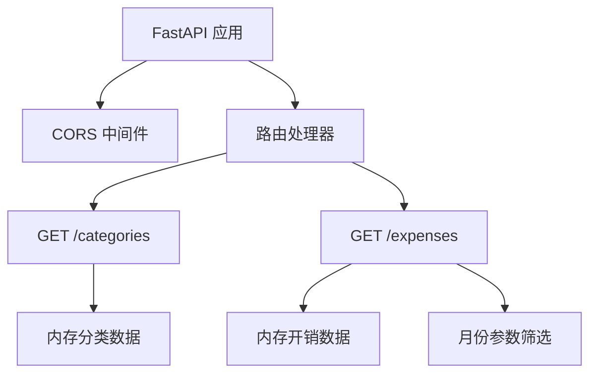

## 1. 架构设计

本项目采用前后端分离架构，前端使用 React + TypeScript + Vite 构建用户界面，后端使用 FastAPI 提供 RESTful API 服务，数据存储在内存中。



## 2. 技术选型

- **前端框架**: React 18 + TypeScript 5
- **构建工具**: Vite 5
- **HTTP 客户端**: axios
- **图标库**: lucide-react
- **后端框架**: FastAPI (Python)
- **ASGI 服务器**: uvicorn
- **数据存储**: 内存存储（模拟数据）

## 3. 项目结构

```
auto4/
├── package.json                 # 前端依赖和脚本
├── requirements.txt             # 后端依赖
├── vite.config.js               # Vite 配置
├── tsconfig.json                # TypeScript 配置
├── index.html                   # 入口 HTML
├── backend/
│   └── main.py                  # FastAPI 后端服务
└── src/
    ├── App.tsx                  # 主组件
    ├── api.ts                   # API 调用封装
    ├── CategoryPieChart.tsx     # 分类饼图组件
    └── ExpenseTable.tsx         # 开销表格组件
```

## 4. API 定义

### 4.1 TypeScript 类型定义

```typescript
interface Category {
  id: string;
  name: string;
  color: string;
}

interface Expense {
  id: string;
  date: string;
  categoryId: string;
  amount: number;
  note: string;
  description?: string;
}
```

### 4.2 接口定义

#### GET /categories

返回所有支出分类列表。

**响应**:
```json
[
  { "id": "1", "name": "餐饮", "color": "#4A90D9" },
  { "id": "2", "name": "交通", "color": "#50E3C2" },
  { "id": "3", "name": "购物", "color": "#F5A623" }
]
```

#### GET /expenses?month=YYYY-MM

返回指定月份的开销数据，按月参数筛选。

**请求参数**:
- `month` (可选): 格式为 YYYY-MM，默认为当前月

**响应**:
```json
[
  {
    "id": "1",
    "date": "2026-06-15",
    "categoryId": "1",
    "amount": 128.50,
    "note": "家庭聚餐",
    "description": "周末全家外出就餐，包括午餐和下午茶"
  }
]
```

## 5. 前端核心模块

### 5.1 src/api.ts

封装 axios 调用，提供两个函数：

```typescript
export const fetchCategories = (): Promise<Category[]> => {
  return axios.get('/api/categories').then(res => res.data);
};

export const fetchExpenses = (month: string): Promise<Expense[]> => {
  return axios.get(`/api/expenses?month=${month}`).then(res => res.data);
};
```

### 5.2 src/App.tsx

主组件，负责：
- 数据获取和加载状态管理
- 月度切换逻辑
- 顶部摘要栏计算和渲染
- 整体布局和动画控制
- 子组件数据传递

### 5.3 src/CategoryPieChart.tsx

饼图组件，使用 Canvas 绘制：
- 接收 categories 和 expenses 数组
- 按分类汇总金额
- 绘制带渐变色的扇区
- 鼠标悬停交互（扇区弹出、tooltip）
- 旋转入场动画
- 60FPS 动画循环

### 5.4 src/ExpenseTable.tsx

表格组件：
- 按日期降序渲染
- 斑马纹样式
- 行展开动画（高度 0 → 80px）
- 分类标签彩色显示
- 响应式宽度

## 6. 后端实现

### 6.1 backend/main.py

FastAPI 应用，包含：
- CORS 中间件配置（允许前端访问）
- 内存数据存储（分类和开销模拟数据）
- /categories 端点：返回分类列表
- /expenses 端点：支持 month 参数筛选，返回开销数据
- 数据生成逻辑，为不同月份生成模拟数据

### 6.2 服务器架构



## 7. 动画实现方案

### 7.1 CSS 动画

- 加载动画：`@keyframes spin` 旋转 + 渐变色边框
- 页面淡入淡出：`transition: opacity 0.5s ease`
- 卡片入场：`animation: fadeInUp 0.5s ease forwards` + `animation-delay`
- 按钮悬停：`transform: scale(0.99)` + 背景色过渡
- 卡片悬停：`transform: translateY(-2px)` + 阴影过渡
- 表格展开：`transition: max-height 0.3s ease-out`

### 7.2 Canvas 动画

- 使用 `requestAnimationFrame` 实现 60FPS 循环
- 饼图入场：扇区起始角度从 0 → 目标角度 + 180度旋转偏移
- 悬停弹出：扇区中心偏移量平滑过渡到 15px
- 使用 easeOutCubic 缓动函数实现自然动画

## 8. 性能优化

- Canvas 绘制仅在数据变化或动画进行时重绘
- 使用 CSS transform 和 opacity 实现硬件加速动画
- 表格使用虚拟滚动（如数据量大），当前数据量小直接渲染
- axios 请求使用 baseURL 配置，便于维护
- 组件使用 React.memo 避免不必要重渲染
- 月度切换时取消未完成的请求

## 9. 开发和运行

### 9.1 启动命令

**后端**:
```bash
cd backend
uvicorn main:app --reload
```

**前端**:
```bash
npm install
npm run dev
```

### 9.2 开发代理

Vite 配置代理，将 `/api/*` 请求转发到 `http://localhost:8000`，避免跨域问题。
