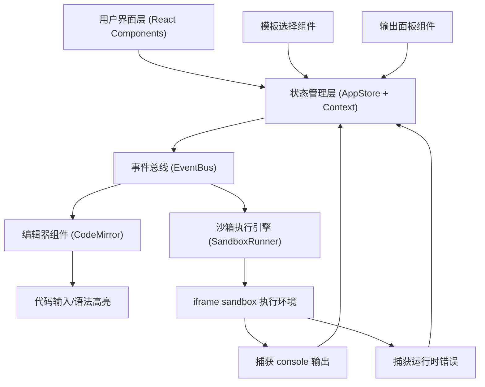

## 1. 架构设计



## 2. 技术描述

- **前端框架**：React 18 + TypeScript
- **构建工具**：Vite 5.x
- **代码编辑器**：CodeMirror 6.x + @codemirror/lang-javascript + @codemirror/theme-one-dark
- **状态管理**：React Context + 自定义事件总线（EventBus）
- **沙箱技术**：HTML5 iframe sandbox 属性 + srcdoc 注入
- **唯一标识**：uuid
- **包管理器**：npm

## 3. 文件结构与职责

```
src/
├── main.tsx                    # 应用入口，挂载App组件
├── App.tsx                     # 主应用组件，布局管理，拖拽分隔线
├── index.css                   # 全局样式，主题变量，响应式布局
├── types/
│   └── index.ts                # 全局TypeScript类型定义
├── editor/
│   └── CodeEditor.tsx          # 代码编辑器组件（CodeMirror封装）
├── runner/
│   └── SandboxRunner.ts        # 沙箱执行引擎（iframe管理）
├── store/
│   ├── AppStore.ts             # 全局状态管理
│   └── EventBus.ts             # 事件总线模块
├── components/
│   ├── OutputPanel.tsx         # 控制台输出面板
│   ├── TemplateSelector.tsx    # 模板选择下拉菜单
│   └── Toolbar.tsx             # 顶部工具栏
└── utils/
    └── templates.ts            # 代码模板定义
```

### 模块调用关系与数据流向

1. **src/store/AppStore.ts** ↔ **Context Provider**
   - 提供全局状态：当前模板、用户代码、运行状态、输出日志
   - 提供方法：设置代码、设置模板、执行代码、添加日志、清空日志

2. **src/editor/CodeEditor.tsx** → **AppStore**
   - 数据流向：用户输入 → onChange → AppStore.setCode()

3. **src/runner/SandboxRunner.ts** ↔ **AppStore**
   - 数据流向：AppStore.code → SandboxRunner.execute() → iframe执行 → 捕获输出 → AppStore.addLog()

4. **src/components/TemplateSelector.tsx** → **AppStore**
   - 数据流向：用户选择模板 → AppStore.setTemplate() → 触发代码更新 → CodeEditor更新

5. **src/components/OutputPanel.tsx** ← **AppStore**
   - 数据流向：AppStore.logs → OutputPanel渲染

## 4. 数据模型

### 4.1 核心类型定义

```typescript
// 运行状态枚举
export type RunStatus = 'idle' | 'running' | 'completed' | 'error';

// 编辑器主题
export type EditorTheme = 'light' | 'dark';

// 代码模板类型
export interface CodeTemplate {
  id: string;
  name: string;
  language: string;
  defaultCode: string;
}

// 日志条目
export interface LogEntry {
  id: string;
  type: 'log' | 'error' | 'warn' | 'info';
  content: string;
  timestamp: Date;
  lineNumber?: number;
}

// 全局状态
export interface AppState {
  currentTemplate: string;
  code: string;
  status: RunStatus;
  logs: LogEntry[];
  theme: EditorTheme;
  templates: CodeTemplate[];
}
```

### 4.2 预定义代码模板

```typescript
export const TEMPLATES: CodeTemplate[] = [
  {
    id: 'html-css-js',
    name: 'HTML+CSS+JS',
    language: 'html',
    defaultCode: `<!DOCTYPE html>
<html>
<head>
  <style>
    .color-btn {
      padding: 12px 24px;
      font-size: 16px;
      border: none;
      border-radius: 8px;
      color: white;
      cursor: pointer;
      background: linear-gradient(135deg, #667eea 0%, #764ba2 100%);
      transition: transform 0.2s, box-shadow 0.2s;
    }
    .color-btn:hover {
      transform: translateY(-2px);
      box-shadow: 0 8px 20px rgba(102, 126, 234, 0.4);
    }
  </style>
</head>
<body>
  <button class="color-btn" onclick="handleClick()">点击我</button>
  <script>
    function handleClick() {
      const colors = ['#ff6b6b', '#4ecdc4', '#45b7d1', '#96ceb4', '#ffeaa7'];
      const randomColor = colors[Math.floor(Math.random() * colors.length)];
      document.querySelector('.color-btn').style.background = randomColor;
      console.log('按钮被点击！新颜色:', randomColor);
    }
  <\/script>
</body>
</html>`
  },
  {
    id: 'pure-js',
    name: 'PureJS',
    language: 'javascript',
    defaultCode: `// 纯JavaScript示例
function fibonacci(n) {
  if (n <= 1) return n;
  return fibonacci(n - 1) + fibonacci(n - 2);
}

console.log('斐波那契数列前10项:');
for (let i = 0; i < 10; i++) {
  console.log('F(' + i + ') = ' + fibonacci(i));
}

// 测试错误处理
try {
  const obj = null;
  console.log(obj.property);
} catch (e) {
  console.error('捕获到错误:', e.message);
}`
  },
  {
    id: 'react-jsx',
    name: 'React+JSX',
    language: 'javascript',
    defaultCode: `// React+JSX 示例（通过Babel转译模拟）
const { useState } = React;

function Counter() {
  const [count, setCount] = useState(0);
  
  return React.createElement('div', { style: { textAlign: 'center', padding: '20px' } },
    React.createElement('h2', null, '计数器: ' + count),
    React.createElement('button', {
      style: {
        padding: '10px 20px',
        fontSize: '16px',
        margin: '5px',
        background: '#28a745',
        color: 'white',
        border: 'none',
        borderRadius: '4px',
        cursor: 'pointer'
      },
      onClick: () => {
        setCount(count + 1);
        console.log('计数增加到:', count + 1);
      }
    }, '增加'),
    React.createElement('button', {
      style: {
        padding: '10px 20px',
        fontSize: '16px',
        margin: '5px',
        background: '#dc3545',
        color: 'white',
        border: 'none',
        borderRadius: '4px',
        cursor: 'pointer'
      },
      onClick: () => {
        setCount(count - 1);
        console.log('计数减少到:', count - 1);
      }
    }, '减少')
  );
}

ReactDOM.render(
  React.createElement(Counter),
  document.getElementById('root')
);`
  }
];
```

## 5. 事件总线设计

```typescript
// src/store/EventBus.ts
export class EventBus {
  private listeners: Map<string, Set<Function>> = new Map();

  on(event: string, callback: Function): () => void {
    if (!this.listeners.has(event)) {
      this.listeners.set(event, new Set());
    }
    this.listeners.get(event)!.add(callback);
    return () => this.off(event, callback);
  }

  off(event: string, callback: Function): void {
    this.listeners.get(event)?.delete(callback);
  }

  emit(event: string, ...args: any[]): void {
    this.listeners.get(event)?.forEach(callback => callback(...args));
  }
}

export const eventBus = new EventBus();

// 事件类型
export const EVENTS = {
  CODE_CHANGED: 'code:changed',
  TEMPLATE_CHANGED: 'template:changed',
  RUN_STARTED: 'run:started',
  RUN_COMPLETED: 'run:completed',
  RUN_ERROR: 'run:error',
  LOG_ADDED: 'log:added',
  LOGS_CLEARED: 'logs:cleared',
  THEME_CHANGED: 'theme:changed'
} as const;
```

## 6. 沙箱执行引擎核心逻辑

```typescript
// src/runner/SandboxRunner.ts
export class SandboxRunner {
  private iframe: HTMLIFrameElement | null = null;
  private messageHandler: ((e: MessageEvent) => void) | null = null;

  createSandbox(container: HTMLElement): HTMLIFrameElement {
    this.iframe = document.createElement('iframe');
    this.iframe.setAttribute('sandbox', 'allow-scripts allow-modals');
    this.iframe.setAttribute('referrerpolicy', 'no-referrer');
    this.iframe.style.cssText = `
      width: 100%;
      height: 100%;
      border: none;
      background: white;
    `;
    
    this.setupMessageListener();
    container.appendChild(this.iframe);
    return this.iframe;
  }

  private setupMessageListener(): void {
    this.messageHandler = (e: MessageEvent) => {
      if (e.source === this.iframe?.contentWindow) {
        const { type, data } = e.data;
        eventBus.emit(`sandbox:${type}`, data);
      }
    };
    window.addEventListener('message', this.messageHandler);
  }

  execute(code: string, templateId: string): void {
    if (!this.iframe) return;

    const wrappedCode = this.wrapCode(code, templateId);
    this.iframe.srcdoc = wrappedCode;
  }

  private wrapCode(code: string, templateId: string): string {
    // 根据模板类型包装代码，注入console劫持
    const consoleHijack = `
      <script>
        (function() {
          const originalConsole = {
            log: console.log,
            error: console.error,
            warn: console.warn,
            info: console.info
          };
          
          function sendToParent(type, args) {
            const content = Array.from(args).map(arg => 
              typeof arg === 'object' ? JSON.stringify(arg, null, 2) : String(arg)
            ).join(' ');
            window.parent.postMessage({
              type: type,
              data: { content, timestamp: Date.now() }
            }, '*');
          }
          
          console.log = function(...args) {
            originalConsole.log.apply(console, args);
            sendToParent('log', args);
          };
          
          console.error = function(...args) {
            originalConsole.error.apply(console, args);
            sendToParent('error', args);
          };
          
          window.onerror = function(message, source, lineno, colno, error) {
            sendToParent('error', [message + ' (行号: ' + lineno + ')']);
            return true;
          };
        })();
      <\/script>
    `;

    if (templateId === 'html-css-js') {
      return code.replace('<head>', '<head>' + consoleHijack);
    } else if (templateId === 'pure-js') {
      return `
        <!DOCTYPE html>
        <html>
        <head>
          <meta charset="UTF-8">
          <title>PureJS Output</title>
          <style>body { font-family: monospace; padding: 20px; background: white; }</style>
          ${consoleHijack}
        </head>
        <body>
          <div id="output"></div>
          <script>${code}<\/script>
        </body>
        </html>
      `;
    } else if (templateId === 'react-jsx') {
      return `
        <!DOCTYPE html>
        <html>
        <head>
          <meta charset="UTF-8">
          <title>React Output</title>
          <script src="https://unpkg.com/react@18/umd/react.development.js"><\/script>
          <script src="https://unpkg.com/react-dom@18/umd/react-dom.development.js"><\/script>
          <script src="https://unpkg.com/@babel/standalone/babel.min.js"><\/script>
          <style>body { font-family: system-ui; padding: 20px; background: white; }</style>
          ${consoleHijack}
        </head>
        <body>
          <div id="root"></div>
          <script type="text/babel">${code}<\/script>
        </body>
        </html>
      `;
    }
    return code;
  }

  destroy(): void {
    if (this.messageHandler) {
      window.removeEventListener('message', this.messageHandler);
    }
    if (this.iframe?.parentNode) {
      this.iframe.parentNode.removeChild(this.iframe);
    }
    this.iframe = null;
  }
}
```

## 7. 性能优化策略

1. **编辑器性能**：
   - 使用CodeMirror 6的虚拟滚动机制
   - 代码变更防抖处理（10ms）
   - 大文件时分块渲染

2. **沙箱执行**：
   - iframe复用机制，避免重复创建
   - 代码注入使用srcdoc而非data URI
   - 消息传递使用结构化克隆算法

3. **输出面板**：
   - 日志条目超过200条时自动截断最旧50条
   - 使用CSS虚拟滚动渲染长列表
   - 批量更新DOM减少重排

4. **状态管理**：
   - 使用React.memo优化组件重渲染
   - 状态更新批量处理
   - 使用useMemo/useCallback缓存计算值和回调
