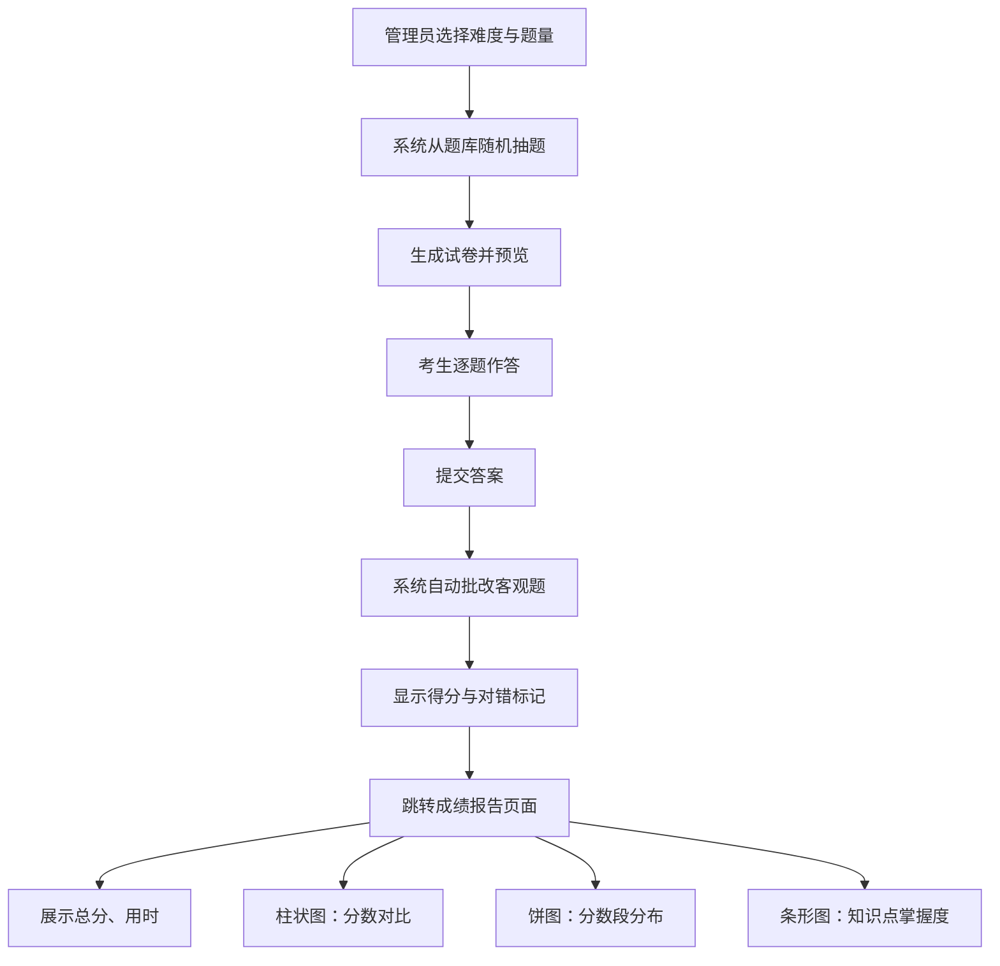

## 1. 产品概述

在线考试系统的组卷与成绩分析模块，面向企业内部培训部门，解决手工出题、组卷、阅卷效率低且易出错的问题。支持管理员从题库按难度和类型自动抽题组卷，考生在线作答后系统自动批改客观题，并生成包含班级平均分、分数段分布和知识点掌握度的可视化成绩报告。

- 目标用户：企业培训部门管理员、参训考生
- 核心价值：组卷自动化、批改即时化、成绩分析可视化，大幅减少人工操作与出错率

## 2. 核心功能

### 2.1 用户角色

| 角色 | 注册方式 | 核心权限 |
|------|----------|----------|
| 管理员 | 系统分配 | 选择难度与题量、生成试卷、查看报告 |
| 考生 | 系统分配 | 在线作答、查看批改结果与成绩报告 |

### 2.2 功能模块

1. **组卷页面**：难度选择器、题量输入、生成试卷按钮、试卷预览
2. **答题页面**：左右两栏布局、题目列表导航、逐题作答、提交批改
3. **成绩报告页面**：总分展示、用时统计、柱状图（分数对比）、饼图（分数段分布）、条形图（知识点掌握度）

### 2.3 页面详情

| 页面名称 | 模块名称 | 功能描述 |
|----------|----------|----------|
| 组卷页面 | 参数表单 | 下拉选择难度（简单/中等/困难）、数字输入题量（10-20）、渐变色生成按钮 |
| 组卷页面 | 试卷预览 | 显示抽取的题目列表，含题型、难度、知识点标签 |
| 答题页面 | 题目导航 | 左栏显示题目序号与完成状态圆点（绿色已完成/灰色未完成） |
| 答题页面 | 题目内容 | 右栏显示当前题干、选项/对错按钮，选项带圆角背景色，选中高亮 |
| 答题页面 | 提交批改 | 提交后自动批改，显示得分、每题对错标记（绿色✓/红色✗）、正确答案 |
| 报告页面 | 总分展示 | 大号数字展示总分与用时 |
| 报告页面 | 分数对比图 | 柱状图对比个人分数与班级平均分 |
| 报告页面 | 分数段分布 | 饼图显示各分数段人数占比 |
| 报告页面 | 知识点掌握度 | 水平条形图按知识点展示掌握度，>80%绿色、60%-80%橙色、<60%红色 |

## 3. 核心流程

管理员进入组卷页面，选择难度和题量后点击生成，系统从题库随机抽取题目生成试卷。考生在答题页面逐题作答，完成后提交，系统自动批改客观题并显示结果，随后跳转到成绩报告页面查看可视化分析。

## 4. 用户界面设计

### 4.1 设计风格

- 主色调：深蓝灰（#1e293b）与青蓝（#0ea5e9），白色文字为主
- 按钮样式：渐变色按钮，圆角，hover状态加深
- 字体：中文使用系统默认，英文使用 DM Sans，标题加粗
- 布局风格：卡片式布局，微弱阴影和圆角
- 图标：使用 lucide-react 图标库

### 4.2 页面设计概览

| 页面名称 | 模块名称 | UI元素 |
|----------|----------|--------|
| 组卷页面 | 参数表单 | 顶部卡片式表单，深蓝灰背景，青蓝渐变按钮，下拉选择器和数字输入框 |
| 组卷页面 | 试卷预览 | 卡片列表，每题显示题型图标、难度标签、知识点标签 |
| 答题页面 | 题目导航 | 左栏固定，圆点标记完成状态，当前题高亮青蓝边框 |
| 答题页面 | 题目内容 | 右栏，选项圆角背景色，选中时青蓝高亮，判断题对/错按钮 |
| 答题页面 | 批改结果 | 对题绿色✓+绿色边框，错题红色✗+红色边框，正确答案显示在题目下方 |
| 报告页面 | 总分卡片 | 居中大号数字，下方用时小字，深蓝灰卡片背景 |
| 报告页面 | 图表区域 | 三列卡片布局，浅色背景（#f1f5f9），左上角标题，微弱阴影圆角 |
| 报告页面 | 柱状图 | 个人分数vs班级平均分双柱对比 |
| 报告页面 | 饼图 | 各分数段占比，带标签 |
| 报告页面 | 条形图 | 水平条形，按掌握度着色（绿/橙/红） |

### 4.3 响应式适配

- 桌面端：答题页左右两栏，报告页三列图表
- 平板端：答题页保持两栏但缩窄，报告页两列图表
- 移动端：全部单列堆叠，答题页题目导航变为顶部横向滚动条

### 4.4 过渡动画

- 页面切换：0.3秒淡入效果
- 提交按钮：加载时显示旋转圈动画
- 选项选中：0.2秒背景色过渡
