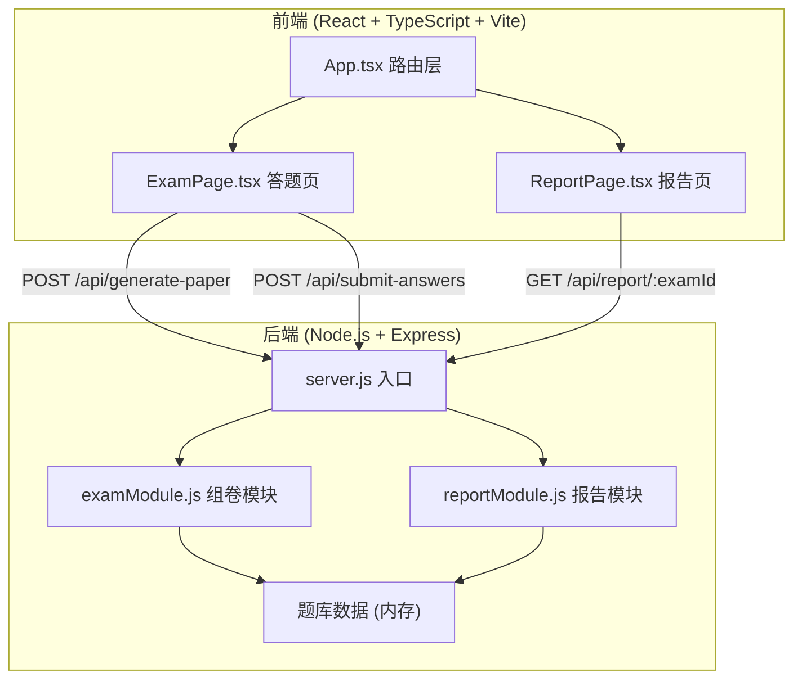
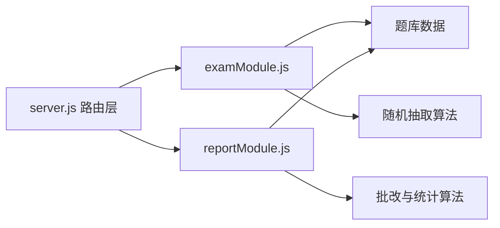
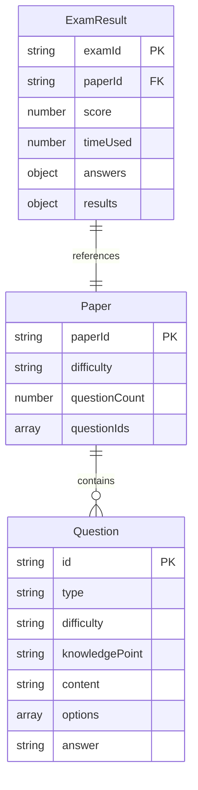

## 1. 架构设计



## 2. 技术说明

- 前端：React@18 + TypeScript + Vite + Recharts + react-hot-toast + axios + react-router-dom
- 初始化工具：vite-init（react-express-ts 模板）
- 后端：Express@4 + cors + uuid
- 数据库：无数据库，使用内存数据结构 + 题库JSON，模拟班级数据

## 3. 路由定义

| 路由 | 用途 |
|------|------|
| / | 组卷页面，管理员选择参数并生成试卷 |
| /exam/:paperId | 答题页面，考生逐题作答并提交 |
| /report/:examId | 成绩报告页面，展示可视化分析 |

## 4. API定义

### 4.1 POST /api/generate-paper

请求：
```typescript
interface GeneratePaperRequest {
  difficulty: "easy" | "medium" | "hard";
  questionCount: number; // 10-20
}
```

响应：
```typescript
interface Question {
  id: string;
  type: "choice" | "judge";
  difficulty: "easy" | "medium" | "hard";
  knowledgePoint: string;
  content: string;
  options?: string[]; // 选择题选项
  answer: string | boolean; // 选择题为选项字母，判断题为true/false
}

interface GeneratePaperResponse {
  paperId: string;
  questions: Question[];
}
```

### 4.2 POST /api/submit-answers

请求：
```typescript
interface SubmitAnswersRequest {
  paperId: string;
  answers: Record<string, string | boolean>; // questionId -> answer
  timeUsed: number; // 秒
}
```

响应：
```typescript
interface SubmitAnswersResponse {
  examId: string;
  score: number;
  totalQuestions: number;
  results: Array<{
    questionId: string;
    correct: boolean;
    userAnswer: string | boolean;
    correctAnswer: string | boolean;
  }>;
}
```

### 4.3 GET /api/report/:examId

响应：
```typescript
interface ReportResponse {
  examId: string;
  score: number;
  totalQuestions: number;
  timeUsed: number;
  classAverage: number;
  scoreDistribution: {
    range: string; // "90-100", "80-89", "70-79", "60-69", "0-59"
    count: number;
  }[];
  knowledgeMastery: {
    knowledgePoint: string;
    mastery: number; // 百分比 0-100
  }[];
}
```

## 5. 服务端架构图



## 6. 数据模型

### 6.1 数据模型定义



### 6.2 数据定义

使用内存数据结构存储：
- `questionBank`：30+道题目数组，包含选择题和判断题，每题标记难度和知识点
- `papers`：生成的试卷Map，paperId -> Paper
- `examResults`：考试结果Map，examId -> ExamResult
- 班级模拟数据：20名同学的随机成绩，用于统计平均分和分数段分布
