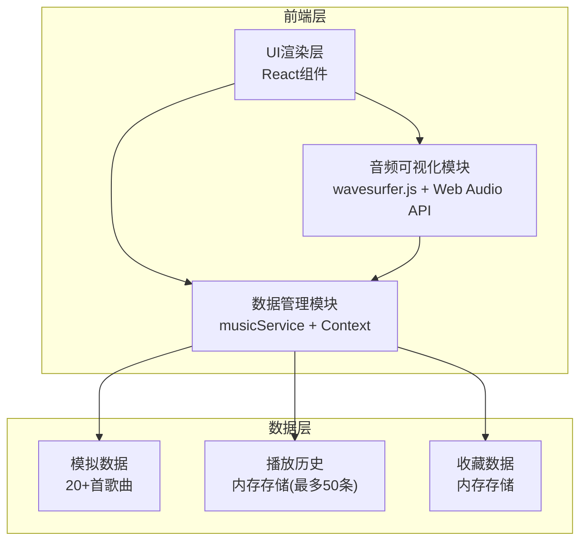
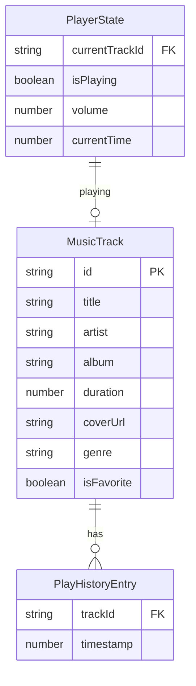

## 1. 架构设计



## 2. 技术说明
- 前端：React@18 + TypeScript + Vite
- 状态管理：React Context + useReducer（useAudioPlayer Hook）
- 样式方案：CSS Modules + CSS Variables（深色主题）
- 音频可视化：wavesurfer.js + Web Audio API
- 图表：recharts（折线图、饼图）
- HTTP请求：axios（模拟数据，无真实后端）
- 通知：react-hot-toast
- 初始化工具：vite-init（react-ts模板）
- 后端：无（纯前端，模拟数据）
- 数据库：无（内存存储）

## 3. 路由定义
| 路由 | 用途 |
|------|------|
| / | 主页面（单页应用，所有功能在一个页面） |

## 4. API定义

### 4.1 模拟数据服务 (src/api/musicService.ts)

```typescript
interface MusicService {
  getTracks(): Promise<MusicTrack[]>
  searchTracks(query: string): Promise<MusicTrack[]>
  getRecommendations(): Promise<MusicTrack[]>
}
```

### 4.2 数据类型定义 (src/types.ts)

```typescript
interface MusicTrack {
  id: string
  title: string
  artist: string
  album: string
  duration: number
  coverUrl: string
  audioUrl?: string
  genre: string
  isFavorite: boolean
}

interface Playlist {
  id: string
  name: string
  tracks: MusicTrack[]
}

interface VisualizerConfig {
  mode: 'bars' | 'waveform'
  barCount: number
  barGap: number
  colorStart: string
  colorEnd: string
}

interface PlayHistoryEntry {
  track: MusicTrack
  timestamp: number
}

interface PlayerState {
  currentTrack: MusicTrack | null
  isPlaying: boolean
  volume: number
  currentTime: number
  duration: number
  history: PlayHistoryEntry[]
  favorites: MusicTrack[]
}
```

## 5. 服务器架构图
无后端服务，纯前端应用。

## 6. 数据模型

### 6.1 数据模型定义



### 6.2 初始数据
- 20+首模拟歌曲数据，涵盖流行/摇滚/电子/古典/爵士五种类型
- 封面图使用模拟URL（placeholder图片服务）
- 7天播放统计数据（模拟）
- 歌曲时长分布数据（模拟）
