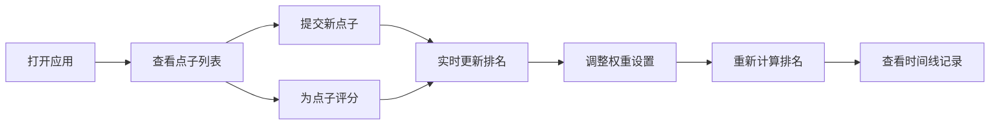

## 1. 产品概述

团队头脑风暴点子投票与排名工具是一款面向产品团队和创意团队的实时协作工具，帮助团队在产品讨论或创意征集时高效提交点子、进行多维度评分并自动生成加权排名。

- 解决问题：传统头脑风暴缺乏结构化评分机制，点子优劣难以量化比较
- 目标用户：产品经理、设计师、开发团队、创意团队
- 核心价值：通过多维度加权评分让优秀点子脱颖而出，提升团队决策效率

## 2. 核心功能

### 2.1 用户角色

| 角色 | 注册方式 | 核心权限 |
|------|----------|----------|
| 团队成员 | 无需注册，直接使用 | 提交点子、评分、查看排名和历史记录 |

### 2.2 功能模块

1. **点子提交模块**：左侧面板提交点子标题和描述
2. **点子列表与评分模块**：中央列表展示点子卡片，支持多维度星级评分
3. **排名看板模块**：按加权总分降序排列，前三显示金银铜奖杯
4. **评分设置模块**：右侧面板调整各维度权重
5. **时间线模块**：底部展示操作历史记录

### 2.3 页面详情

| 页面名称 | 模块名称 | 功能描述 |
|-----------|-------------|---------------------|
| 主页面 | 点子提交表单 | 输入标题和描述（最多200字），提交后添加到列表 |
| 主页面 | 点子卡片列表 | 展示标题、描述预览、五个评分维度、平均评分、排名奖杯 |
| 主页面 | 评分设置面板 | 权重滑块调整、重置按钮、面板收起/展开 |
| 主页面 | 时间线 | 横向滚动展示操作历史，区分提交和评分操作 |

## 3. 核心流程

用户打开应用 → 查看已有点子和排名 → 提交新点子 → 为各维度评分 → 查看实时排名变化 → 调整权重验证不同排序结果

## 4. 用户界面设计

### 4.1 设计风格

- **主色调**：深灰蓝(#2C3E50)与白色(#FFFFFF)搭配
- **强调色**：金色(#FFD700)用于星级评分和奖杯，绿色(#27AE60)用于评分反馈
- **卡片风格**：圆角8px，浅阴影(0 2px 8px rgba(0,0,0,0.1))
- **按钮交互**：hover放大1.05倍，点击缩小0.95倍，时长0.15秒
- **字体**：现代无衬线字体，清晰易读

### 4.2 页面设计概述

| 页面名称 | 模块名称 | UI元素 |
|-----------|-------------|-------------|
| 主页面 | 点子提交表单 | 标题输入框、描述文本域、提交按钮、字数统计 |
| 主页面 | 点子卡片 | 排名奖杯、标题、描述（可展开）、星评组件、平均评分 |
| 主页面 | 评分设置面板 | 权重滑块、数值显示、重置按钮、展开/收起按钮 |
| 主页面 | 时间线 | 横向滚动容器、时间节点、操作描述、颜色区分 |

### 4.3 响应式

- **桌面端**：三栏布局（左侧提交区、中央列表、右侧设置区）
- **平板端**：设置区折叠为右侧弹出面板，点击图标展开
- **手机端**：所有面板折叠为全屏模态
- 触摸优化：支持手势拖动时间线

### 4.4 动画与交互

- 描述展开/收起：0.3秒高度过渡动画
- 评分反馈：卡片背景从白色过渡到极浅绿色(#F0FFF0)再恢复，0.5秒
- 排名变化：卡片列表整体移动，0.3秒缓动曲线
- 奖杯入场：缩放和旋转动画，持续0.4秒
- 面板展开/收起：滑入动画0.3秒
- 虚拟滚动：超过50条点子时启用，只渲染可视区域12条
