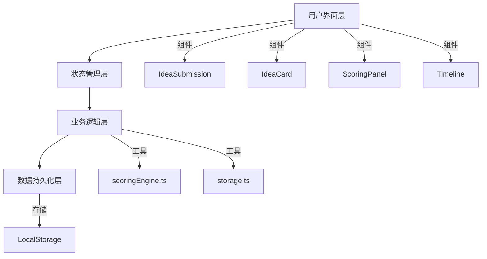

## 1. 架构设计

纯前端应用，使用React + TypeScript + Vite构建，数据通过LocalStorage持久化存储。



## 2. 技术描述

- **前端框架**：React@18 + TypeScript
- **构建工具**：Vite@5
- **样式方案**：原生CSS + CSS变量
- **状态管理**：React Hooks (useState, useEffect, useCallback)
- **图标**：Lucide React
- **提示消息**：react-hot-toast
- **唯一ID生成**：uuid
- **数据持久化**：LocalStorage
- **开发服务器端口**：3000

## 3. 目录结构

```
src/
├── components/
│   ├── IdeaSubmission.tsx    # 点子提交表单组件
│   ├── IdeaCard.tsx          # 点子卡片组件
│   ├── ScoringPanel.tsx      # 评分设置面板组件
│   └── Timeline.tsx          # 时间线组件
├── utils/
│   ├── scoringEngine.ts      # 评分引擎模块
│   └── storage.ts            # 本地存储模块
├── App.tsx                   # 主布局组件
└── index.tsx                 # React应用入口
```

## 4. 数据模型

### 4.1 数据类型定义

```typescript
interface Idea {
  id: string;
  title: string;
  description: string;
  scores: {
    innovation: number;
    feasibility: number;
    impact: number;
    cost: number;
    risk: number;
  };
  createdAt: number;
}

interface Weights {
  innovation: number;
  feasibility: number;
  impact: number;
  cost: number;
  risk: number;
}

interface TimelineEvent {
  id: string;
  type: 'submit' | 'score';
  ideaId: string;
  ideaTitle: string;
  dimension?: string;
  score?: number;
  user: string;
  timestamp: number;
}
```

### 4.2 评分维度说明

| 维度 | 默认权重 | 说明 |
|------|----------|------|
| 创新性 (innovation) | 0.25 | 点子的新颖程度和创意价值 |
| 可行性 (feasibility) | 0.25 | 技术实现的难易程度 |
| 影响力 (impact) | 0.20 | 对产品/业务的影响程度 |
| 成本 (cost) | 0.15 | 实现所需的资源成本 |
| 风险 (risk) | 0.15 | 潜在风险和不确定性 |

## 5. 核心功能实现

### 5.1 评分引擎

- 纯函数设计，不依赖React
- 计算加权总分：各维度分数 × 对应权重之和
- 计算平均评分：所有维度分数的平均值
- 排名排序：按加权总分降序排列
- 性能目标：50ms内完成计算

### 5.2 虚拟滚动

- 触发条件：点子数量超过50条
- 渲染策略：只渲染可视区域的12条
- 实现方式：通过计算scrollTop和容器高度确定可见范围

### 5.3 响应式布局

- 桌面端 (≥1200px)：三栏布局
- 平板端 (768px-1199px)：双栏布局 + 右侧抽屉式设置面板
- 手机端 (<768px)：单栏布局 + 模态弹窗

## 6. 性能优化

- 使用React.memo优化组件重渲染
- 评分计算使用useMemo缓存
- 列表滚动使用requestAnimationFrame优化
- LocalStorage读写防抖处理
