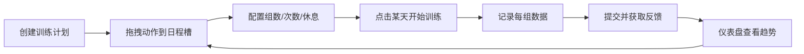

## 1. 产品概述

健身训练计划与日志追踪系统，帮助健身爱好者创建个性化训练计划、记录每次训练数据，并通过可视化图表追踪力量增长趋势。

- 核心用户：有规律健身习惯、希望系统化追踪训练进度的人群
- 解决问题：传统纸质记录繁琐、无法直观查看进步趋势、计划管理混乱
- 产品价值：通过拖拽式计划编排 + 实时容量计算 + 数据可视化图表，让训练管理变得轻松直观

## 2. 核心功能

### 2.1 用户角色

| 角色 | 注册方式 | 核心权限 |
|------|----------|----------|
| 普通用户 | 无需注册（本地存储） | 创建/编辑训练计划、记录训练日志、查看统计图表 |

### 2.2 功能模块

1. **训练计划编辑器**：创建个性化计划、预置动作库、拖拽编排日程、动作参数配置
2. **训练日记与记录**：按天记录训练、实时容量计算、完成度反馈提示
3. **统计与趋势仪表盘**：日历热力图、容量折线图、动作排行榜、核心指标卡片

### 2.3 页面详情

| 页面名称 | 模块名称 | 功能描述 |
|----------|----------|----------|
| 计划编辑器 | 计划信息输入 | 输入计划名称、每周训练天数 |
| 计划编辑器 | 动作库面板 | 搜索/筛选20+预置动作，可拖拽动作卡片 |
| 计划编辑器 | 日程槽区域 | 每天一个Droppable区域，显示总组数，超限变色 |
| 计划编辑器 | 动作参数配置 | 设置目标组数、次数范围、休息时间 |
| 计划编辑器 | 拖拽交互 | 跟随鼠标+半透明阴影+0.2s平滑动画 |
| 计划编辑器 | 放置反馈 | 成功绿色闪烁、已满红色边框闪烁 |
| 训练日志 | 动作列表 | 展示当天所有动作及目标参数 |
| 训练日志 | 组记录表单 | 输入每组重量、次数，实时显示单组容量 |
| 训练日志 | 容量汇总 | 自动计算动作总容量，加粗大字展示 |
| 训练日志 | 提交反馈 | <80%滑入提示条、>120%星星飘落动画 |
| 统计仪表盘 | 训练天数卡片 | 30天日历热力图，今日橙色边框 |
| 统计仪表盘 | 周容量卡片 | 本周总训练容量统计 |
| 统计仪表盘 | 动作排行榜 | Top5常用动作，进度条+百分比 |
| 统计仪表盘 | 容量折线图 | 近7次训练容量，平滑曲线+渐变填充+悬浮提示 |
| 全局导航 | 顶部导航栏 | Logo+三页面切换，当前页底部横线指示 |
| 全局导航 | 页面过渡 | 0.3秒fade切换动画 |
| 响应式 | 移动端适配 | <768px单列布局、汉堡菜单抽屉 |

## 3. 核心流程

用户创建训练计划 → 从动作库拖拽动作到日程槽 → 配置动作参数 → 点击某天进入训练记录 → 填写每组重量次数 → 提交查看反馈 → 返回仪表盘查看统计趋势

## 4. 用户界面设计

### 4.1 设计风格

- **主色调**：鲜艳绿色 #4CAF50（动作、按钮）、高亮蓝色 #2196F3（图表、数据）
- **背景色**：深灰 #1E1E1E（页面）、更深 #121212（导航栏）、#2A2A2A（卡片）
- **边框色**：#3A3A3A（卡片微弱白色边框）
- **按钮风格**：圆角矩形，绿色填充配白色文字，悬停上移+阴影
- **字体**：思源黑体/系统无衬线字体；数字使用等宽字体monospace
- **数字发光效果**：绿色数字带 #00FF0040 微光，蓝色数字带 #0000FF40 微光
- **图标风格**：Lucide React 线性图标，健身主题
- **卡片效果**：悬停上移3px+深阴影（0.5s transition），点击 scale(0.98) 按压感

### 4.2 页面设计概览

| 页面名称 | 模块名称 | UI 元素 |
|----------|----------|---------|
| 计划编辑器 | 动作卡片 | 深灰卡片+绿色标题+参数标签+拖拽手柄，拖动时半透明+阴影偏移 |
| 计划编辑器 | 日程槽 | 垂直排列容器，顶部数字徽章，超20组变橙色，拖入时绿色闪烁 |
| 训练日志 | 数据输入框 | 深色背景输入框，绿色focus边框，右侧实时容量数字 |
| 训练日志 | 总容量展示 | 卡片底部加粗monospace大字，绿色发光效果 |
| 训练日志 | 底部提示条 | 从下方0.5s滑入，>120%时3颗星星向上飘散消失 |
| 统计仪表盘 | 指标卡片 | 4张2列网格卡片，标题小字+数字大字发光+底部图表/热力图 |
| 统计仪表盘 | 日历热力图 | 7列网格小方块，绿/灰/橙边框三色状态 |
| 统计仪表盘 | 折线图 | Recharts平滑曲线，蓝色线条+渐变蓝色填充，自定义悬浮tooltip |
| 全局导航 | 导航栏 | 左侧Logo图标+名称，右侧三个按钮，当前页底部2px绿色横线+加粗 |
| 响应式 | 汉堡菜单 | <768px显示，点击半透明遮罩+右侧抽屉0.3s滑入 |

### 4.3 响应式

- **设计策略**：Desktop-first，断点 768px
- **仪表盘**：2×2卡片网格 → 单列垂直排列
- **日程槽**：固定宽度 → 100%屏幕宽度
- **导航栏**：三按钮横排 → 汉堡菜单+抽屉
- **触摸优化**：最小点击区域44px，拖拽区域增加触控边距

### 4.4 动画细节

- **拖拽位移**：transform transition 0.2s ease-out
- **放置成功**：卡片背景绿色闪烁 @keyframes flashGreen 0.3s
- **放置失败**：日程槽边框红色闪烁 @keyframes flashRed 0.4s 2次
- **页面切换**：opacity 0 → 1，0.3s ease
- **卡片悬停**：translateY(-3px) + box-shadow 加深，0.5s
- **卡片按压**：scale(0.98)，0.1s
- **提示条滑入**：translateY(100%) → 0，0.5s ease-out
- **星星飘落**：3颗星星 @keyframes starFloat 0.3s，不同延迟
- **数字发光**：text-shadow 常驻微光
