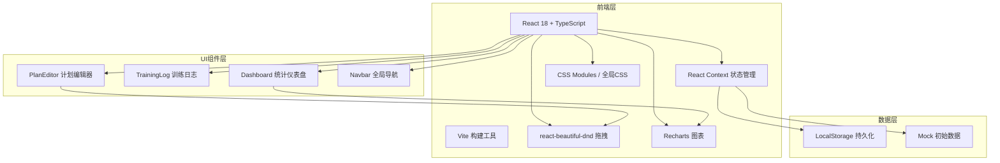
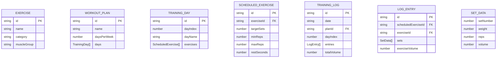

## 1. 架构设计



## 2. 技术描述

- **前端框架**：React 18 + TypeScript（严格模式）
- **构建工具**：Vite 5，开发端口 3000
- **状态管理**：React Context + useReducer（无需后端，轻量全局状态）
- **拖拽库**：react-beautiful-dnd（DragDropContext、Droppable、Draggable）
- **图表库**：Recharts（LineChart、AreaChart、Bar、Cell 等）
- **工具库**：uuid（生成唯一ID）
- **持久化**：LocalStorage 存储计划和日志数据
- **图标**：lucide-react（线性健身图标）
- **样式方案**：全局 CSS + CSS 变量（暗色主题设计系统）

## 3. 路由定义

本项目为单页应用，使用内部状态切换页面，无 URL 路由：

| 页面标识 | 组件 | 用途 |
|----------|------|------|
| plan | PlanEditor | 训练计划编辑器 |
| log | TrainingLog | 训练日记记录（需传入dayId参数） |
| dashboard | Dashboard | 统计与趋势仪表盘（默认首页） |

## 4. 数据模型

### 4.1 数据模型定义（ER图）



### 4.2 预置动作库（20+动作）

| ID | 动作名称 | 分类 | 主要肌群 |
|----|----------|------|----------|
| squat | 深蹲 | 腿部 | 股四头肌、臀大肌 |
| bench-press | 卧推 | 推 | 胸大肌、三头肌 |
| deadlift | 硬拉 | 拉 | 竖脊肌、腘绳肌 |
| pull-up | 引体向上 | 拉 | 背阔肌、二头肌 |
| barbell-row | 杠铃划船 | 拉 | 背阔肌、菱形肌 |
| overhead-press | 推举 | 推 | 三角肌、三头肌 |
| bicep-curl | 弯举 | 手臂 | 二头肌 |
| tricep-pushdown | 三头下压 | 手臂 | 三头肌 |
| leg-press | 腿举 | 腿部 | 股四头肌 |
| leg-curl | 腿弯举 | 腿部 | 腘绳肌 |
| lat-pulldown | 高位下拉 | 拉 | 背阔肌 |
| cable-fly | 绳索夹胸 | 推 | 胸大肌 |
| shoulder-raise | 侧平举 | 推 | 三角肌中束 |
| face-pull | 面拉 | 拉 | 三角肌后束 |
| lunge | 箭步蹲 | 腿部 | 股四头肌、臀大肌 |
| calf-raise | 提踵 | 腿部 | 腓肠肌 |
| incline-bench | 上斜卧推 | 推 | 上胸肌 |
| dips | 双杠臂屈伸 | 推 | 胸肌、三头肌 |
| shrug | 耸肩 | 拉 | 斜方肌 |
| plank | 平板支撑 | 核心 | 核心肌群 |
| russian-twist | 俄罗斯转体 | 核心 | 腹斜肌 |
| hip-thrust | 臀推 | 腿部 | 臀大肌 |

## 5. 文件结构

```
e:\solo\VersionFastPro\tasks\auto49\
├── package.json
├── vite.config.js
├── tsconfig.json
├── index.html
└── src/
    ├── types.ts              # 所有TypeScript类型定义
    ├── App.tsx               # 主应用、Context、路由状态、全局样式
    ├── data.ts               # 预置动作库、Mock初始数据
    ├── PlanEditor.tsx        # 计划编辑器（拖拽逻辑）
    ├── TrainingLog.tsx       # 训练日志（表单+计算）
    └── Dashboard.tsx         # 仪表盘（图表+统计）
```

## 6. 关键实现要点

### 6.1 拖拽系统（react-beautiful-dnd）
- `<DragDropContext>` 包裹整个应用
- 动作库：每个动作卡片为 `<Draggable>`
- 日程槽：每个天的容器为 `<Droppable>`
- `onDragEnd` 处理跨列表移动和同列表重排
- 拖拽快照：`snapshot.isDragging` 时添加半透明+阴影样式
- 过渡动画：利用 Draggable 的 `style.transform` 配合 CSS transition

### 6.2 容量计算
- 单组容量 = `weight * reps`
- 动作总容量 = 所有组容量求和
- 训练总容量 = 所有动作总容量求和
- 使用 `useMemo` 缓存计算结果避免重复计算

### 6.3 反馈动画（纯CSS Keyframes）
- `@keyframes flashGreen`：background-color 从透明→#4CAF50→透明
- `@keyframes flashRed`：border-color 从#3A3A3A→#F44336→#3A3A3A，动画迭代2次
- `@keyframes starFloat`：transform translateY(0)→-40px + opacity 1→0
- `@keyframes slideUp`：transform translateY(100%)→0 + opacity 0→1
- 使用 `animation-fill-mode: forwards` 保持结束状态

### 6.4 图表渲染（Recharts）
- 折线图：`LineChart` + `Line type="monotone"` 平滑曲线 + `Area` 渐变填充
- 自定义 `Tooltip` 组件显示日期和容量数值
- 日历热力图：纯 CSS Grid 渲染，根据日期状态应用不同 className

### 6.5 响应式断点
- CSS Media Query：`@media (max-width: 768px)`
- Grid 布局：`grid-template-columns: repeat(2, 1fr)` → `repeat(1, 1fr)`
- 汉堡菜单：state `isMenuOpen` 控制遮罩层 `opacity` 和抽屉 `transform`
