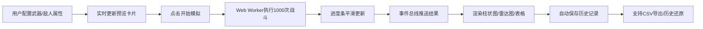

## 1. 产品概述

武器数值模拟与敌人强度测试应用，专为独立游戏开发者和Game Jam活动设计，帮助用户快速验证不同武器与敌人属性之间的平衡性。通过大规模战斗模拟和数据可视化，减少手动测试的繁琐过程，快速找到最佳数值平衡点。

- **核心价值**：自动化测试武器-敌人组合，提供数据驱动的平衡性调整依据
- **目标用户**：独立游戏开发者、Game Jam参与者、游戏设计师

## 2. 核心功能

### 2.1 功能模块

1. **配置面板模块**：武器与敌人属性编辑、预设池选择、实时预览卡片
2. **战斗模拟引擎模块**：回合制战斗逻辑、1000次大规模模拟、Web Worker异步执行
3. **统计展示模块**：柱状图胜率对比、雷达图多维度分析、详细数据表格
4. **历史记录模块**：配置快照保存、快速还原、CSV数据导出

### 2.2 页面详情

| 页面名称 | 模块名称 | 功能描述 |
|-----------|-------------|---------------------|
| 主应用页面 | 配置面板 | 6种武器+4种敌人属性编辑，滑块/数字输入，实时预览卡片，0.3秒渐变动画 |
| 主应用页面 | 模拟控制条 | 开始模拟按钮，进度条（0.5秒过渡动画），按钮悬停/点击反馈 |
| 主应用页面 | 统计展示 | 柱状图（胜率）、雷达图（多维度）、数据表格，0.4秒淡入淡出切换 |
| 主应用页面 | 历史记录 | 最多10条历史，0.3秒滑动动画，一键还原配置，CSV导出 |

## 3. 核心流程

用户在左侧配置面板选择或编辑武器与敌人属性 → 实时预览卡片同步更新 → 点击"开始模拟"按钮 → Web Worker异步执行1000次战斗模拟 → 进度条平滑更新 → 模拟完成后事件总线推送结果 → 右侧统计区域渲染三种图表视图 → 自动保存到历史记录 → 用户可切换历史或导出CSV

## 4. 用户界面设计

### 4.1 设计风格

- **主题**：深色科技感，深蓝灰色渐变背景（#1E2229 → #262B33）
- **主色调**：蓝色渐变按钮（#4A90E2 → #357ABD）
- **武器类型配色**：长剑金属银#C0C0C0、法杖魔法紫#8A2BE2、弓箭自然绿#228B22、匕首暗影灰#696969
- **文字**：标题银色带发光阴影（text-shadow: 0 0 8px rgba(0,0,0,0.7)），主标题白色#FFFFFF，次要数据浅灰色#B0B8C4
- **卡片**：浅色背景#2C313A，圆角12px，投影0 4px 12px rgba(0,0,0,0.3)
- **配置面板**：半透明毛玻璃效果（rgba(255,255,255,0.05) + backdrop-filter: blur(12px)），边框1px rgba(255,255,255,0.1)

### 4.2 页面设计概述

| 页面名称 | 模块名称 | UI Elements |
|-----------|-------------|-------------|
| 主应用 | 配置面板 | 左侧320px宽度，毛玻璃背景，表单滑块+数字输入，属性卡片渐变动画 |
| 主应用 | 模拟控制 | 顶部控制条，渐变按钮悬停上移2px，点击缩小2px，进度条0.5秒过渡 |
| 主应用 | 统计展示 | 下方卡片区域，ECharts暗色主题，渐变填充，0.4秒淡入淡出切换 |
| 主应用 | 历史记录 | 左侧列表，0.3秒滑动动画，配置摘要+时间戳 |

### 4.3 响应性

- **桌面端**：左侧320px配置面板 + 右侧主内容区
- **移动端（<768px）**：单列布局，配置面板变为可折叠顶部面板，图表全宽自适应
- **触控优化**：滑块和按钮增大触控区域，确保移动端操作流畅

### 4.4 动画与交互

- 属性卡片背景切换：0.3秒渐变动画
- 进度条更新：0.5秒平滑过渡
- 视图切换：0.4秒淡入淡出
- 历史记录切换：0.3秒上下滑动
- 按钮悬停：上移2px + 阴影加深
- 按钮点击：缩小2px模拟下压
