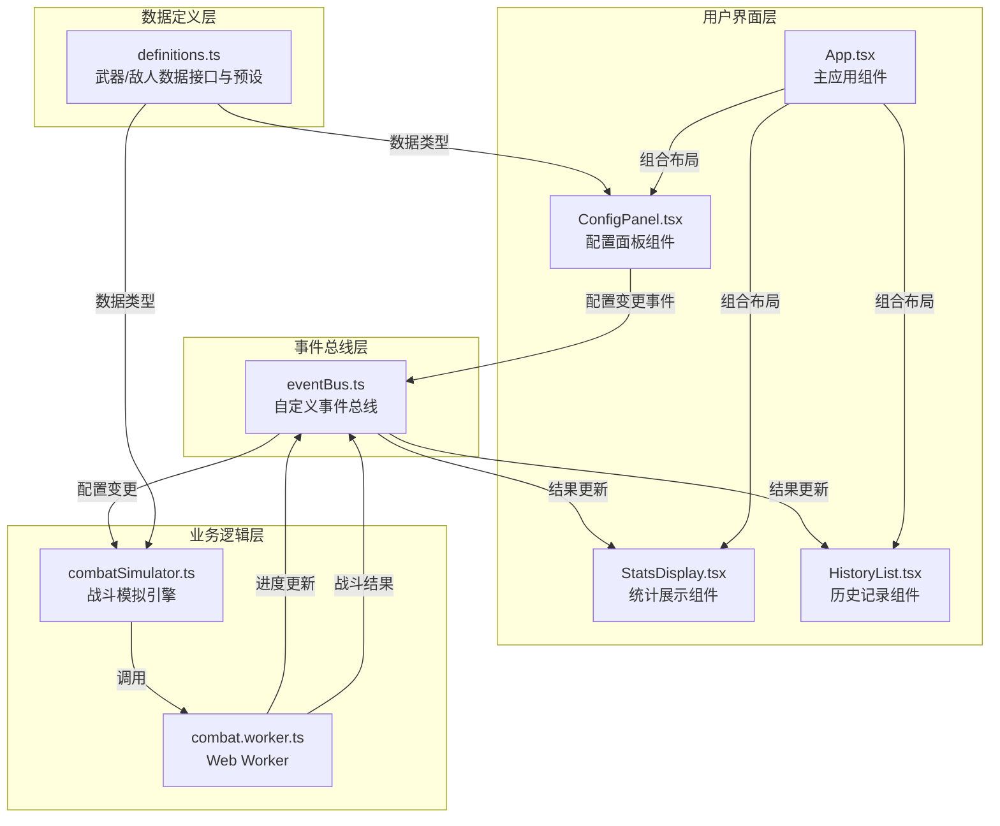

## 1. 架构设计



**模块调用关系与数据流向：**

1. **数据定义层 (definitions.ts)**：定义 Weapon、Enemy、CombatResult 等核心接口，提供预设数据池，导出标准化的创建函数
2. **事件总线层 (eventBus.ts)**：实现发布-订阅模式，定义 `config:update`、`simulation:progress`、`simulation:complete` 等事件类型
3. **业务逻辑层 (combatSimulator.ts + combat.worker.ts)**：接收武器/敌人配置，执行回合制战斗逻辑，在Web Worker中进行1000次模拟，通过事件总线返回进度和结果
4. **用户界面层**：
   - ConfigPanel 组件订阅数据定义，发布配置变更事件
   - StatsDisplay 组件订阅模拟结果事件，渲染ECharts图表
   - HistoryList 组件管理历史记录，支持配置还原
   - App.tsx 作为容器组件，整合所有子组件

## 2. 技术描述

- **前端框架**：React 18 + TypeScript
- **构建工具**：Vite 5（端口3000，React插件，严格模式）
- **图表库**：ECharts 5 + echarts-for-react
- **工具库**：uuid（唯一标识）
- **状态管理**：自定义事件总线 + React Hooks
- **并发处理**：Web Worker（避免UI阻塞）
- **样式方案**：原生CSS + CSS变量 + 响应式媒体查询

**文件结构：**
```
src/
├── main.tsx              # React入口
├── App.tsx               # 主应用组件
├── App.css               # 全局样式
├── data/
│   └── definitions.ts    # 数据接口与预设
├── engine/
│   └── combatSimulator.ts # 战斗模拟引擎
├── workers/
│   └── combat.worker.ts  # Web Worker
├── components/
│   ├── ConfigPanel.tsx   # 配置面板
│   ├── StatsDisplay.tsx  # 统计展示
│   ├── HistoryList.tsx   # 历史记录
│   ├── PreviewCard.tsx   # 预览卡片
│   └── ProgressBar.tsx   # 进度条
└── utils/
    └── eventBus.ts       # 事件总线
```

## 3. 数据模型

### 3.1 核心类型定义

```mermaid
classDiagram
    class Weapon {
        +string id
        +string name
        +WeaponType type
        +number damage
        +number attackSpeed
        +number range
        +number critRate
        +SpecialEffect? specialEffect
    }
    
    class Enemy {
        +string id
        +string name
        +number maxHealth
        +number armor
        +number dodgeRate
        +number resistance
        +number moveSpeed
    }
    
    class CombatResult {
        +string weaponId
        +string enemyId
        +number winRate
        +number avgRoundsToKill
        +number minDamage
        +number maxDamage
        +number avgDamage
        +number critRate
        +number hitRate
        +number specialEffectTriggerRate
        +number avgExtraDamage
        +number totalSimulations
    }
    
    class SpecialEffect {
        +EffectType type
        +number triggerChance
        +number duration
        +number value
    }
    
    enum WeaponType {
        LONGSWORD
        STAFF
        BOW
        DAGGER
    }
    
    enum EffectType {
        BLEED
        FIREBALL
        SLOW
        POISON
    }
```

### 3.2 武器特殊效果系统

| 武器类型 | 效果类型 | 触发概率 | 效果描述 |
|---------|---------|---------|---------|
| 长剑 | 流血 | 100% | 每回合减5点生命，持续2回合 |
| 法杖 | 火球 | 15% | 造成双倍伤害 |
| 弓箭 | 减速 | 10% | 闪避率降低50%，持续1回合 |
| 匕首 | 中毒 | 20% | 每回合减10点生命，持续3回合 |

## 4. 核心算法

### 4.1 战斗回合制流程

```
每回合执行：
1. 命中判定：random() < (1 - enemy.dodgeRate - slowEffect) ? 命中 : 闪避
2. 暴击判定：命中后 random() < weapon.critRate ? 暴击(x2) : 普通
3. 伤害计算：baseDamage = weapon.damage * critMultiplier
            actualDamage = max(1, baseDamage - enemy.armor * (1 - enemy.resistance))
4. 特殊效果触发：random() < effect.triggerChance ? 应用效果
5. 状态效果结算：流血、中毒等持续伤害
6. 判定胜负：enemy.health <= 0 ? 胜利 : 下一回合
```

### 4.2 大规模模拟策略

- 每对武器-敌人组合执行1000次独立模拟
- 使用Web Worker分批处理，每100次模拟后发送进度更新
- 结果聚合计算：胜率、平均回合数、伤害分布（min/max/avg）、特殊效果统计

## 5. 性能优化

- **Web Worker**：战斗模拟完全在Worker线程执行，主线程仅处理UI
- **分批更新**：进度条每5%更新一次，避免频繁重渲染
- **图表懒更新**：数据接收后500ms防抖重绘
- **历史记录限制**：最多保留10条，自动淘汰最旧记录
- **CSS硬件加速**：动画使用transform和opacity，触发GPU加速

## 6. 配置文件说明

- **package.json**：依赖react、react-dom、typescript、vite、@vitejs/plugin-react、echarts-for-react、echarts、uuid；启动脚本 `npm run dev`
- **vite.config.js**：配置React插件，开发服务器端口3000，启用严格模式
- **tsconfig.json**：启用严格模式（strict: true），target ES2020，moduleResolution bundler
- **index.html**：入口页面，挂载点 div#root
