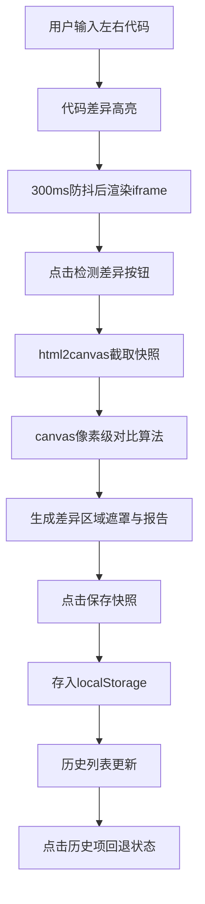

## 1. 产品概述
前端代码差异对比工具，帮助开发团队高效比对两套设计稿或实现版本在代码与视觉效果上的差异，解决多人协作中难以直观看到同一页面不同实现版本差异的问题。

- 主要用途：双栏代码对比、实时渲染预览、视觉差异检测、历史版本回退
- 目标用户：前端开发工程师、UI设计师、代码审查人员
- 产品价值：提升协作效率，减少人工比对成本，精准定位差异点

## 2. 核心功能

### 2.1 功能模块
1. **主工作区**：双栏代码编辑器 + 双栏实时渲染预览
2. **差异检测系统**：代码行级差异高亮 + 视觉像素级差异标注
3. **历史管理系统**：快照保存、历史列表、一键回退

### 2.2 页面详情
| 页面名称 | 模块名称 | 功能描述 |
|-----------|-------------|---------------------|
| 主页面 | 顶部工具栏 | 运行预览(Ctrl+Enter)、检测视觉差异、保存快照 |
| 主页面 | 左侧边栏 | 历史记录列表（最近10条，时间倒序） |
| 主页面 | 双栏编辑器 | Monaco编辑器实例，支持代码粘贴、HTML文件拖入、行级差异高亮 |
| 主页面 | 双栏预览区 | iframe沙箱渲染、可拖动分隔条、视觉差异遮罩层 |
| 主页面 | 底部状态栏 | 渲染状态指示、差异数量统计、差异区域详情 |

## 3. 核心流程

## 4. 用户界面设计

### 4.1 设计风格
- 主题：深色IDE风格，主背景色#1e1e1e
- 主色调：蓝色#0078d4，悬停#106ebe
- 差异配色：新增#e6ffed(绿)、删除#ffeef0(红)、修改#fff8c5(黄)、视觉差异#FF0000 20%透明度
- 按钮样式：圆角8px矩形，悬停上移2px
- 动画：所有过渡0.3秒 cubic-bezier(0.4, 0, 0.2, 1)

### 4.2 页面设计概述
| 页面名称 | 模块名称 | UI元素 |
|-----------|-------------|-------------|
| 主页面 | 工具栏 | 蓝色圆角按钮组、快捷键提示、图标+文字 |
| 主页面 | 编辑器区 | Monaco深色主题、差异行背景色、行号+/-符号 |
| 主页面 | 预览区 | 白色背景1px#ddd边框、可拖动分隔条col-resize光标 |
| 主页面 | 历史侧栏 | 卡片式列表、悬停浅蓝色渐变#E3F2FD、时间+差异数 |
| 主页面 | 状态栏 | 状态指示圆(绿/灰/红)、差异统计文本、加载动画 |

### 4.3 响应式
- 桌面端（≥768px）：左右双栏布局，编辑器与预览区并排
- 移动端（<768px）：上下布局，编辑器在上，预览区在下
- 分隔条在两种模式下均可用

## 5. 性能指标
| 指标 | 目标值 |
|------|--------|
| 代码变更到渲染完成 | ≤800ms（含300ms防抖） |
| 视觉差异检测 | ≤1500ms |
| 历史记录加载 | ≤100ms |
| 分隔条拖动流畅度 | 无卡顿 |
