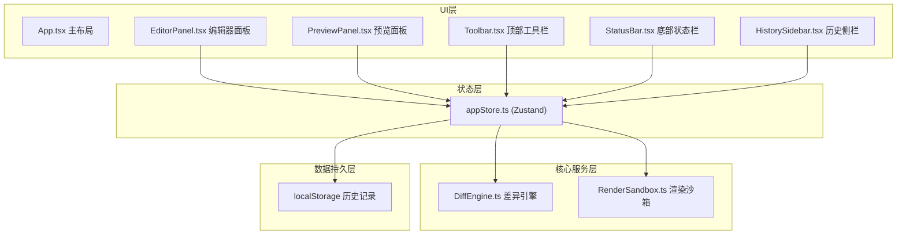

## 1. 架构设计



## 2. 技术描述
- 前端框架：React@18 + TypeScript@5
- 构建工具：Vite@5 + @vitejs/plugin-react
- 代码编辑器：@monaco-editor/react
- 状态管理：zustand@4
- 截图库：html2canvas@1
- 差异计算：diff@5
- 提示组件：react-hot-toast@2
- 开发服务器端口：3000

## 3. 模块数据流向

### 3.1 DiffEngine.ts - 差异引擎模块
- 输入：左侧代码文本、右侧代码文本、canvas截图数据
- 输出：行级差异数组（含类型/行号/内容）、像素差异区域数组（坐标+面积）
- 核心算法：diff库行对比、canvas像素逐点扫描+连通区域合并

### 3.2 RenderSandbox.ts - 渲染沙箱模块
- 输入：HTML字符串
- 输出：渲染状态（就绪/等待/错误）、base64截图数据
- 实现方式：iframe + srcdoc属性、postMessage通信、html2canvas截图

### 3.3 appStore.ts - 全局状态模块
- 状态：leftCode / rightCode / diffResult / historyList / uiState
- 动作：setLeftCode / setRightCode / runPreview / detectDiff / saveSnapshot / restoreHistory
- 持久化：historyList自动同步localStorage

## 4. 目录结构
```
src/
├── core/
│   ├── DiffEngine.ts        # 差异引擎（代码+视觉）
│   └── RenderSandbox.ts     # 渲染沙箱管理
├── stores/
│   └── appStore.ts          # Zustand全局状态
├── components/
│   ├── EditorPanel.tsx      # Monaco编辑器面板
│   ├── PreviewPanel.tsx     # 预览+差异遮罩
│   ├── HistorySidebar.tsx   # 历史记录侧栏
│   ├── Toolbar.tsx          # 顶部工具栏
│   └── StatusBar.tsx        # 底部状态栏
├── App.tsx                  # 主应用组件
└── main.tsx                 # 入口
```

## 5. 关键类型定义

```typescript
type LineDiffType = 'added' | 'removed' | 'modified' | 'unchanged';

interface LineDiff {
  type: LineDiffType;
  leftLine?: number;
  rightLine?: number;
  content: string;
}

interface DiffRegion {
  x: number;
  y: number;
  width: number;
  height: number;
  areaPercent: number;
}

interface DiffResult {
  lineDiffs: LineDiff[];
  visualDiffs: DiffRegion[];
  totalVisualDiffs: number;
}

type RenderStatus = 'idle' | 'loading' | 'ready' | 'error';

interface HistoryItem {
  id: string;
  timestamp: number;
  leftCode: string;
  rightCode: string;
  diffResult: DiffResult;
}

interface UIState {
  isDetecting: boolean;
  leftRenderStatus: RenderStatus;
  rightRenderStatus: RenderStatus;
}
```
