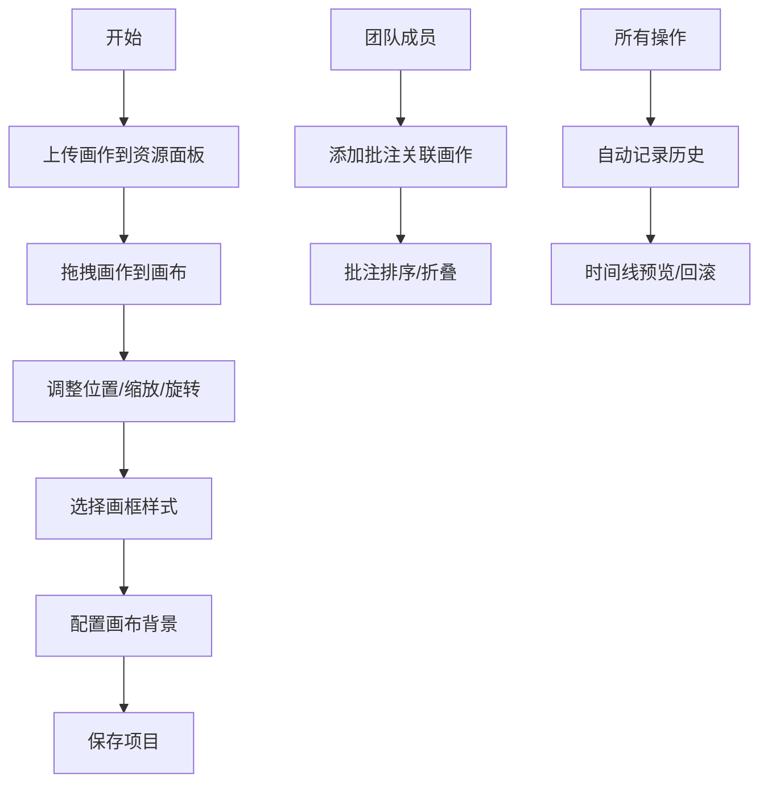

## 1. 产品概述

虚拟画廊策展与协作文档平台，为设计师和策展人提供在线画廊布置、团队协作批注和版本历史管理的一站式解决方案。

- 核心目标：解决艺术展览策划过程中空间布局可视化困难、团队协作效率低下、版本追溯不便等痛点
- 目标用户：画廊策展人、博物馆设计师、艺术展览团队、室内设计师
- 产品价值：提升策展效率，降低沟通成本，实现创意的可视化协作与历史回溯

## 2. 核心功能

### 2.1 用户角色

| 角色 | 注册方式 | 核心权限 |
|------|----------|----------|
| 策展人 | 系统登录 | 上传画作、编辑布局、配置背景、保存/加载项目 |
| 团队成员 | 邀请加入 | 查看画廊、添加批注、拖拽排序批注 |
| 管理员 | 系统分配 | 所有权限 + 项目管理 |

### 2.2 功能模块

1. **画廊展厅编辑器**：画作上传与拖拽、属性调整（位置/缩放/旋转）、画框样式选择、背景配置、项目保存/加载
2. **实时协作文档批注**：批注卡片管理、Markdown内容支持、画作关联、拖拽排序、新批注角标提示
3. **版本历史与回滚**：操作历史记录、时间线展示、状态预览、平滑回滚过渡

### 2.3 页面详情

| 页面名称 | 模块名称 | 功能描述 |
|-----------|-------------|---------------------|
| 主工作台 | 左侧资源面板 | 画作缩略图展示、拖拽上传、折叠/展开动画 |
| 主工作台 | 中央画布区域 | 画作渲染、拖拽移动、属性编辑、背景配置 |
| 主工作台 | 右侧批注面板 | 批注列表、新增批注、折叠展开、拖拽排序 |
| 主工作台 | 历史时间线 | 操作历史展示、节点点击预览、回滚操作 |

## 3. 核心流程

### 主操作流程
用户登录后进入工作台，从资源面板上传画作图片，拖拽画作到中央画布进行布局设计，调整画作属性和画框样式，配置画布背景。团队成员可在右侧面板添加批注关联到特定画作，所有操作自动记录历史。用户可通过时间线查看历史版本并回滚到任意状态。

## 4. 用户界面设计

### 4.1 设计风格
- **主色调**：深色主题，主背景 `#1a1a2e`，卡片背景 `#16213e`，强调色 `#e94560`
- **字体**：使用现代无衬线字体，标题粗体，正文常规
- **卡片样式**：圆角 8px，阴影 `0 2px 8px rgba(0,0,0,0.3)`
- **动效风格**：平滑过渡，微交互，弹性动画
- **图标风格**：线性图标，简洁现代

### 4.2 页面设计概述

| 页面名称 | 模块名称 | UI元素 |
|-----------|-------------|-------------|
| 主工作台 | 资源面板 | 250px宽度，可折叠，滑入动画0.3秒，拖拽源区域 |
| 主工作台 | 画布区域 | 自适应宽度，拖放目标区，画作卡片带阴影动画，触底弹性效果 |
| 主工作台 | 批注面板 | 300px固定宽度，批注卡片带圆形头像占位符，展开/折叠高度动画0.2秒 |
| 主工作台 | 历史时间线 | 侧边垂直时间线，操作图标+描述+时间戳，回滚动画0.5秒Ease-Out |

### 4.3 响应式
- 桌面端（≥900px）：三栏布局，左250px + 中央自适应 + 右300px
- 移动端（<900px）：左右面板转为底部浮层，可切换显示/隐藏，滑出动画0.4秒
- 触摸优化：增大点击区域，支持触摸拖拽

### 4.4 性能要求
- 画布同时摆放20张画作时帧率不低于50FPS
- 实时批注轮询间隔2秒
- 所有动画流畅无卡顿
