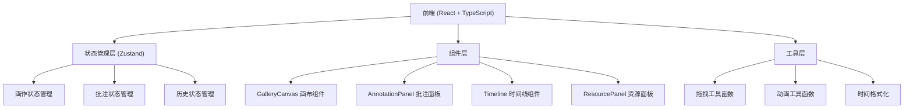

## 1. 架构设计



## 2. 技术描述

- **前端框架**：React 18 + TypeScript
- **构建工具**：Vite 5
- **状态管理**：Zustand
- **拖拽库**：react-beautiful-dnd
- **Markdown渲染**：react-markdown
- **颜色选择器**：react-color
- **开发服务器端口**：3000

## 3. 路由定义

| 路由 | 用途 |
|-------|---------|
| / | 主工作台页面 |

## 4. 数据模型

### 4.1 画作数据模型

```typescript
interface Artwork {
  id: string;
  name: string;
  imageUrl: string;
  x: number;
  y: number;
  scale: number;
  rotation: number;
  frameStyle: 'simple-black' | 'gold-european' | 'none';
  width: number;
  height: number;
}

interface Annotation {
  id: string;
  artworkId: string;
  content: string;
  author: string;
  authorInitials: string;
  backgroundColor: string;
  createdAt: number;
  isExpanded: boolean;
  order: number;
}

interface HistoryRecord {
  id: string;
  type: 'add' | 'move' | 'update' | 'delete' | 'rollback';
  description: string;
  timestamp: number;
  artworks: Artwork[];
  background: BackgroundConfig;
}

interface BackgroundConfig {
  type: 'solid' | 'texture';
  color?: string;
  texture?: 'marble' | 'wood' | 'brick';
}

interface GalleryState {
  artworks: Artwork[];
  annotations: Annotation[];
  history: HistoryRecord[];
  historyIndex: number;
  background: BackgroundConfig;
  selectedArtworkId: string | null;
  isPanelCollapsed: boolean;
}
```

## 5. 项目文件结构

```
e:\solo\VersionFastPro\tasks\auto61/
├── package.json
├── vite.config.js
├── tsconfig.json
├── index.html
└── src/
    ├── main.tsx
    ├── App.tsx
    ├── store/
    │   └── galleryStore.ts
    ├── components/
    │   ├── GalleryCanvas.tsx
    │   ├── AnnotationPanel.tsx
    │   ├── Timeline.tsx
    │   └── ResourcePanel.tsx
    ├── styles/
    │   └── global.css
    └── utils/
        └── helpers.ts
```

## 6. 核心状态管理 Actions

```typescript
// galleryStore.ts 核心方法：
- addArtwork(artwork: Omit<Artwork, 'id'>)
- moveArtwork(id: string, x: number, y: number)
- updateArtwork(id: string, updates: Partial<Artwork>)
- deleteArtwork(id: string)
- addAnnotation(annotation: Omit<Annotation, 'id' | 'createdAt'>)
- updateAnnotation(id: string, updates: Partial<Annotation>)
- toggleAnnotationExpand(id: string)
- reorderAnnotations(startIndex: number, endIndex: number)
- setBackground(config: BackgroundConfig)
- saveHistory(type: string, description: string)
- rollback(index: number)
- saveProject()
- loadProject(data: GalleryState)
```
