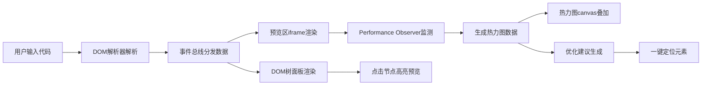

## 1. 产品概述

CSS布局性能分析工具是一款面向前端开发团队的浏览器端可视化分析应用，帮助开发者在复杂页面重构时快速发现DOM重排/重绘热点、盒模型嵌套导致的意外布局偏移，通过可视化性能指标辅助优化决策。

- 目标用户：前端开发工程师、UI重构工程师、性能优化专家
- 核心价值：将抽象的布局性能数据转化为直观的可视化热力图和可交互的DOM树，大幅提升CSS性能调优效率

## 2. 核心功能

### 2.1 用户角色

| 角色 | 使用方式 | 核心需求 |
|------|----------|----------|
| 前端开发者 | 上传/粘贴HTML+CSS代码 | 快速定位布局性能瓶颈，获取具体优化建议 |

### 2.2 功能模块

1. **代码输入模块**：支持HTML文件上传或HTML+CSS代码粘贴输入
2. **DOM树可视化面板**：可折叠树形结构展示元素节点，显示标签名、类名、尺寸和偏移坐标
3. **预览渲染区**：iframe沙箱渲染用户页面，叠加热力图canvas层，支持缩放和同步滚动
4. **盒模型信息面板**：显示元素完整盒模型数据、计算样式和层叠上下文信息
5. **布局性能检测**：自动模拟交互，使用Performance Observer收集布局/重绘事件
6. **热力图叠加**：以绿到红渐变色在元素上显示性能消耗，超阈值元素闪烁警告
7. **优化建议面板**：自动生成优化建议列表，支持一键定位到对应DOM节点
8. **多视图对比模式**：最多3个视图纵向排列，支持同步缩放滚动和性能对比
9. **状态栏**：实时显示总布局次数、总耗时、最大单次耗时和FPS平均值

### 2.3 页面详情

| 页面名称 | 模块名称 | 功能描述 |
|---------|---------|----------|
| 主应用页 | 左侧DOM树面板 | 可折叠树形结构，点击节点高亮预览区元素，显示尺寸和坐标 |
| 主应用页 | 中间预览区 | iframe沙箱渲染，热力图叠加，标签栏切换视图，底部状态栏 |
| 主应用页 | 右侧优化建议面板 | 虚拟滚动建议列表，影响等级标签，一键定位按钮 |
| 主应用页 | 信息详情面板 | 盒模型可视化、计算样式展示、层叠上下文顺序 |
| 主应用页 | 多视图控制栏 | 视图标签拖拽排序，主控缩放滑块，同步开关 |

## 3. 核心流程

用户上传或粘贴HTML+CSS代码 → 系统解析DOM树并渲染到预览区 → 自动执行性能检测（模拟点击和滚动） → 生成热力图数据并叠加显示 → 分析结果生成优化建议 → 用户点击建议一键定位问题元素 → 用户切换多视图对比不同方案性能

## 4. 用户界面设计

### 4.1 设计风格

- 设计语言：深色专业开发工具风格，类似Chrome DevTools
- 主背景色：#1E1E1E，侧栏面板背景：#252526
- 文字主色：#D4D4D4，链接/突出色：#569CD6
- 分隔线：#E0E0E0
- 热力图渐变色：绿色#00FF00 → 黄色 → 红色#FF0000
- 影响等级色：高#F44336 / 中#FF9800 / 低#4CAF50
- 字体：Roboto（Google Fonts）
- 按钮风格：扁平圆角，hover背景变亮，active缩放0.97
- 动效原则：过渡动画0.15-0.3秒，ease-in-out缓动函数

### 4.2 页面设计概述

| 页面名称 | 模块名称 | UI元素 |
|---------|---------|--------|
| 主应用页 | 整体布局 | 三栏结构，左侧280px可收缩，中间弹性60%，右侧350px |
| 主应用页 | DOM树面板 | 可折叠树节点，缩进层级，选中高亮，hover效果 |
| 主应用页 | 预览区 | iframe + canvas叠加，顶部标签栏，底部半透明状态栏 |
| 主应用页 | 建议面板 | 虚拟滚动卡片列表，圆角等级标签，代码高亮片段 |
| 主应用页 | 盒模型信息 | 可视化盒模型图（content/padding/border/margin），数值标注 |

### 4.3 响应式设计

- 桌面端（≥900px）：经典三栏布局
- 平板/窄屏（<900px）：左侧面板自动收缩为图标模式，右侧面板变为底部抽屉（高度300px，可上拉至全屏）
- 底部抽屉顶部有拖拽手柄符号≡，拉动时带弹簧阻力感
- 触控优化：按钮最小44px触控区域，支持滑动手势

### 4.4 动画与交互细节

- 面板展开/收缩：0.3秒宽度过渡动画
- 元素高亮：半透明蓝色#2196F380边框，0.2秒脉冲动画闪烁一次
- 滚动行为：平滑滚动0.3秒ease-in-out
- 建议标签入场：0.2秒从左到右滑入动画
- 视图拖拽：拖拽时半透明，松开后0.2秒归位弹性动画
- 状态栏数字变化：0.2秒缓动过渡效果
- 按钮交互：hover 0.15秒颜色变化，click 0.1秒scale(0.97)
- 警告圆点：耗时超16ms元素边框闪烁红色动画
