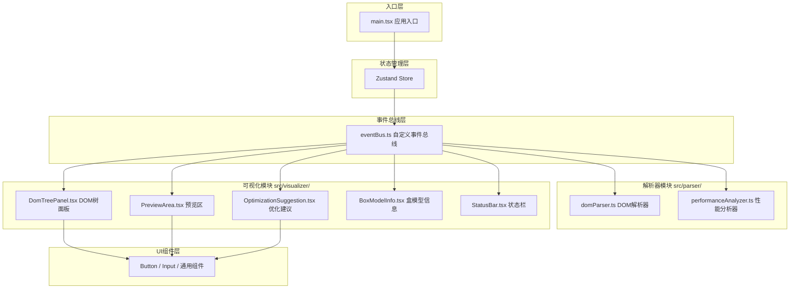

## 1. 架构设计



## 2. 技术描述

- **前端框架**：React 18 + TypeScript 5
- **构建工具**：Vite 5（开发服务器端口3000，开启HMR热更新）
- **状态管理**：Zustand
- **代码编辑器**：Monaco Editor
- **样式方案**：原生CSS Module + CSS变量主题系统
- **通知提示**：react-hot-toast
- **图标库**：lucide-react

### 核心技术选型说明

1. **自定义事件总线**：解析器模块与可视化模块解耦，通过emit/on/off异步通信
2. **iframe沙箱**：安全渲染用户HTML/CSS代码，隔离宿主环境
3. **Performance Observer API**：精准捕获Recalc Style和Layout性能事件
4. **Canvas热力图**：高效渲染性能热力图叠加层
5. **虚拟滚动**：优化建议列表使用虚拟滚动提升长列表性能

## 3. 目录结构

```
src/
├── main.tsx                 # 应用入口
├── App.tsx                  # 根组件
├── eventBus.ts              # 自定义事件总线
├── styles/
│   ├── global.css           # 全局样式
│   └── variables.css        # CSS变量主题
├── parser/
│   ├── domParser.ts         # DOM解析器
│   ├── performanceAnalyzer.ts # 性能分析器
│   └── types.ts             # 解析器类型定义
├── visualizer/
│   ├── components/
│   │   ├── DomTreePanel.tsx    # DOM树面板
│   │   ├── PreviewArea.tsx     # 预览区域
│   │   ├── OptimizationSuggestion.tsx # 优化建议
│   │   ├── BoxModelInfo.tsx    # 盒模型信息
│   │   ├── StatusBar.tsx       # 状态栏
│   │   ├── CodeInput.tsx       # 代码输入
│   │   ├── MultiViewControl.tsx # 多视图控制
│   │   └── TreeNode.tsx        # 树节点组件
│   └── hooks/
│       ├── useVirtualScroll.ts # 虚拟滚动hook
│       └── useResizeObserver.ts # 尺寸监听hook
└── store/
    └── useAppStore.ts        # Zustand全局状态
```

## 4. 核心数据类型定义

```typescript
// DOM节点数据
interface DomNode {
  id: string;
  tagName: string;
  className?: string;
  children: DomNode[];
  parentId?: string;
  // 尺寸与位置
  width: number;
  height: number;
  offsetLeft: number;
  offsetTop: number;
  // 盒模型
  boxModel: {
    content: { width: number; height: number };
    padding: { top: number; right: number; bottom: number; left: number };
    border: { top: number; right: number; bottom: number; left: number };
    margin: { top: number; right: number; bottom: number; left: number };
  };
  // 计算样式
  computedStyles: Record<string, string>;
  // 层叠上下文
  zIndex?: number;
  hasStackingContext: boolean;
}

// 性能数据
interface PerformanceEntry {
  elementId: string;
  recalcStyleCount: number;
  recalcStyleDuration: number;
  layoutCount: number;
  layoutDuration: number;
  totalDuration: number;
}

// 优化建议
interface OptimizationSuggestion {
  id: string;
  elementId: string;
  description: string;
  impactLevel: 'high' | 'medium' | 'low';
  codeSnippet: string;
  suggestion: string;
}

// 视图配置
interface ViewConfig {
  id: string;
  name: string;
  html: string;
  css: string;
  zoom: number;
  scrollTop: number;
  scrollLeft: number;
}
```

## 5. 事件总线事件定义

```typescript
// 事件类型
enum EventType {
  // DOM解析事件
  DOM_PARSED = 'dom:parsed',
  // 性能数据事件
  PERFORMANCE_UPDATED = 'performance:updated',
  // 节点选中事件
  NODE_SELECTED = 'node:selected',
  // 节点高亮事件
  NODE_HIGHLIGHT = 'node:highlight',
  // 代码更新事件
  CODE_UPDATED = 'code:updated',
  // 视图切换事件
  VIEW_CHANGED = 'view:changed',
  // 缩放事件
  ZOOM_CHANGED = 'zoom:changed',
  // 建议生成事件
  SUGGESTIONS_GENERATED = 'suggestions:generated',
}
```

## 6. 性能优化策略

1. **虚拟滚动**：优化建议列表仅渲染可视区域内的卡片
2. **Canvas热力图**：使用2D Canvas批量绘制，避免大量DOM操作
3. **requestAnimationFrame**：动画和热力图更新使用RAF调度
4. **防抖节流**：窗口resize、滚动事件添加防抖处理
5. **memo优化**：React组件使用React.memo减少不必要重渲染
6. **useMemo/useCallback**：复杂计算和回调函数缓存
7. **CSS硬件加速**：transform和opacity动画启用GPU加速

## 7. 构建与开发

- **开发命令**：npm run dev（端口3000，HMR热更新）
- **构建命令**：npm run build
- **代码检查**：TypeScript严格模式
- **目标浏览器**：Chrome 90+ / Firefox 88+ / Safari 14+
- **目标ES版本**：ES2020
