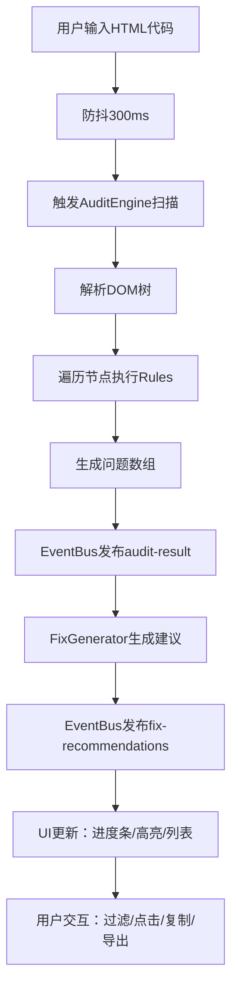

## 1. 产品概述

网页可访问性审计与修复建议工具，帮助前端开发者快速定位HTML代码中的无障碍化问题（符合WCAG 2.1标准），并提供可视化高亮、修复建议和多会话管理能力。

- 目标用户：前端开发者、无障碍化测试工程师、QA团队
- 核心价值：将手动排查可访问性问题的时间缩短80%以上，提供即插即用的修复代码片段

---

## 2. 核心功能

### 2.1 用户角色

| 角色 | 注册方式 | 核心权限 |
|------|----------|----------|
| 开发者 | 无需注册 | 使用全部审计、建议、导出功能 |

### 2.2 功能模块

1. **代码输入与实时扫描模块**：Monaco编辑器 + 防抖自动扫描 + 进度条动画
2. **审计引擎模块**：WCAG 2.1规则集 + DOM解析 + 10类错误检测
3. **可视化高亮模块**：iframe预览 + 错误元素边框高亮 + 悬浮标签
4. **修复建议模块**：建议生成器 + 代码缓存 + 一键复制
5. **问题过滤排序模块**：多维度过滤 + 拖拽排序 + 动画过渡
6. **报告导出模块**：JSON报告生成 + 下载进度条
7. **多页面会话模块**：标签栏管理 + 状态保存 + 切换动画

### 2.3 页面详情

| 页面名称 | 模块名称 | 功能描述 |
|----------|----------|----------|
| 主应用页面 | 顶部标签栏 | 多会话标签创建、切换、关闭确认 |
| 主应用页面 | 进度条区域 | 扫描进度动画、下载进度显示 |
| 主应用页面 | 代码编辑区 | Monaco Editor、HTML自动补全、活动行高亮 |
| 主应用页面 | 预览区 | iframe沙箱预览、元素高亮、闪烁定位 |
| 主应用页面 | 侧边栏 | 问题列表、过滤排序、修复建议、复制代码 |
| 主应用页面 | 分隔条 | 拖拽调整区域大小、视觉反馈 |

---

## 3. 核心流程

用户输入HTML代码 → 防抖300ms触发扫描 → 审计引擎遍历DOM执行规则 → 生成问题列表 → 修复建议模块生成建议 → EventBus分发结果 → UI更新（编辑器进度条、iframe高亮、侧边栏列表）→ 用户过滤/排序/点击问题 → 预览区定位闪烁 → 用户复制建议代码/导出报告

---

## 4. 用户界面设计

### 4.1 设计风格

- **主题色**：主色 #1976D2（深蓝），严重红 #F44336，中等黄 #FFC107，低危蓝 #2196F3
- **字体**：系统默认字体，代码使用 Monaco 等宽字体
- **按钮风格**：圆角6px，hover背景加深
- **布局风格**：三栏式（标签栏+主区域+侧边栏），卡片式问题列表
- **图标风格**：Emoji图标（⛔⚠️ℹ️👍）

### 4.2 页面设计概览

| 页面名称 | 模块名称 | UI元素 |
|----------|----------|--------|
| 主应用 | 标签栏 | 白色背景、活动标签下划线#1976D2、关闭按钮hover红色 |
| 主应用 | 代码编辑器 | Monaco 14px字体、行高1.5、活动行#E3F2FD高亮 |
| 主应用 | 预览iframe | 独立沙箱、最小高度400px、边框1px #E0E0E0 |
| 主应用 | 侧边栏 | 固定300px、问题卡片左侧色条、hover#FAFAFA |
| 主应用 | 分隔条 | 默认1px、拖拽时3px#1976D2、鼠标hover变粗 |
| 主应用 | 进度条 | 浅蓝色#64B5F6、0.5秒从0%到100% |
| 主应用 | 导出按钮 | #1976D2背景、hover#1565C0、圆角6px |
| 主应用 | 关闭确认框 | 半透明遮罩、白色圆角12px卡片、阴影2px 4px 12px |

### 4.3 响应式设计

- **≥900px**：三栏布局（编辑器50% + 预览50% + 侧边栏300px）
- **600-900px**：隐藏预览iframe，编辑器:侧边栏 = 2:1
- **<600px**：侧边栏变为底部抽屉（向上拖拽展开300px高度）

### 4.4 动画规范

| 动画名称 | 持续时间 | 缓动函数 | 说明 |
|----------|----------|----------|------|
| 常规过渡 | 0.3s | ease-out | hover、展开折叠等 |
| 进度条 | 0.5s | linear | 扫描进度 |
| 脉冲呼吸 | 0.3s 循环 | ease-in-out | 高亮元素边框 |
| 闪烁定位 | 1s | ease-out | 问题元素白→红 |
| 过滤切换 | 0.2s | ease-out | 淡入淡出 |
| 标签切换 | 0.3s | ease-out | 左右滑入 |
| 拖拽排序 | 0.2s | ease-out | 弹性动画 |
