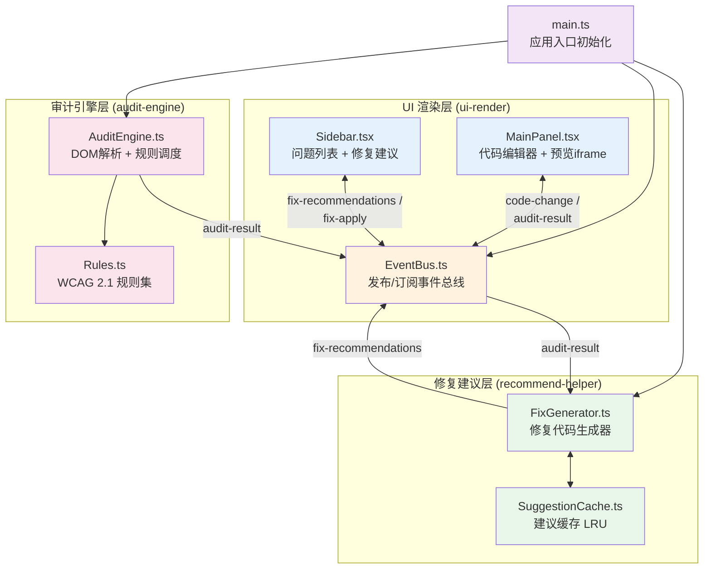

## 1. 架构设计



---

## 2. 技术描述

- **前端框架**：React@18 + TypeScript@5（严格模式，target ES2020）
- **构建工具**：Vite@5 + @vitejs/plugin-react（端口5173，HMR热更新）
- **代码编辑器**：@monaco-editor/react（HTML语言自动补全）
- **分隔布局**：react-split-pane（可拖拽分隔条）
- **工具函数**：lodash（防抖、排序、分组等）
- **状态管理**：EventBus（自定义发布/订阅，跨模块解耦）
- **DOM解析**：浏览器原生 DOMParser + iframe 沙箱环境
- **初始化命令**：`npm run dev`

---

## 3. 文件结构与调用关系

```
project-root/
├── package.json                          # 项目依赖配置
├── vite.config.js                        # Vite构建配置（端口5173）
├── tsconfig.json                         # TS严格模式配置
├── index.html                            # 应用入口HTML
└── src/
    ├── main.ts                           # 入口：初始化各模块
    ├── App.tsx                           # 根组件：多标签会话管理
    ├── styles.css                        # 全局样式与动画
    │
    ├── modules/
    │   ├── ui-render/
    │   │   ├── EventBus.ts               # ⭐ 事件总线（所有模块通信枢纽）
    │   │   ├── MainPanel.tsx             # 主面板 → 依赖EventBus
    │   │   ├── Sidebar.tsx               # 侧边栏 → 依赖EventBus
    │   │   ├── TabBar.tsx                # 标签栏组件
    │   │   └── ConfirmDialog.tsx         # 关闭确认对话框
    │   │
    │   ├── audit-engine/
    │   │   ├── AuditEngine.ts            # 审计引擎 → 依赖Rules → 发布到EventBus
    │   │   └── Rules.ts                  # WCAG规则集（10+检测规则函数）
    │   │
    │   └── recommend-helper/
    │       ├── FixGenerator.ts           # 建议生成 → 依赖SuggestionCache → 发布到EventBus
    │       └── SuggestionCache.ts        # LRU缓存（避免重复计算）
    │
    └── types/
        └── index.ts                      # 全局TypeScript类型定义
```

### 数据流向说明

| 事件名称 | 触发源 | 数据负载 | 订阅者 | 方向 |
|----------|--------|----------|--------|------|
| `code-change` | MainPanel | `{ tabId, html }` | AuditEngine | 编辑器→引擎 |
| `audit-start` | AuditEngine | `{ tabId }` | MainPanel（进度条） | 引擎→UI |
| `audit-result` | AuditEngine | `{ tabId, issues: AuditIssue[] }` | MainPanel、Sidebar、FixGenerator | 引擎→全模块 |
| `fix-generate` | FixGenerator | `{ tabId, issueId }` | -（内部） | 内部 |
| `fix-recommendations` | FixGenerator | `{ tabId, suggestions: Map<issueId, FixSuggestion[]> }` | Sidebar | 建议→侧边栏 |
| `highlight-click` | Sidebar | `{ tabId, issueId, selector }` | MainPanel（iframe闪烁） | 侧边栏→预览 |
| `copy-success` | Sidebar | `{ tabId, suggestionId }` | Sidebar（👍反馈） | 内部UI |
| `export-report` | 导出按钮 | `{ tabId }` | AuditEngine（生成JSON） | UI→引擎 |

---

## 4. 核心数据类型定义

```typescript
// 严重等级
type Severity = 'critical' | 'medium' | 'low';

// 审计问题
interface AuditIssue {
  id: string;                    // 唯一ID
  type: string;                  // 错误类型标识
  description: string;           // 错误描述
  selector: string;              // CSS选择器（定位元素）
  severity: Severity;            // 严重等级
  wcagCriterion: string;         // WCAG成功准则编号（如"1.1.1"）
  wcagLevel: 'A' | 'AA' | 'AAA'; // WCAG级别
  domOrder: number;              // DOM中出现顺序（用于排序）
  elementHTML?: string;          // 元素原始HTML片段
  currentValue?: string;         // 当前值（用于对比）
  tabId: string;                 // 所属标签页ID
}

// 修复建议
interface FixSuggestion {
  id: string;
  issueId: string;
  title: string;                 // 建议标题
  codeSnippet: string;           // 修复代码片段
  explanation: string;           // 修复说明
  isApplied?: boolean;           // 是否已应用
}

// 标签页会话
interface AuditSession {
  id: string;
  title: string;
  htmlCode: string;
  issues: AuditIssue[];
  suggestions: Map<string, FixSuggestion[]>;
  filterState: FilterState;
  createdAt: number;
}

// 过滤状态
interface FilterState {
  severities: Severity[];
  tagNames: string[];
  wcagCriteria: string[];
}
```

---

## 5. WCAG 2.1 规则清单（10类）

| 规则ID | 错误类型 | 严重等级 | WCAG准则 | 检测逻辑 |
|--------|----------|----------|----------|----------|
| R01 | 图片无alt属性 | critical | 1.1.1 (A) | `` 无alt或alt为空 |
| R02 | 表单输入缺少label | critical | 1.3.1 (A), 3.3.2 (A) | `<input>/<select>/<textarea>` 无关联label |
| R03 | 颜色对比度不足 | medium | 1.4.3 (AA) | 元素背景色与文字色对比度 < 4.5:1 |
| R04 | 焦点顺序异常 | critical | 2.4.3 (A) | tabindex正数打乱DOM顺序 |
| R05 | ARIA角色与语义冲突 | medium | 1.3.1 (A) | `<button>` 配 role="heading" 等冲突 |
| R06 | 缺少lang属性 | low | 3.1.1 (A) | `<html>` 无lang属性 |
| R07 | ID重复 | medium | 4.1.1 (A) | 同一ID出现多次 |
| R08 | 标题层级跳跃 | medium | 1.3.1 (A) | `<h1>` 后直接 `<h3>` 跳过h2 |
| R09 | 元素缺少可访问名称 | critical | 4.1.2 (A) | 按钮/链接无文字/aria-label |
| R10 | onclick非按钮元素 | medium | 2.1.1 (A) | `<div>/<span>` 有onclick但非button/role |

---

## 6. 性能保障策略

| 优化点 | 策略 | 目标 |
|--------|------|------|
| 代码变更扫描 | lodash debounce 300ms | 避免频繁触发 |
| 审计引擎 | 单次DFS遍历DOM，节点遍历时并行执行所有规则 | 2万字符 < 500ms |
| 建议生成 | SuggestionCache LRU缓存，key=issueType+elementHash | 单条 < 50ms |
| 侧边栏列表 | React.memo + 虚拟滚动（>100条时） | 首次渲染 < 300ms |
| 预览高亮 | 使用CSS类名切换而非频繁操作style | 渲染流畅 |
| 标签切换 | 状态保存在内存Map，切换仅切换CSS display | 0.3s滑入动画 |
