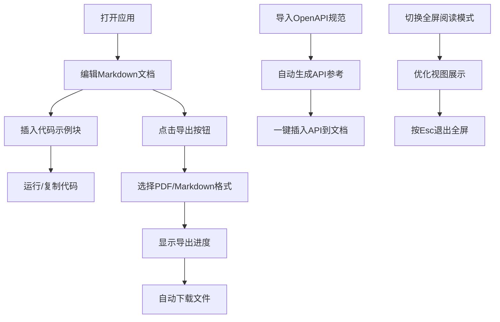

## 1. 产品概述

本产品是一个面向技术写作者的浏览器端技术文档集中管理工具，解决编写API文档时需在编辑器、文档工具和示例代码之间频繁切换的痛点，提供一站式的文档编辑、代码示例嵌入、API参考自动生成和一键导出功能。

- 核心价值：技术文档编写效率提升50%以上，消除多工具切换开销
- 目标用户：API文档编写者、技术博客作者、开源项目维护者

## 2. 核心功能

### 2.1 用户角色

| 角色 | 注册方式 | 核心权限 |
|------|----------|----------|
| 技术写作者 | 无需注册，浏览器本地使用 | 文档编辑、代码运行、API导入、文档导出 |

### 2.2 功能模块

1. **文档编辑器与代码示例嵌入**
2. **API参考自动生成**
3. **文档导出与打包**
4. **侧边栏文档树与全屏阅读模式**

### 2.3 页面详情

| 页面名称 | 模块名称 | 功能描述 |
|----------|----------|----------|
| 主编辑页面 | Markdown编辑器 | 实时预览、语法高亮、工具栏（加粗/斜体/代码块/标题/列表/链接） |
| 主编辑页面 | 代码示例块 | 支持JS/TS/Python，Monaco编辑器绑定，可折叠展开，复制/运行按钮 |
| 主编辑页面 | API参考面板 | OpenAPI 3.0解析，端点卡片列表，展开详情，一键插入文档 |
| 主编辑页面 | 导出对话框 | PDF/Markdown导出选项，进度条展示，自动下载 |
| 主编辑页面 | 侧边栏文档树 | 标题解析，跳转高亮，滚动定位 |
| 主编辑页面 | 全屏阅读模式 | 优化阅读视图，Esc退出 |

## 3. 核心流程

用户打开应用后，默认显示空文档。可以直接开始编写Markdown文档，通过工具栏插入代码块并运行查看结果。导入OpenAPI规范后自动生成API参考卡片，可一键插入文档。编辑完成后选择导出格式，等待进度完成后自动下载文件。

## 4. 用户界面设计

### 4.1 设计风格

- 主色调：#1A1A2E（深空蓝紫
- 卡片背景：#16213E（深蓝
- 文字主色：#E0E0E0（浅灰
- 链接/按钮主色：#4FC3F7（亮蓝
- 按钮样式：圆角8px，悬停涟漪动画，点击缩放0.95
- 字体：系统等宽字体用于代码，现代无衬线字体用于正文
- 布局：顶部固定工具栏56px高，左右分栏布局
- 图标：lucide-react图标库，统一线性风格

### 4.2 页面设计概述

| 页面名称 | 模块名称 | UI元素 |
|----------|----------|----------|
| 主编辑页面 | 顶部工具栏 | Logo、导出按钮、全屏按钮、深色主题背景#0F3460 |
| 主编辑页面 | 左侧文档树 | 章节标题列表，点击高亮跳转，黄色高亮#FFF8C5 |
| 主编辑页面 | 编辑器面板 | Monaco编辑器，语法高亮，工具栏按钮 |
| 主编辑页面 | 预览面板 | Markdown实时预览，代码块卡片#1E1E1E背景，行号显示 |
| 主编辑页面 | 代码块卡片 | 圆角12px，阴影0 4px 6px rgba(0,0,0,0.3)，悬停加深阴影 |
| 主编辑页面 | API端点卡片 | 方法标签（GET绿#66BB6A、POST蓝#4FC3F7、PUT橙#FFA726、DELETE红#EF5350） |
| 主编辑页面 | 分隔条 | 宽8px，#2C3E50，悬停变#4FC3F7 |
| 主编辑页面 | 导出对话框 | 模态框，进度条动画3-5秒过渡 |
| 主编辑页面 | 全屏阅读模式 | 背景#FAFAFA，正文最大宽800px，字号18px，行高1.8 |

### 4.3 响应式

- 桌面优先设计，适配1920x1080和1440x900
- 无水平滚动条
- 分栏比例可拖拽调整
- 代码块输出区域最大高度200px，超出滚动

### 4.4 交互动效

- 按钮涟漪动画0.3秒
- 分隔条拖拽0.2秒平滑过渡
- 标题高亮2秒渐隐
- 导出进度条平滑过渡
- 卡片悬停阴影过渡
- 代码块折叠展开动画
