## 1. 架构设计

```mermaid
graph TD
    A["用户界面层 (React Components)"]
    B["状态管理层 (Zustand Store)"]
    C["自定义Hooks层"]
    D["工具函数层"]
    E["第三方库层"]
    
    A -->|渲染| F["App.tsx (主应用)"]
    A -->|组件| G["EditorPanel.tsx (编辑器面板)"]
    A -->|组件| H["PreviewPanel.tsx (预览面板)"]
    A -->|组件| I["ExportDialog.tsx (导出对话框)"]
    A -->|组件| J["DocumentTree.tsx (文档树)"]
    A -->|组件| K["ApiReference.tsx (API参考)"]
    A -->|组件| L["CodeBlock.tsx (代码块)"]
    
    C -->|Hook| M["useExport.ts (导出逻辑)"]
    C -->|Hook| N["useMonaco.ts (编辑器)"]
    C -->|Hook| O["useOpenApi.ts (API解析)"]
    
    D -->|工具| P["markdownUtils.ts"]
    D -->|工具| Q["codeExecutor.ts"]
    D -->|工具| R["openapiParser.ts"]
    
    E -->|依赖| S["React 18"]
    E -->|依赖| T["TypeScript"]
    E -->|依赖| U["Monaco Editor"]
    E -->|依赖| V["pdf-lib"]
    E -->|依赖| W["react-markdown"]
    E -->|依赖| X["JSZip"]
    E -->|依赖| Y["Vite"]
```



## 2. 技术描述

- 前端：React 18 + TypeScript + Vite
- 构建工具：Vite 5.x
- 状态管理：Zustand
- 样式方案：CSS Modules + CSS Variables
- 代码编辑器：Monaco Editor
- Markdown渲染：react-markdown + gray-matter
- PDF生成：pdf-lib
- 打包压缩：JSZip
- 图标库：lucide-react
- HTTP请求：swr

## 3. 路由定义

| 路由 | 用途 |
|------|------|
| / | 主编辑页面，包含所有功能模块 |

本应用为单页应用，无多页面路由。

## 4. 数据模型

### 4.1 类型定义

```typescript
interface Document {
  id: string;
  title: string;
  content: string;
  createdAt: number;
  updatedAt: number;
}

interface CodeBlock {
  id: string;
  language: 'javascript' | 'typescript' | 'python';
  filename: string;
  code: string;
  output: string;
  collapsed: boolean;
}

interface OpenApiSpec {
  openapi: string;
  info: {
    title: string;
    version: string;
    description?: string;
  };
  paths: Record<string, PathItem>;
}

interface PathItem {
  [method: string]: Operation;
}

interface Operation {
  summary?: string;
  description?: string;
  parameters?: Parameter[];
  requestBody?: RequestBody;
  responses?: Record<string, Response>;
}

interface Parameter {
  name: string;
  in: 'query' | 'path' | 'header' | 'cookie';
  required?: boolean;
  schema?: Schema;
  description?: string;
}

interface ApiEndpoint {
  method: 'GET' | 'POST' | 'PUT' | 'DELETE';
  path: string;
  summary: string;
  description?: string;
  parameters: Parameter[];
  responses: Record<string, Response>;
}

interface ExportProgress {
  status: 'idle' | 'processing' | 'completed' | 'error';
  progress: number;
  message?: string;
}
```

## 5. 项目结构

```
.
├── src/
│   ├── components/
│   │   ├── EditorPanel.tsx
│   │   ├── PreviewPanel.tsx
│   │   ├── ExportDialog.tsx
│   │   ├── DocumentTree.tsx
│   │   ├── ApiReference.tsx
│   │   ├── CodeBlock.tsx
│   │   └── Toolbar.tsx
│   ├── hooks/
│   │   ├── useExport.ts
│   │   └── useOpenApi.ts
│   ├── store/
│   │   └── useAppStore.ts
│   ├── types/
│   │   └── index.ts
│   ├── utils/
│   │   ├── markdownUtils.ts
│   │   ├── codeExecutor.ts
│   │   └── openapiParser.ts
│   ├── styles/
│   │   └── variables.css
│   │   └── globals.css
│   ├── App.tsx
│   └── main.tsx
├── package.json
├── vite.config.ts
├── tsconfig.json
└── index.html
```

## 6. 性能优化策略

1. **编辑器性能**
   - Monaco Editor按需加载
   - Markdown预览防抖更新（<100ms延迟）
   - 代码块懒渲染

2. **导出性能**
   - PDF生成分块处理
   - 大文档流式导出
   - Web Worker处理重型计算

3. **首屏加载**
   - 代码分割
   - 依赖按需导入
   - 目标<2秒初始化时间

4. **渲染优化**
   - React.memo优化重渲染
   - useMemo/useCallback缓存
   - 虚拟滚动处理长文档