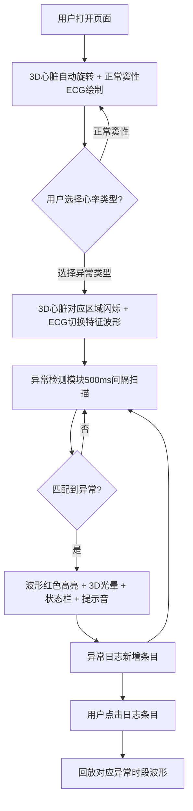

## 1. 产品概述

3D实时心电图模拟与异常波形检测系统——面向医学生和临床医生的浏览器端教学与诊断辅助工具。通过Three.js三维心脏模型实时展示心脏电信号传播过程，同步绘制12导联心电图波形，并自动检测标注心律失常异常片段，帮助用户直观理解心脏电生理活动与异常表现。

## 2. 核心功能

### 2.1 用户角色

| 角色 | 核心权限 |
|------|----------|
| 医学生 | 观察心脏模型、切换心率类型、查看异常检测结果 |
| 临床医生 | 同上，额外可回放异常时段波形动画 |

### 2.2 功能模块

1. **3D心脏模型场景**：低多边形解剖学心脏模型、心房/心室分区着色、自动旋转与交互控制、异常区域闪烁与警告光晕
2. **心电图波形面板**：12导联实时波形绘制、心率类型切换、异常区域高亮标注
3. **异常检测与日志**：实时波形扫描、异常模式匹配、检测日志列表、波形回放

### 2.3 页面详情

| 页面名称 | 模块名称 | 功能描述 |
|----------|----------|----------|
| 主页面（单页应用） | 3D心脏模型场景 | 渲染低多边形心脏模型，心房浅红#FF6B6B、心室深红#C0392B，半透明纹理，绕Y轴自动旋转（周期4秒），鼠标拖拽旋转（0.3秒缓动）、滚轮缩放（0.5x-3x） |
| 主页面 | 心率类型选择器 | 下拉列表选择：正常窦性、房颤、室性早搏、心动过速、心动过缓；选择后3D心脏对应区域闪烁、心电图切换为特征波形，0.5秒淡入动画 |
| 主页面 | 心电图波形区域 | 右侧面板上部60%，Canvas 2D绘制12导联折线图，每导联不同颜色半透明背景，16ms刷新间隔（60Hz采样模拟） |
| 主页面 | 异常检测高亮 | 500ms间隔扫描波形，匹配异常时红色半透明矩形标注异常区域，底部显示异常类型名称 |
| 主页面 | 3D心脏警告光晕 | 异常检测时对应区域红色闪烁光晕，周期0.5秒，持续3次 |
| 主页面 | 顶部状态栏 | 显示"检测到异常：房颤"等提示，播放440Hz正弦波提示音（0.2秒，Web Audio） |
| 主页面 | 异常检测日志列表 | 右侧面板下部40%，按时间倒序排列，每条含时间戳、异常类型、置信度百分比，点击回放对应时段波形 |

## 3. 核心流程

用户打开页面→3D心脏模型自动旋转+正常窦性心电图实时绘制→用户选择心率类型（如房颤）→3D心房表面不规则闪烁+心电图切换为房颤特征波形（0.5秒淡入）→异常检测模块以500ms间隔扫描波形→检测到异常匹配→波形图红色高亮标注+3D心脏红色光晕+状态栏更新+提示音→异常日志新增条目→用户点击日志条目→回放对应异常时段波形动画

## 4. 用户界面设计

### 4.1 设计风格

- 主题：深色医疗风格
- 主色：背景#1a1a2e、卡片#16213e、文字#e0e0e0、强调色#e94560
- 心房色#FF6B6B（浅红）、心室色#C0392B（深红）
- 字体：等宽字体用于ECG波形标注，无衬线字体用于UI文本
- 布局：左侧3D场景65%、右侧面板35%，卡片式布局

### 4.2 页面设计概览

| 页面名称 | 模块名称 | UI元素 |
|----------|----------|--------|
| 主页面 | 3D场景区域 | Three.js Canvas全区域渲染，暗色背景，心脏模型居中，自动旋转 |
| 主页面 | 心率选择器 | 右侧面板顶部下拉菜单，深色卡片样式，强调色边框 |
| 主页面 | ECG波形区域 | 12导联折线图，每导联独立横条，不同半透明背景色，Canvas 2D渲染 |
| 主页面 | 异常日志列表 | 时间倒序列表，每行含时间戳+类型+置信度，深色卡片行，点击高亮 |
| 主页面 | 顶部状态栏 | 固定顶部，深色背景，异常时强调色文字+闪烁动画 |

### 4.3 响应式设计

- 桌面优先设计，最小支持1280px宽度
- 3D场景与面板比例在小屏时调整（可切换为上下布局）

### 4.4 3D场景指导

- 环境：暗色空间，微弱环境光，无HDRI
- 光照：方向光+环境光，突出心脏表面立体感
- 相机：透视相机，初始距离适中可观察完整心脏，Y轴自动旋转周期4秒
- 焦点：心脏模型为唯一焦点，异常时光晕聚焦对应区域
- 交互：OrbitControls拖拽旋转（0.3秒缓动）、滚轮缩放（0.5x-3x）
- 后处理：异常时红色光晕发光效果
- 性能：低多边形模型，确保≥30FPS
