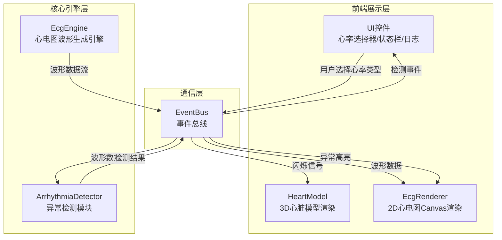

## 1. 架构设计



## 2. 技术说明

- 前端框架：纯TypeScript（无React/Vue），Three.js + Canvas 2D
- 构建工具：Vite，开发服务器端口3000，开启HMR
- 语言：TypeScript，严格模式，target ES2020
- 3D渲染：Three.js，OrbitControls交互
- 2D渲染：Canvas 2D API
- 音频：Web Audio API
- 通信：自定义EventBus事件总线
- 无后端、无数据库

## 3. 路由定义

单页应用，无路由。所有内容在同一页面展示。

## 4. 事件总线事件类型

| 事件名称 | 数据结构 | 发布者 | 订阅者 |
|----------|----------|--------|--------|
| `ecg:data` | `{ leads: Float32Array[], timestamp: number }` | EcgEngine | EcgRenderer, ArrhythmiaDetector |
| `ecg:rhythm-change` | `{ rhythmType: RhythmType }` | UI → EcgEngine | HeartModel |
| `detection:result` | `{ type: string, confidence: number, startTime: number, endTime: number }` | ArrhythmiaDetector | EcgRenderer, HeartModel, UI |
| `heart:flash` | `{ region: 'atria' \| 'ventricles', color: string, frequency: number }` | EventBus中转 | HeartModel |
| `detection:alert` | `{ type: string, message: string }` | ArrhythmiaDetector | UI（状态栏+提示音） |

## 5. 模块依赖关系

```
main.ts
  ├── EventBus.ts（最先初始化）
  ├── HeartModel.ts（依赖EventBus）
  ├── EcgEngine.ts（依赖EventBus）
  ├── EcgRenderer.ts（依赖EventBus）
  └── ArrhythmiaDetector.ts（依赖EventBus）
```

## 6. 文件结构

```
├── package.json
├── vite.config.js
├── tsconfig.json
├── index.html
└── src/
    ├── main.ts
    └── modules/
        ├── core/
        │   └── EventBus.ts
        ├── scene3d/
        │   ├── HeartModel.ts
        │   └── EcgRenderer.ts
        ├── ecg/
        │   └── EcgEngine.ts
        └── detection/
            └── ArrhythmiaDetector.ts
```

## 7. 异常模式库

| 异常类型 | 识别特征 | 3D闪烁区域 |
|----------|----------|------------|
| 房颤(Atrial Fibrillation) | 不规则R-R间期，无P波，f波 | 心房，不规则频率60-100次/分 |
| 室性早搏(PVC) | 宽大畸形QRS波群，提前出现，无P波 | 心室，单次闪烁 |
| 心动过速(Tachycardia) | 心率>100bpm，R-R间期缩短 | 全心，快速闪烁 |
| 心动过缓(Bradycardia) | 心率<60bpm，R-R间期延长 | 全心，缓慢闪烁 |
| 房室传导阻滞(AV Block) | P-R间期延长或P波后QRS脱落 | 心房→心室传导路径，交替闪烁 |
