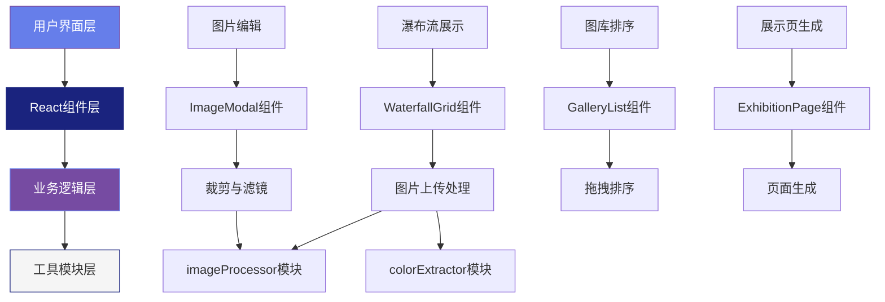

## 1. 架构设计



## 2. 技术描述

- **前端框架**：React 18 + TypeScript 5 + Vite 5
- **状态管理**：React Context API（全局状态）+ React Hooks（组件状态）
- **样式方案**：原生CSS + CSS Variables（避免Tailwind，保持设计独特性）
- **构建工具**：Vite，开发服务器端口3000，开启热更新
- **第三方库**：
  - react-dropzone：拖拽上传
  - color-thief：主色调提取
  - @hello-pangea/dnd：拖拽排序（react-beautiful-dnd的维护分支）
  - file-saver：文件下载

## 3. 文件结构

| 文件路径 | 功能描述 |
|---------|---------|
| `package.json` | 项目依赖和脚本配置 |
| `vite.config.js` | Vite开发服务器配置 |
| `tsconfig.json` | TypeScript严格模式配置 |
| `index.html` | 入口HTML页面 |
| `src/main.tsx` | React应用入口 |
| `src/App.tsx` | 主布局组件，全局状态管理 |
| `src/components/WaterfallGrid.tsx` | 瀑布流网格组件 |
| `src/components/ImageModal.tsx` | 图片编辑模态框 |
| `src/components/GalleryList.tsx` | 图库列表拖拽排序 |
| `src/components/ExhibitionPage.tsx` | 独立展示页面 |
| `src/modules/imageProcessor.ts` | 图片裁剪与滤镜处理 |
| `src/modules/colorExtractor.ts` | 主色调提取 |
| `src/context/AppContext.tsx` | 全局状态Context |
| `src/types/index.ts` | TypeScript类型定义 |
| `src/styles/global.css` | 全局样式和CSS变量 |

## 4. 数据模型定义

### 4.1 核心类型

```typescript
interface ImageItem {
  id: string;
  file: File;
  originalUrl: string;
  editedUrl: string | null;
  name: string;
  width: number;
  height: number;
  dominantColor: string;
  colorName: string;
  filterType: FilterType;
  cropData: CropData | null;
  selected: boolean;
  order: number;
}

type FilterType = 'none' | 'vintage' | 'monochrome' | 'cool' | 'warm' | 'film';

interface CropData {
  x: number;
  y: number;
  width: number;
  height: number;
  aspectRatio: '1:1' | '4:3' | '16:9';
}

interface AppState {
  images: ImageItem[];
  currentEditingId: string | null;
  sortedIds: string[];
  isLoading: boolean;
}
```

### 4.2 Context状态

```typescript
interface AppContextType {
  state: AppState;
  addImages: (files: File[]) => Promise<void>;
  updateImage: (id: string, updates: Partial<ImageItem>) => void;
  selectImage: (id: string, selected: boolean) => void;
  selectAllImages: (selected: boolean) => void;
  reorderImages: (startIndex: number, endIndex: number) => void;
  setEditingImage: (id: string | null) => void;
  generateExhibition: () => string;
}
```

## 5. 关键技术实现

### 5.1 瀑布流布局算法
- 使用CSS columns实现多列布局
- 列宽固定360px，桌面端3列，移动端2列
- 动态计算图片高度，通过margin-top调整避免断层
- Intersection Observer实现无限滚动

### 5.2 图片处理性能
- Canvas API进行裁剪和滤镜处理，避免重绘闪烁
- Offscreen Canvas优化大图片处理
- 原图和编辑版本分别存储在内存中
- 使用requestAnimationFrame确保60fps动画

### 5.3 滤镜实现（Canvas）
```typescript
// 复古滤镜：降低饱和度，增加暖色调
// 黑白滤镜：灰度转换，对比度增强
// 冷色调：蓝色通道增益，红色通道衰减
// 暖色调：红色通道增益，蓝色通道衰减
// 胶片滤镜：增加颗粒感，色彩偏移
```
