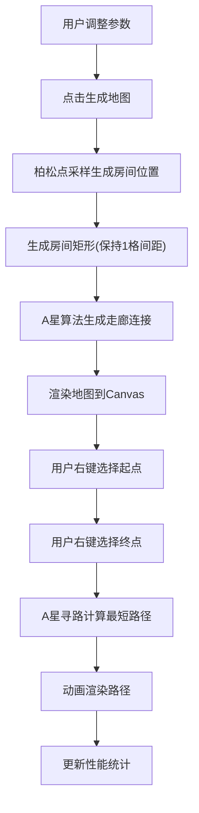

## 1. 产品概述
基于柏松点采样和A星寻路的2D随机地牢地图生成与测试工具，面向策略类游戏开发者，解决手动设计关卡地图耗时且缺乏多样性的问题。用户可配置地图参数，自动生成连通地牢并可视化寻路路径和性能数据。

## 2. 核心功能

### 2.1 用户角色
| 角色 | 使用方式 | 核心权限 |
|------|----------|----------|
| 游戏开发者 | 直接访问Web应用 | 配置参数、生成地图、测试寻路、查看性能数据 |

### 2.2 功能模块
1. **地牢编辑器页面**：参数配置面板、地图画布、寻路测试、性能统计面板

### 2.3 页面详情
| 页面名称 | 模块名称 | 功能描述 |
|----------|----------|----------|
| 地牢编辑器 | 参数配置面板 | 调整地图宽度(20-50)、高度(20-50)、房间数量(5-15)、最小房间尺寸(3-6)、走廊宽度(1-3)，点击"生成地图"触发重新生成 |
| 地牢编辑器 | 地图画布 | 基于柏松点采样随机放置房间，A星算法生成走廊，支持缩放和平移，网格线辅助定位 |
| 地牢编辑器 | 寻路测试 | 右键点击任意两个房间格子设为起点/终点，自动计算并高亮最短路径，白色连线动画 |
| 地牢编辑器 | 性能统计面板 | 实时显示生成耗时、房间数量、走廊长度、寻路耗时，超500ms红色警示 |

## 3. 核心流程

用户打开应用→调整参数→点击"生成地图"→柏松点采样生成房间→A星算法连接走廊→渲染地图→右键选择起点和终点→A星寻路计算最短路径→动画显示路径→性能数据实时更新



## 4. 用户界面设计

### 4.1 设计风格
- 主色调：深色游戏风格，背景#1a1a2e，墙壁#0f0f23
- 辅助色：房间浅灰#e0e0e0，走廊深灰#4a4a4a，起点绿色#00ff88，终点红色#ff3355
- 面板：半透明白色(0.1透明度)，圆角6px，悬停高亮
- 字体：等宽字体Consolas（数据展示），路径动画逐帧渲染
- 布局：三栏布局，左侧参数面板280px，中间画布，右侧统计面板280px

### 4.2 页面设计概览
| 页面名称 | 模块名称 | UI元素 |
|----------|----------|--------|
| 地牢编辑器 | 参数配置面板 | 深色背景、半透明面板、滑块控件、圆角按钮(6px)、悬停高亮效果 |
| 地牢编辑器 | 地图画布 | 全屏Canvas、网格线(#2a2a4e,0.3透明度)、房间填充+描边、走廊填充、起点闪烁动画 |
| 地牢编辑器 | 路径渲染 | 白色线条(#ffffff)、路径节点白色小圆点(3px半径)、逐帧动画(8px/帧) |
| 地牢编辑器 | 性能统计面板 | 等宽字体、数值颜色过渡动画(0.3秒绿→白)、超时红色警示 |

### 4.3 响应式
- 桌面优先设计，视口宽度≥1024px时三栏布局
- 视口宽度<1024px时，左右面板折叠为顶部和底部工具栏
- Canvas自适应中间区域

### 4.4 数据流向
```
用户参数输入 → main.ts → mapGenerator.ts(生成网格数据) → mapRenderer.ts(渲染到Canvas)
用户右键点击 → main.ts(坐标转换) → mapGenerator.ts(A星寻路) → mapRenderer.ts(路径动画)
mapGenerator.ts → main.ts → 性能统计面板(更新数据)
```
